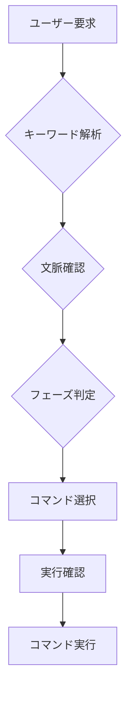

# Claude Code コマンドインデックス

このファイルは、ユーザーの要求に対して適切なコマンドを選択するためのインデックスです。

## コマンド一覧と使用条件

### 開発系コマンド

#### /new-feature-investigate
**使用条件:**
- 新機能の実装を検討している
- 「新しい機能を追加したい」
- 「〜機能を実装したい」
- 「〜できるようにしたい」

#### /new-feature-plan
**使用条件:**
- 新機能の設計・計画段階
- 「設計を考えて」
- 「実装計画を立てて」
- 調査（investigate）の後

#### /new-feature-implement
**使用条件:**
- 新機能の実装開始
- 「実装して」
- 「コーディングして」
- 計画（plan）の後

#### /bug-investigate
**使用条件:**
- バグの調査
- 「エラーが出る」
- 「動かない」
- 「不具合がある」
- 「おかしい」

#### /bug-fix
**使用条件:**
- バグの修正実装
- 「バグを直して」
- 「修正して」
- 調査（investigate）の後

#### /refactor-analyze
**使用条件:**
- リファクタリング検討
- 「コードを整理したい」
- 「リファクタリングしたい」
- 「構造を改善したい」

#### /refactor-plan
**使用条件:**
- リファクタリング計画
- 「リファクタリング計画を立てて」
- 分析（analyze）の後

#### /refactor-implement
**使用条件:**
- リファクタリング実装
- 「リファクタリングを実行して」
- 計画（plan）の後

#### /root-cause-analysis
**使用条件:**
- 根本原因分析
- 「なぜ〜なのか」
- 「原因を調べて」
- 「根本原因を特定して」

#### /feature-removal
**使用条件:**
- 機能削除
- 「削除したい」
- 「不要な機能を取り除きたい」
- 「廃止したい」

#### /implementation-proposal
**使用条件:**
- 実装提案
- 「どう実装すべきか」
- 「実装方法を提案して」
- 「ベストプラクティスは？」

#### /db-optimization
**使用条件:**
- データベース最適化
- 「DBが遅い」
- 「クエリを最適化したい」
- 「インデックスを改善したい」

### テスト系コマンド

#### /test
**使用条件:**
- テスト実装・実行
- 「テストを書いて」
- 「テストを実行して」
- 「動作確認して」

### ドキュメント系コマンド

#### /docs-audit
**使用条件:**
- ドキュメント監査
- 「ドキュメントを確認して」
- 「古い情報がないか調べて」
- 「ドキュメントの問題を見つけて」

#### /docs-update
**使用条件:**
- ドキュメント更新
- 「ドキュメントを更新して」
- 「情報を最新にして」
- 監査（audit）の後

#### /docs-cleanup
**使用条件:**
- ドキュメント削除
- 「不要なドキュメントを削除して」
- 「ドキュメントを整理して」
- 「削除推奨のものは削除して」

#### /docs-organize
**使用条件:**
- ドキュメント整理
- 「フォルダを整理して」
- 「構造を改善して」
- 「散らかっているので整理して」

#### /docs-consolidate
**使用条件:**
- ドキュメント統合
- 「情報をまとめて」
- 「重複を統合して」
- 「シンプルにして」

### 品質管理系コマンド

#### /quality-audit
**使用条件:**
- 品質監査
- 「品質を確認して」
- 「問題がないか調べて」
- 「改善点を見つけて」

#### /quality-improve
**使用条件:**
- 品質改善
- 「品質を向上させて」
- 「改善を実装して」
- 監査（audit）の後

## 選択ロジック

1. **キーワードマッチング**: ユーザーの発言に含まれるキーワードをチェック
2. **文脈理解**: 前の作業との関連性を考慮
3. **フェーズ判定**: investigate → plan → implement の流れを認識
4. **複合判定**: 複数の条件が該当する場合は、より具体的なコマンドを優先

## 使用例

| ユーザーの要求 | 選択されるコマンド |
|--------------|-------------------|
| 「経費申請機能を追加したい」 | /new-feature-investigate |
| 「バグを修正して」 | /bug-fix（調査済みの場合）または /bug-investigate（未調査の場合） |
| 「docsフォルダが散らかっているので整理して」 | /docs-organize |
| 「古い情報のドキュメントを整理して」 | /docs-audit → /docs-update |
| 「DBのパフォーマンスを改善したい」 | /db-optimization |

## 自動選択のフロー

## 更新履歴

- 2025-01-30: 初版作成