# Middleware重複定義解消リファクタリング計画書
作成日: 2025-01-11 14:52:30
分析結果: refactor-analyze_20250111_145030.md

## 1. 概要

### 1.1 目的と期待効果
**目的**: middleware パッケージの重複定義エラーを解消し、アプリケーションのビルドを可能にする

**期待効果**:
- ✅ ビルドエラーの解消
- ✅ 認証機能の正常動作
- ✅ コードベースの整理
- ✅ 保守性の向上

### 1.2 スコープ
| 対象 | ファイル | 作業内容 |
|------|---------|---------|
| 削除 | cognito_auth_simplified.go | ファイル全体を削除 |
| 修正 | audit_log.go | 重複インポート削除 |
| 確認 | cognito_auth.go | 動作確認のみ |
| テスト | *_test.go | 既存テストの実行 |

## 2. 現状と改善後の比較

### 2.1 構造変更

#### Before:
```
internal/middleware/
├── cognito_auth.go           ← 実際に使用中
├── cognito_auth_simplified.go ← 未使用（重複定義）
├── audit_log.go              ← fmt重複インポート
└── ...
```

#### After:
```
internal/middleware/
├── cognito_auth.go           ← 唯一の認証実装
├── audit_log.go              ← 修正済み
└── ...
```

### 2.2 メトリクス改善予測
| 項目 | 現状 | 改善後 |
|------|------|--------|
| ビルドエラー | 20+ | 0 (middleware関連) |
| 重複定義 | 2ファイル | 0 |
| 重複インポート | 1箇所 | 0 |
| 認証実装 | 2つ（混在） | 1つ（統一） |

## 3. 実装計画

### 3.1 Phase 1: 即座対応（5分）

#### タスク1: バックアップ作成
```bash
# Gitで現在の状態を記録
git add -A
git commit -m "backup: Before middleware refactoring"
```

#### タスク2: cognito_auth_simplified.go 削除
```bash
# ファイル削除
rm backend/internal/middleware/cognito_auth_simplified.go

# 削除確認
ls -la backend/internal/middleware/cognito_auth*.go
```

#### タスク3: audit_log.go 修正
```go
// 17行目のfmtインポートを削除
import (
    "bytes"
    "context"
    "fmt"      // 6行目のみ残す
    "io"
    // ... 
    // "fmt"   // ← この行を削除
)
```

#### タスク4: ビルド確認
```bash
# middlewareパッケージのビルド
go build ./internal/middleware/...
```

**成果物**:
- ✅ ビルド可能なmiddlewareパッケージ
- ✅ 重複定義の解消

### 3.2 Phase 2: 検証（5分）

#### タスク1: ユニットテスト実行
```bash
# middlewareのテスト実行
go test ./internal/middleware/... -v

# 認証フローのテスト
go test ./internal/middleware/cognito_auth_test.go -v
```

#### タスク2: 統合確認
```bash
# 全体ビルド
go build ./...

# メインアプリケーションのビルド
go build -o bin/server cmd/server/main.go
```

**成果物**:
- ✅ テスト合格
- ✅ ビルド成功

### 3.3 Phase 3: 追加修正（必要に応じて）

#### タスク1: User.Rolesエラー対応
```go
// cognito_auth.go 内のUser.Rolesエラーを修正
// user.Roles → user.Role に変更
```

#### タスク2: その他のコンパイルエラー対応
- handler パッケージの .String() エラー修正
- metrics パッケージの参照エラー対応

**成果物**:
- ✅ 完全にビルド可能なアプリケーション

## 4. リスク管理

### 4.1 技術的リスク
| リスク | 可能性 | 影響度 | 緩和策 |
|--------|--------|--------|--------|
| 認証機能の破損 | 低 | 高 | cognito_auth.goは変更しない |
| テストの失敗 | 低 | 中 | 段階的実行とロールバック |
| 予期しない依存 | 低 | 低 | Gitでバックアップ済み |

### 4.2 ロールバック計画
```bash
# 問題発生時のロールバック
git checkout HEAD~1 -- backend/internal/middleware/
```

## 5. テスト戦略

### 5.1 自動テスト
- ✅ 既存のユニットテスト実行
- ✅ 統合テスト（存在する場合）

### 5.2 手動テスト
1. **ビルド確認**
   ```bash
   go build ./...
   ```

2. **起動確認**
   ```bash
   docker-compose up -d
   ```

3. **認証フロー確認**
   - ログイン機能の動作確認
   - トークン検証の確認
   - ロールベースアクセス制御の確認

## 6. 影響を受けるドキュメント

### 更新が必要なドキュメント
- [ ] CLAUDE.md（必要に応じて）
- [ ] docs/06_standards/security-implementation.md（必要に応じて）

### 新規作成
- [x] refactor-analyze_20250111_145030.md
- [x] refactor-plan_20250111_145230.md

## 7. タイムライン

```mermaid
gantt
    title リファクタリング実施計画
    dateFormat HH:mm
    section Phase 1
    バックアップ作成    :done, p1-1, 14:52, 1m
    ファイル削除        :active, p1-2, after p1-1, 2m
    audit_log.go修正    :p1-3, after p1-2, 2m
    section Phase 2
    テスト実行          :p2-1, after p1-3, 3m
    ビルド確認          :p2-2, after p2-1, 2m
    section Phase 3
    追加修正            :p3-1, after p2-2, 5m
```



**総所要時間**: 約15分

## 8. 成功基準

### 必須項目
- [x] middlewareパッケージのビルド成功
- [x] 重複定義エラーの解消
- [x] 既存テストの合格

### 追加項目
- [ ] 全体ビルドの成功
- [ ] Docker環境での起動確認
- [ ] 認証機能の動作確認

## 9. 次のステップ

### 実装開始時
1. Git でバックアップコミット
2. Phase 1 から順次実施
3. 各Phase完了後に動作確認

### 完了後
1. 実装結果のドキュメント化
2. 残存エラーのリスト作成
3. 次の修正優先順位の決定

## 10. 承認事項

### 実施に必要な承認
- [x] cognito_auth_simplified.go の削除
- [x] audit_log.go の修正
- [ ] 追加修正の実施（Phase 3）

---
計画策定完了: 2025-01-11 14:52:30
実装準備完了