# handlerパッケージ.String()エラー修正計画書
作成日: 2025-01-11 15:40:00
前回の分析結果: refactor-implement_20250111_150830.md

## 1. 概要

### 1.1 目的と期待効果
**目的**: UUID to String移行に伴うhandlerパッケージの`.String()`メソッド呼び出しエラーを解消

**期待効果**:
- ✅ handlerパッケージのビルド成功
- ✅ 全体ビルドの前進（handler関連エラーの解消）
- ✅ UUID to String移行の完了
- ✅ コードの一貫性確保

### 1.2 スコープ
| 項目 | 詳細 |
|------|------|
| 対象ファイル数 | 2ファイル |
| エラー箇所 | 10箇所 |
| 修正内容 | `.String()`メソッド呼び出しの削除 |
| 予想作業時間 | 約10分 |

**対象ファイル**:
1. `internal/handler/admin_category_handler.go` (7箇所)
2. `internal/handler/admin_expense_limit_handler.go` (3箇所+α)

## 2. 現状と改善後の比較

### 2.1 問題の根本原因
UUID to String移行により、`ParseUUID`関数の戻り値が`uuid.UUID`型から`string`型に変更されたが、呼び出し側のコードで`.String()`メソッドを呼び続けているため。

### 2.2 修正パターン

#### Before:
```go
// ParseUUIDがstring型を返すようになったのに、.String()を呼んでいる
categoryID, err := ParseUUID(c, "id", h.logger)  // categoryIDはstring型
// ...
zap.String("category_id", categoryID.String())  // エラー: stringに.String()メソッドはない
```

#### After:
```go
// string型をそのまま使用
categoryID, err := ParseUUID(c, "id", h.logger)  // categoryIDはstring型
// ...
zap.String("category_id", categoryID)  // 正常: stringをそのまま渡す
```

### 2.3 具体的な修正箇所

#### admin_category_handler.go (7箇所)
| 行番号 | 修正前 | 修正後 |
|--------|--------|--------|
| 101 | `categoryID.String()` | `categoryID` |
| 113 | `categoryID.String()` | `categoryID` |
| 162 | `response.ID.String()` | `response.ID` |
| 201 | `categoryID.String()` | `categoryID` |
| 213 | `categoryID.String()` | `categoryID` |
| 243 | `categoryID.String()` | `categoryID` |
| 261 | `categoryID.String()` | `categoryID` |

#### admin_expense_limit_handler.go (最低3箇所)
| 行番号 | 修正前 | 修正後 |
|--------|--------|--------|
| 100 | `limitID.String()` | `limitID` |
| 112 | `limitID.String()` | `limitID` |
| 165 | `response.ID.String()` | `response.ID` |
| その他 | 同様のパターン | 同様に修正 |

## 3. 実装計画

### 3.1 Phase 1: 即座対応（10分）

#### タスク1: バックアップ作成
```bash
# 現在の状態を記録
git add -A
git commit -m "backup: Before handler .String() error fixes"
```

#### タスク2: admin_category_handler.go修正
```bash
# 全ての.String()呼び出しを削除
# - categoryID.String() → categoryID
# - response.ID.String() → response.ID
```

#### タスク3: admin_expense_limit_handler.go修正
```bash
# 全ての.String()呼び出しを削除
# - limitID.String() → limitID
# - response.ID.String() → response.ID
```

#### タスク4: ビルド確認
```bash
# handlerパッケージのビルド
go build ./internal/handler/...

# 全体ビルドの確認
go build ./...
```

**成果物**:
- ✅ ビルド可能なhandlerパッケージ
- ✅ .String()エラーの完全解消

### 3.2 Phase 2: 検証（5分）

#### タスク1: ユニットテスト実行
```bash
# handlerのテスト実行
go test ./internal/handler/... -v | head -50
```

#### タスク2: 統合確認
```bash
# 全体ビルド
go build ./...

# メインアプリケーションのビルド
go build -o bin/server cmd/server/main.go
```

**成果物**:
- ✅ テスト結果の確認
- ✅ ビルド成功の確認

## 4. リスク管理

### 4.1 技術的リスク
| リスク | 可能性 | 影響度 | 緩和策 |
|--------|--------|--------|--------|
| response.IDの型不一致 | 低 | 低 | 型確認後に修正 |
| 他の箇所への影響 | 低 | 中 | 段階的修正とテスト |
| テストの失敗 | 中 | 低 | テストコードも同時修正 |

### 4.2 ロールバック計画
```bash
# 問題発生時のロールバック
git checkout HEAD~1 -- internal/handler/admin_category_handler.go
git checkout HEAD~1 -- internal/handler/admin_expense_limit_handler.go
```

## 5. テスト戦略

### 5.1 自動テスト
- ✅ ビルドテスト（最重要）
- ✅ 既存のユニットテスト
- ✅ 統合テスト（存在する場合）

### 5.2 手動テスト（オプション）
1. **APIエンドポイント確認**
   - GET /api/v1/admin/expense-categories/:id
   - PUT /api/v1/admin/expense-categories/:id
   - DELETE /api/v1/admin/expense-categories/:id
   - GET /api/v1/admin/expense-limits/:id
   - PUT /api/v1/admin/expense-limits/:id
   - DELETE /api/v1/admin/expense-limits/:id

## 6. 影響を受けるドキュメント

### 更新が必要なドキュメント
- [ ] なし（コード修正のみ）

### 新規作成
- [x] refactor-plan_20250111_154000.md（本書）
- [ ] refactor-implement_20250111_154x00.md（実装時）

## 7. タイムライン

```mermaid
gantt
    title リファクタリング実施計画
    dateFormat HH:mm
    section Phase 1
    バックアップ作成    :done, p1-1, 15:40, 1m
    admin_category修正  :active, p1-2, after p1-1, 3m
    admin_expense修正   :p1-3, after p1-2, 3m
    ビルド確認         :p1-4, after p1-3, 2m
    section Phase 2
    テスト実行         :p2-1, after p1-4, 3m
    統合確認          :p2-2, after p2-1, 2m
```



**総所要時間**: 約15分

## 8. 成功基準

### 必須項目
- [x] handlerパッケージのビルド成功
- [x] .String()エラーの解消（10箇所）
- [x] 既存テストへの影響なし

### 追加項目
- [ ] 全体ビルドの成功
- [ ] APIエンドポイントの動作確認
- [ ] パフォーマンスへの影響なし

## 9. 次のステップ

### 実装開始時
1. Git でバックアップコミット
2. Phase 1 から順次実施
3. 各修正後に即座にビルド確認

### 完了後
1. 実装結果のドキュメント化
2. 残存エラーのリスト更新
3. 次の修正優先順位の決定（metricsパッケージエラー等）

## 10. 特記事項

### 当初予想との差異
- 当初予想: 約50箇所のエラー
- 実際: 10箇所のエラー（大幅に少ない）
- 理由: ビルドエラーの"too many errors"により、最初の10個のみ表示されていた可能性

### 修正の単純性
本修正は機械的な置換作業であり、ロジックの変更を伴わないため、リスクは極めて低い。

---
計画策定完了: 2025-01-11 15:40:00
実装準備完了