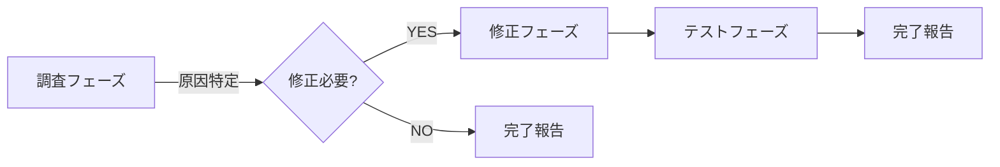

# コマンドフェーズ管理ガイド

**作成日**: 2025-07-31  
**目的**: Claude Codeにおけるコマンド実行の段階的管理と適切な役割分担

## 概要

各コマンドは単一の責任を持ち、明確なフェーズ区切りで動作する必要があります。

## フェーズ管理の原則

### 1. 単一責任の原則
各コマンドは以下の役割に限定されます：

| コマンドタイプ | 責任範囲 | 禁止事項 |
|------------|---------|---------|
| investigate系 | 調査・分析・原因特定 | 修正・実装・変更 |
| plan系 | 設計・計画・方針決定 | 実装・修正・調査 |
| implement/fix系 | 実装・修正・変更 | 新規調査・設計変更 |
| test系 | テスト実行・検証 | 実装・修正 |

### 2. フェーズ移行のルール



### 3. コマンド終了時の必須アクション

1. **ステータス報告**
   ```
   status: SUCCESS/PARTIAL/NEED_NEXT_PHASE
   next: 次のコマンド名 or USER_INPUT
   details: "実行内容の要約"
   ```

2. **成果物の保存**
   - 調査結果 → `docs/investigate/`
   - 設計書 → `docs/design/`
   - 修正記録 → `docs/fix/`

3. **次フェーズの明示**
   - 自動実行せず、ユーザーに提案
   - 理由と期待される成果を説明

## 実例：バグ対応フロー

### 正しい例 ✅
```
1. /bug-investigate
   - エラー調査のみ
   - 原因特定で終了
   - 出力: "status: SUCCESS, next: BUG-FIX"

2. ユーザー確認

3. /bug-fix
   - 調査結果に基づく修正のみ
   - テスト追加
   - 出力: "status: SUCCESS, next: TEST"
```

### 誤った例 ❌
```
1. /bug-investigate
   - エラー調査
   - 原因特定
   - そのまま修正実行 ← ❌ 役割逸脱
   - マイグレーション実行 ← ❌ 役割逸脱
```

## チェックリスト

### コマンド開始時
- [ ] コマンドの責任範囲を確認
- [ ] 前フェーズの成果物を読み込み
- [ ] 実行内容をユーザーに通知

### コマンド実行中
- [ ] 責任範囲内の作業のみ実行
- [ ] 他フェーズの作業は行わない
- [ ] 成果物を適切に保存

### コマンド終了時
- [ ] ステータス報告を出力
- [ ] 次のコマンドを提案（自動実行しない）
- [ ] 完了通知（音声など）

## 例外的なケース

### 緊急対応が必要な場合
- セキュリティ上の重大な問題
- データ破損の可能性
→ この場合も、ユーザーに確認を求めてから次フェーズへ

### 調査で即座に解決できる場合
- 設定ミスなど軽微な問題
→ 調査結果として「即座に解決可能」と報告し、修正の許可を求める

## まとめ

コマンドフェーズ管理により：
- 各作業の責任が明確になる
- 予期しない変更を防げる
- ユーザーが進捗を把握しやすい
- 品質の高い段階的な作業が可能

常に「調査は調査のみ」「修正は修正のみ」という原則を守ることが重要です。