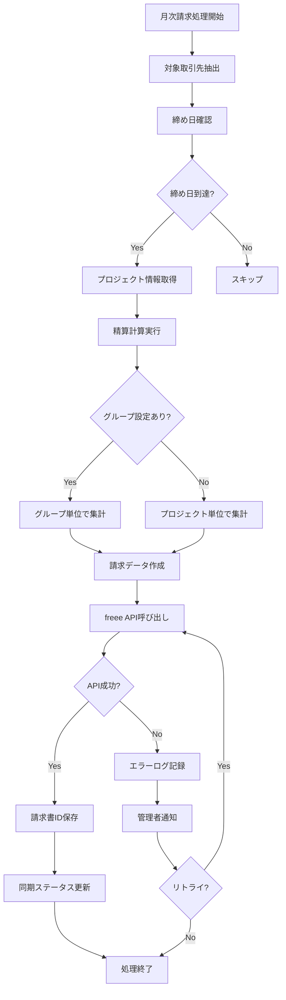

# Monstera 経理機能 基本設計書

> ⚠️ **注意**: この機能は未実装です。将来的な実装予定の設計書です。

## 1. 概要

### 1.1 目的
本設計書は、Monsteraシステムに新規追加する経理機能（取引先別・月次請求処理、月次入金金額管理）の基本設計を定義する。

### 1.2 主要機能
1. **月次請求処理**
   - freee APIを利用した請求書自動作成
   - プロジェクトグルーピングによる請求明細管理
   - 手動個別請求書作成機能

2. **入金管理**
   - freeeからの入金情報同期
   - 入金ステータス管理

### 1.3 システム連携
- **freee請求書API**: 請求書作成・管理
- **freee会計**: 会計連携（自動仕訳）

## 2. システム構成

### 2.1 アーキテクチャ概要

```
┌─────────────────┐     ┌─────────────────┐     ┌─────────────────┐
│   Monstera      │     │   freee API     │     │  freee会計      │
│   フロントエンド │────▶│   Gateway       │────▶│                 │
└─────────────────┘     └─────────────────┘     └─────────────────┘
         │                       │                       │
         ▼                       ▼                       ▼
┌─────────────────┐     ┌─────────────────┐     ┌─────────────────┐
│   Monstera      │◀────│  Webhook/Sync   │◀────│  入金データ     │
│   バックエンド   │     │                 │     │                 │
└─────────────────┘     └─────────────────┘     └─────────────────┘
         │
         ▼
┌─────────────────┐
│   PostgreSQL DB │
└─────────────────┘
```

### 2.2 認証フロー
- OAuth 2.0による認証
- Client ID: 613326521645499
- リダイレクトURI: http://localhost:3000/auth/freee/callback

## 3. データベース設計

### 3.1 新規テーブル

#### 3.1.1 project_groups（プロジェクトグループ）
```sql
CREATE TABLE project_groups (
  id VARUUID PRIMARY KEY,
  group_name VARCHAR(255) NOT NULL COMMENT 'グループ名',
  client_id VARUUID NOT NULL COMMENT '取引先ID',
  description TEXT COMMENT '説明',
  created_by VARUUID NOT NULL,
  created_at TIMESTAMP NOT NULL DEFAULT CURRENT_TIMESTAMP(3),
  updated_at TIMESTAMP DEFAULT CURRENT_TIMESTAMP(3) -- Requires UPDATE trigger in PostgreSQL,
  deleted_at TIMESTAMP NULL,
  FOREIGN KEY (client_id) REFERENCES clients(id),
  FOREIGN KEY (created_by) REFERENCES users(id)
) COMMENT='プロジェクトグループ管理';
```

#### 3.1.2 project_group_mappings（プロジェクトグループマッピング）
```sql
CREATE TABLE project_group_mappings (
  id VARUUID PRIMARY KEY,
  project_group_id VARUUID NOT NULL,
  project_id VARUUID NOT NULL,
  created_at TIMESTAMP NOT NULL DEFAULT CURRENT_TIMESTAMP(3),
  FOREIGN KEY (project_group_id) REFERENCES project_groups(id),
  FOREIGN KEY (project_id) REFERENCES projects(id),
  UNIQUE KEY idx_group_project (project_group_id, project_id)
) COMMENT='プロジェクトグループマッピング';
```

#### 3.1.3 freee_sync_logs（freee同期ログ）
```sql
CREATE TABLE freee_sync_logs (
  id VARUUID PRIMARY KEY,
  sync_type ENUM('invoice_create', 'invoice_update', 'payment_sync', 'client_sync') NOT NULL,
  target_id VARUUID COMMENT '対象ID（請求書ID等）',
  freee_id INT COMMENT 'freee側のID',
  status ENUM('success', 'failed', 'pending') NOT NULL,
  error_message TEXT,
  request_data JSON,
  response_data JSON,
  created_at TIMESTAMP NOT NULL DEFAULT CURRENT_TIMESTAMP(3)
) COMMENT='freee API同期ログ';
```

### 3.2 既存テーブル拡張

#### 3.2.1 clients（取引先）テーブルへの追加カラム
```sql
ALTER TABLE clients ADD COLUMN billing_closing_day INT DEFAULT 31 COMMENT '請求締め日（1-31、31は月末）';
ALTER TABLE clients ADD COLUMN freee_client_id INT COMMENT 'freee取引先ID';
ALTER TABLE clients ADD COLUMN freee_sync_status ENUM('synced', 'pending', 'failed') DEFAULT 'pending';
ALTER TABLE clients ADD COLUMN freee_synced_at TIMESTAMP;
```

#### 3.2.2 invoices（請求書）テーブルへの追加カラム
```sql
ALTER TABLE invoices ADD COLUMN freee_invoice_id INT COMMENT 'freee請求書ID';
ALTER TABLE invoices ADD COLUMN freee_company_id INT DEFAULT 12078529 COMMENT 'freee事業所ID';
ALTER TABLE invoices ADD COLUMN freee_sync_status ENUM('synced', 'pending', 'failed') DEFAULT 'pending';
ALTER TABLE invoices ADD COLUMN freee_synced_at TIMESTAMP;
ALTER TABLE invoices ADD COLUMN project_group_id VARUUID COMMENT 'プロジェクトグループID';
ALTER TABLE invoices ADD FOREIGN KEY (project_group_id) REFERENCES project_groups(id);
```

#### 3.2.3 project_assignments（プロジェクトアサインメント）テーブルへの追加カラム
```sql
ALTER TABLE project_assignments ADD COLUMN billing_type ENUM('fixed', 'variable_upper_lower', 'variable_middle') DEFAULT 'fixed' COMMENT '精算タイプ';
ALTER TABLE project_assignments ADD COLUMN min_hours DECIMAL(5,2) COMMENT '精算下限時間';
ALTER TABLE project_assignments ADD COLUMN max_hours DECIMAL(5,2) COMMENT '精算上限時間';
ALTER TABLE project_assignments ADD COLUMN billing_unit INT DEFAULT 60 COMMENT '精算単位（分）';
```

## 4. API設計

### 4.1 経理機能API

#### 4.1.1 プロジェクトグループ管理
- `GET /api/v1/admin/accounting/project-groups` - グループ一覧取得
- `POST /api/v1/admin/accounting/project-groups` - グループ作成
- `PUT /api/v1/admin/accounting/project-groups/:id` - グループ更新
- `DELETE /api/v1/admin/accounting/project-groups/:id` - グループ削除
- `POST /api/v1/admin/accounting/project-groups/:id/projects` - プロジェクト追加
- `DELETE /api/v1/admin/accounting/project-groups/:id/projects/:projectId` - プロジェクト削除

#### 4.1.2 月次請求処理
- `GET /api/v1/admin/accounting/billing/preview` - 請求プレビュー取得
- `POST /api/v1/admin/accounting/billing/process` - 月次請求処理実行
- `POST /api/v1/admin/accounting/billing/manual` - 手動請求書作成
- `GET /api/v1/admin/accounting/billing/status` - 請求処理ステータス確認

#### 4.1.3 freee連携
- `GET /api/v1/admin/accounting/freee/auth` - freee認証開始
- `GET /api/v1/admin/accounting/freee/callback` - OAuth2コールバック
- `POST /api/v1/admin/accounting/freee/sync/clients` - 取引先同期
- `POST /api/v1/admin/accounting/freee/sync/payments` - 入金情報同期
- `GET /api/v1/admin/accounting/freee/sync/logs` - 同期ログ取得

### 4.2 リクエスト/レスポンス例

#### 月次請求処理実行
```json
// Request
POST /api/v1/admin/accounting/billing/process
{
  "billing_month": "2024-01",
  "target_clients": ["client_id_1", "client_id_2"], // 空の場合は全取引先
  "dry_run": false // trueの場合はプレビューのみ
}

// Response
{
  "status": "success",
  "data": {
    "processed_count": 5,
    "total_amount": 3500000,
    "invoices": [
      {
        "client_name": "株式会社ABC",
        "invoice_number": "INV-2024-0001",
        "amount": 1200000,
        "freee_invoice_id": 12345,
        "status": "synced"
      }
    ],
    "errors": []
  }
}
```

## 5. 処理フロー

### 5.1 月次請求処理フロー



### 5.2 精算計算ロジック

#### 5.2.1 固定精算
```go
func calculateFixed(billingRate float64) float64 {
    return billingRate
}
```

#### 5.2.2 上下割精算
```go
func calculateUpperLower(billingRate float64, actualHours float64, minHours float64, maxHours float64) float64 {
    if actualHours < minHours {
        // 控除計算
        deductionRate := billingRate / minHours
        deductionAmount := (minHours - actualHours) * deductionRate
        return billingRate - deductionAmount
    } else if actualHours > maxHours {
        // 超過計算
        overtimeRate := billingRate / maxHours
        overtimeAmount := (actualHours - maxHours) * overtimeRate
        return billingRate + overtimeAmount
    }
    return billingRate
}
```

#### 5.2.3 中間値精算
```go
func calculateMiddle(billingRate float64, actualHours float64, minHours float64, maxHours float64) float64 {
    middleHours := (minHours + maxHours) / 2
    if actualHours < minHours || actualHours > maxHours {
        rate := billingRate / middleHours
        return actualHours * rate
    }
    return billingRate
}
```

## 6. 画面設計

### 6.1 画面一覧

1. **経理ダッシュボード** - 請求・入金状況サマリ
2. **プロジェクトグループ管理** - グループ作成・編集
3. **月次請求処理** - 請求プレビュー・実行
4. **請求書一覧** - freee連携状況確認
5. **入金管理** - 入金ステータス確認
6. **freee連携設定** - 認証・同期設定

### 6.2 主要画面フロー

```
経理ダッシュボード
├─ プロジェクトグループ管理
│  ├─ グループ作成
│  └─ プロジェクトマッピング
├─ 月次請求処理
│  ├─ 請求プレビュー
│  ├─ 一括請求実行
│  └─ 個別請求作成
├─ 請求書一覧
│  └─ freee同期ステータス
└─ freee連携設定
   ├─ OAuth認証
   └─ 同期ログ
```

## 7. エラーハンドリング

### 7.1 API連携エラー

#### 7.1.1 認証エラー
- HTTPステータス: 401
- 対応: トークンリフレッシュ → 再認証画面へ誘導

#### 7.1.2 レート制限
- HTTPステータス: 429
- 対応: 指数バックオフでリトライ（初回1秒、最大32秒）

#### 7.1.3 freeeサーバーエラー
- HTTPステータス: 5xx
- 対応: 3回までリトライ、失敗時は管理者通知

### 7.2 データ整合性エラー

- 取引先マッピング不一致: 手動マッピング画面へ誘導
- 請求金額不一致: 差異レポート表示、手動修正機能

## 8. セキュリティ考慮事項

### 8.1 認証情報管理
- Client Secret: 環境変数で管理（暗号化）
- アクセストークン: DBに暗号化して保存
- リフレッシュトークン: DBに暗号化して保存

### 8.2 権限管理
- 経理機能アクセス権限: `accounting:read`, `accounting:write`
- freee連携設定権限: `accounting:admin`

## 9. 運用・保守

### 9.1 定期処理

#### 9.1.1 入金情報同期（日次）
- 実行時刻: 毎日午前6時
- 処理内容: freee APIから前日の入金情報を取得

#### 9.1.2 データ整合性チェック（週次）
- 実行時刻: 毎週月曜日午前3時
- 処理内容: Monsteraとfreeeのデータ差異検出

### 9.2 ログ管理
- API通信ログ: 90日間保存
- エラーログ: 180日間保存
- 監査ログ: freee側で管理

## 10. 今後の拡張性

### 10.1 複数事業所対応
- company_idの動的切り替え機能
- 事業所別の請求書番号体系

### 10.2 高度な請求機能
- 請求書テンプレートカスタマイズ
- 複数通貨対応
- 電子インボイス対応

## 11. 制約事項

1. freee API制限
   - リクエスト数: 3,600回/時間
   - 同時接続数: 10

2. データサイズ制限
   - 請求明細: 最大200行/請求書

3. 同期遅延
   - 入金情報: 最大24時間の遅延可能性

## 12. 用語定義

| 用語 | 説明 |
|------|------|
| プロジェクトグループ | 複数プロジェクトをまとめて請求するための論理グループ |
| 精算幅 | 工数の上限・下限時間（例: 140-180h） |
| 上下割 | 下限・上限で異なる単価計算を行う精算方式 |
| 中間値精算 | 精算幅の中間値で単価計算を行う精算方式 |
| 締め日 | 月次請求の締切日（1-31、31は月末） |