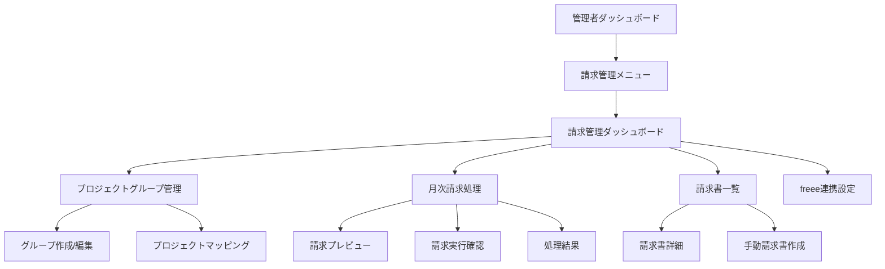

# Monstera 経理機能 詳細設計書

## 1. 概要

本詳細設計書は、基本設計書に基づき、経理機能（請求管理）の実装レベルの詳細を定義する。

### 1.1 更新履歴
| 日付 | バージョン | 内容 | 作成者 |
|------|------------|------|--------|
| 2024-01-28 | 1.0 | 初版作成 | Claude |

## 2. 画面設計

### 2.1 画面一覧と遷移図



### 2.2 サイドバーメニュー構成

```typescript
// frontend/src/constants/menu.ts に追加
export const ADMIN_MENU_ITEMS = [
  // ... 既存メニュー
  {
    title: '請求管理',
    icon: 'ReceiptLong',
    path: '/admin/accounting',
    permission: 'accounting:read',
    subItems: [
      {
        title: 'ダッシュボード',
        path: '/admin/accounting/dashboard'
      },
      {
        title: 'プロジェクトグループ',
        path: '/admin/accounting/project-groups'
      },
      {
        title: '月次請求処理',
        path: '/admin/accounting/billing'
      },
      {
        title: '請求書一覧',
        path: '/admin/accounting/invoices'
      },
      {
        title: 'freee連携設定',
        path: '/admin/accounting/freee-settings'
      }
    ]
  }
];
```

### 2.3 請求管理ダッシュボード

#### レイアウト
```
┌─────────────────────────────────────────────────────────────┐
│ 請求管理ダッシュボード                                      │
├─────────────────────────────────────────────────────────────┤
│ ┌─────────────┐ ┌─────────────┐ ┌─────────────┐         │
│ │ 今月請求額  │ │ 未入金額    │ │ 期限超過    │         │
│ │ ¥12,500,000│ │ ¥3,200,000  │ │ ¥800,000   │         │
│ └─────────────┘ └─────────────┘ └─────────────┘         │
│                                                             │
│ ┌─────────────────────────┐ ┌───────────────────────────┐│
│ │ 月別請求推移（グラフ）  │ │ 取引先別請求状況         ││
│ │                         │ │ ├─ A社: ¥3,000,000 [済] ││
│ │                         │ │ ├─ B社: ¥2,500,000 [未] ││
│ │                         │ │ └─ C社: ¥1,800,000 [超] ││
│ └─────────────────────────┘ └───────────────────────────┘│
│                                                             │
│ ┌─────────────────────────────────────────────────────────┐
│ │ 最近の請求活動                                          ││
│ │ ├─ 2024/01/25 10:30 - 5件の請求書を作成しました       ││
│ │ ├─ 2024/01/24 15:20 - A社の入金を確認しました         ││
│ │ └─ 2024/01/23 09:45 - freee同期が完了しました         ││
│ └─────────────────────────────────────────────────────────┘
└─────────────────────────────────────────────────────────────┘
```

#### コンポーネント設計
```typescript
// frontend/src/app/(admin)/admin/accounting/dashboard/page.tsx
export default function AccountingDashboard() {
  const { data: summary } = useAccountingSummary();
  const { data: recentActivities } = useRecentActivities();
  
  return (
    <Box>
      <Typography variant="h4" gutterBottom>
        請求管理ダッシュボード
      </Typography>
      
      <Grid container spacing={3}>
        {/* KPIカード */}
        <Grid item xs={12} md={4}>
          <KPICard
            title="今月請求額"
            value={summary?.currentMonthBilling}
            format="currency"
            trend={summary?.billingTrend}
          />
        </Grid>
        
        {/* グラフとテーブル */}
        <Grid item xs={12} md={6}>
          <BillingChart data={summary?.monthlyData} />
        </Grid>
        
        {/* 最近の活動 */}
        <Grid item xs={12}>
          <ActivityTimeline activities={recentActivities} />
        </Grid>
      </Grid>
    </Box>
  );
}
```

### 2.4 プロジェクトグループ管理画面

#### 一覧画面
```typescript
// frontend/src/app/(admin)/admin/accounting/project-groups/page.tsx
interface ProjectGroup {
  id: string;
  groupName: string;
  clientName: string;
  projectCount: number;
  totalAmount: number;
  projects: Project[];
}

export default function ProjectGroupList() {
  const columns: GridColDef[] = [
    { field: 'groupName', headerName: 'グループ名', width: 200 },
    { field: 'clientName', headerName: '取引先', width: 200 },
    { field: 'projectCount', headerName: 'プロジェクト数', width: 120 },
    { 
      field: 'totalAmount', 
      headerName: '合計金額', 
      width: 150,
      renderCell: (params) => formatCurrency(params.value)
    },
    {
      field: 'actions',
      headerName: '操作',
      width: 200,
      renderCell: (params) => (
        <>
          <IconButton onClick={() => handleEdit(params.row.id)}>
            <EditIcon />
          </IconButton>
          <IconButton onClick={() => handleMapping(params.row.id)}>
            <LinkIcon />
          </IconButton>
          <IconButton onClick={() => handleDelete(params.row.id)}>
            <DeleteIcon />
          </IconButton>
        </>
      )
    }
  ];
  
  return (
    <DataGrid
      rows={groups}
      columns={columns}
      pageSize={20}
      checkboxSelection={false}
    />
  );
}
```

#### グループ作成/編集ダイアログ
```typescript
interface ProjectGroupFormData {
  groupName: string;
  clientId: string;
  description?: string;
  projectIds: string[];
}

export function ProjectGroupDialog({ 
  open, 
  onClose, 
  groupId 
}: ProjectGroupDialogProps) {
  const { control, handleSubmit } = useForm<ProjectGroupFormData>();
  
  return (
    <Dialog open={open} onClose={onClose} maxWidth="md" fullWidth>
      <form onSubmit={handleSubmit(onSubmit)}>
        <DialogTitle>
          {groupId ? 'プロジェクトグループ編集' : 'プロジェクトグループ作成'}
        </DialogTitle>
        <DialogContent>
          <Grid container spacing={2}>
            <Grid item xs={12}>
              <Controller
                name="groupName"
                control={control}
                rules={{ required: 'グループ名は必須です' }}
                render={({ field, fieldState }) => (
                  <TextField
                    {...field}
                    label="グループ名"
                    fullWidth
                    error={!!fieldState.error}
                    helperText={fieldState.error?.message}
                  />
                )}
              />
            </Grid>
            <Grid item xs={12}>
              <Controller
                name="clientId"
                control={control}
                rules={{ required: '取引先は必須です' }}
                render={({ field }) => (
                  <ClientSelect {...field} label="取引先" />
                )}
              />
            </Grid>
            <Grid item xs={12}>
              <ProjectMultiSelect
                clientId={watch('clientId')}
                value={watch('projectIds')}
                onChange={(ids) => setValue('projectIds', ids)}
              />
            </Grid>
          </Grid>
        </DialogContent>
        <DialogActions>
          <Button onClick={onClose}>キャンセル</Button>
          <Button type="submit" variant="contained">
            {groupId ? '更新' : '作成'}
          </Button>
        </DialogActions>
      </form>
    </Dialog>
  );
}
```

### 2.5 月次請求処理画面

#### 請求プレビュー画面
```typescript
export default function BillingPreview() {
  const [billingMonth, setBillingMonth] = useState(getCurrentMonth());
  const [selectedClients, setSelectedClients] = useState<string[]>([]);
  const { data: preview, isLoading } = useBillingPreview({
    billingMonth,
    clientIds: selectedClients
  });
  
  return (
    <Box>
      <Typography variant="h5" gutterBottom>
        月次請求処理
      </Typography>
      
      {/* フィルター */}
      <Paper sx={{ p: 2, mb: 3 }}>
        <Grid container spacing={2} alignItems="center">
          <Grid item xs={12} md={3}>
            <MonthPicker
              value={billingMonth}
              onChange={setBillingMonth}
              label="請求月"
            />
          </Grid>
          <Grid item xs={12} md={6}>
            <ClientMultiSelect
              value={selectedClients}
              onChange={setSelectedClients}
              label="対象取引先（空の場合は全て）"
            />
          </Grid>
          <Grid item xs={12} md={3}>
            <Button
              variant="contained"
              onClick={handlePreview}
              disabled={isLoading}
              fullWidth
            >
              プレビュー生成
            </Button>
          </Grid>
        </Grid>
      </Paper>
      
      {/* プレビュー結果 */}
      {preview && (
        <>
          <Alert severity="info" sx={{ mb: 2 }}>
            {preview.totalCount}件の請求書が作成されます。
            合計金額: {formatCurrency(preview.totalAmount)}
          </Alert>
          
          <TableContainer component={Paper}>
            <Table>
              <TableHead>
                <TableRow>
                  <TableCell>取引先</TableCell>
                  <TableCell>プロジェクト/グループ</TableCell>
                  <TableCell align="right">請求額</TableCell>
                  <TableCell>締め日</TableCell>
                  <TableCell>ステータス</TableCell>
                </TableRow>
              </TableHead>
              <TableBody>
                {preview.invoices.map((invoice) => (
                  <TableRow key={invoice.clientId}>
                    <TableCell>{invoice.clientName}</TableCell>
                    <TableCell>
                      {invoice.items.map((item) => (
                        <div key={item.id}>
                          {item.type === 'group' ? '📁 ' : '📄 '}
                          {item.name}
                        </div>
                      ))}
                    </TableCell>
                    <TableCell align="right">
                      {formatCurrency(invoice.amount)}
                    </TableCell>
                    <TableCell>{invoice.closingDay}日締め</TableCell>
                    <TableCell>
                      <Chip
                        label={invoice.status}
                        color={invoice.canProcess ? 'success' : 'default'}
                        size="small"
                      />
                    </TableCell>
                  </TableRow>
                ))}
              </TableBody>
            </Table>
          </TableContainer>
          
          {/* 実行ボタン */}
          <Box sx={{ mt: 3, textAlign: 'center' }}>
            <Button
              variant="contained"
              color="primary"
              size="large"
              onClick={handleExecute}
              startIcon={<SendIcon />}
            >
              請求処理を実行
            </Button>
          </Box>
        </>
      )}
    </Box>
  );
}
```

#### 予約実行設定ダイアログ
```typescript
export function ScheduleDialog({ open, onClose }: ScheduleDialogProps) {
  const { control, handleSubmit } = useForm<ScheduleFormData>();
  
  return (
    <Dialog open={open} onClose={onClose}>
      <DialogTitle>請求処理の予約実行</DialogTitle>
      <DialogContent>
        <Grid container spacing={2}>
          <Grid item xs={12}>
            <Controller
              name="executionDate"
              control={control}
              render={({ field }) => (
                <DateTimePicker
                  {...field}
                  label="実行日時"
                  minDateTime={new Date()}
                />
              )}
            />
          </Grid>
          <Grid item xs={12}>
            <Controller
              name="recurrence"
              control={control}
              render={({ field }) => (
                <Select {...field} label="繰り返し設定">
                  <MenuItem value="once">1回のみ</MenuItem>
                  <MenuItem value="monthly">毎月</MenuItem>
                </Select>
              )}
            />
          </Grid>
          {watch('recurrence') === 'monthly' && (
            <Grid item xs={12}>
              <Controller
                name="executionDay"
                control={control}
                render={({ field }) => (
                  <TextField
                    {...field}
                    type="number"
                    label="実行日（1-31）"
                    helperText="31を指定すると月末実行"
                  />
                )}
              />
            </Grid>
          )}
        </Grid>
      </DialogContent>
      <DialogActions>
        <Button onClick={onClose}>キャンセル</Button>
        <Button onClick={handleSubmit(onSubmit)} variant="contained">
          予約
        </Button>
      </DialogActions>
    </Dialog>
  );
}
```

## 3. API詳細設計

### 3.1 プロジェクトグループAPI

#### GET /api/v1/admin/accounting/project-groups
```go
// リクエストパラメータ
type GetProjectGroupsRequest struct {
    ClientID string `form:"client_id"`
    Page     int    `form:"page" binding:"min=1"`
    Limit    int    `form:"limit" binding:"min=1,max=100"`
}

// レスポンス
type GetProjectGroupsResponse struct {
    Groups []ProjectGroupDTO `json:"groups"`
    Total  int64            `json:"total"`
    Page   int              `json:"page"`
    Limit  int              `json:"limit"`
}

type ProjectGroupDTO struct {
    ID           string    `json:"id"`
    GroupName    string    `json:"group_name"`
    ClientID     string    `json:"client_id"`
    ClientName   string    `json:"client_name"`
    Description  string    `json:"description"`
    ProjectCount int       `json:"project_count"`
    TotalAmount  float64   `json:"total_amount"`
    Projects     []ProjectSummaryDTO `json:"projects"`
    CreatedAt    time.Time `json:"created_at"`
    UpdatedAt    time.Time `json:"updated_at"`
}
```

#### POST /api/v1/admin/accounting/project-groups
```go
// リクエスト
type CreateProjectGroupRequest struct {
    GroupName   string   `json:"group_name" binding:"required,max=255"`
    ClientID    string   `json:"client_id" binding:"required,uuid"`
    Description string   `json:"description" binding:"max=1000"`
    ProjectIDs  []string `json:"project_ids" binding:"required,min=1,dive,uuid"`
}

// バリデーション
func (r *CreateProjectGroupRequest) Validate(ctx context.Context, db *gorm.DB) error {
    // 同一取引先内でグループ名の重複チェック
    var count int64
    db.Model(&model.ProjectGroup{}).
        Where("client_id = ? AND group_name = ? AND deleted_at IS NULL", 
            r.ClientID, r.GroupName).
        Count(&count)
    
    if count > 0 {
        return errors.New("同じ取引先内に同名のグループが存在します")
    }
    
    // プロジェクトの存在確認と取引先整合性チェック
    var projects []model.Project
    db.Where("id IN ? AND client_id = ?", r.ProjectIDs, r.ClientID).
        Find(&projects)
    
    if len(projects) != len(r.ProjectIDs) {
        return errors.New("指定されたプロジェクトが存在しないか、取引先が一致しません")
    }
    
    return nil
}
```

### 3.2 月次請求処理API

#### POST /api/v1/admin/accounting/billing/preview
```go
// リクエスト
type BillingPreviewRequest struct {
    BillingMonth string   `json:"billing_month" binding:"required,datetime=2006-01"`
    ClientIDs    []string `json:"client_ids" binding:"dive,uuid"`
    DryRun       bool     `json:"dry_run"`
}

// レスポンス
type BillingPreviewResponse struct {
    TotalCount  int                     `json:"total_count"`
    TotalAmount float64                 `json:"total_amount"`
    Invoices    []BillingPreviewInvoice `json:"invoices"`
    Warnings    []string                `json:"warnings"`
}

type BillingPreviewInvoice struct {
    ClientID     string               `json:"client_id"`
    ClientName   string               `json:"client_name"`
    ClosingDay   int                  `json:"closing_day"`
    CanProcess   bool                 `json:"can_process"`
    Status       string               `json:"status"`
    Amount       float64              `json:"amount"`
    Items        []BillingPreviewItem `json:"items"`
    ErrorMessage string               `json:"error_message,omitempty"`
}

// 実装
func (s *billingService) GeneratePreview(
    ctx context.Context, 
    req *BillingPreviewRequest,
) (*BillingPreviewResponse, error) {
    
    billingDate, _ := time.Parse("2006-01", req.BillingMonth)
    
    // 対象取引先の取得
    query := s.db.Model(&model.Client{}).
        Where("deleted_at IS NULL")
    
    if len(req.ClientIDs) > 0 {
        query = query.Where("id IN ?", req.ClientIDs)
    }
    
    var clients []model.Client
    query.Find(&clients)
    
    var invoices []BillingPreviewInvoice
    var totalAmount float64
    
    for _, client := range clients {
        // 締め日チェック
        if !s.shouldProcessClient(client, billingDate) {
            continue
        }
        
        // プロジェクトとグループの集計
        invoice := s.calculateClientInvoice(ctx, client, billingDate)
        invoices = append(invoices, invoice)
        totalAmount += invoice.Amount
    }
    
    return &BillingPreviewResponse{
        TotalCount:  len(invoices),
        TotalAmount: totalAmount,
        Invoices:    invoices,
    }, nil
}
```

#### POST /api/v1/admin/accounting/billing/process
```go
// リクエスト
type BillingProcessRequest struct {
    BillingMonth   string   `json:"billing_month" binding:"required"`
    ClientIDs      []string `json:"client_ids"`
    ScheduledAt    *time.Time `json:"scheduled_at"`
    RecurrenceType string   `json:"recurrence_type" binding:"omitempty,oneof=once monthly"`
}

// レスポンス  
type BillingProcessResponse struct {
    JobID         string                   `json:"job_id"`
    ProcessedCount int                     `json:"processed_count"`
    TotalAmount   float64                  `json:"total_amount"`
    Results       []BillingProcessResult   `json:"results"`
    Errors        []BillingProcessError    `json:"errors"`
}

// 分割処理の実装
func (s *billingService) ProcessBilling(
    ctx context.Context,
    req *BillingProcessRequest,
) (*BillingProcessResponse, error) {
    
    const BATCH_SIZE = 10
    jobID := uuid.New().String()
    
    // 予約実行の場合
    if req.ScheduledAt != nil && req.ScheduledAt.After(time.Now()) {
        return s.scheduleJob(ctx, jobID, req)
    }
    
    // 即時実行
    clients := s.getTargetClients(ctx, req.ClientIDs)
    batches := s.chunkClients(clients, BATCH_SIZE)
    
    var results []BillingProcessResult
    var errors []BillingProcessError
    var mu sync.Mutex
    
    for i, batch := range batches {
        // バッチごとに処理
        batchResults, batchErrors := s.processBatch(ctx, batch, req.BillingMonth)
        
        mu.Lock()
        results = append(results, batchResults...)
        errors = append(errors, batchErrors...)
        mu.Unlock()
        
        // 進捗更新
        s.updateJobProgress(jobID, (i+1)*100/len(batches))
    }
    
    return &BillingProcessResponse{
        JobID:          jobID,
        ProcessedCount: len(results),
        Results:        results,
        Errors:         errors,
    }, nil
}
```

### 3.3 freee連携API

#### GET /api/v1/admin/accounting/freee/auth
```go
func (h *freeeHandler) InitiateAuth(c *gin.Context) {
    state := generateRandomState()
    
    // セッションに保存
    session := sessions.Default(c)
    session.Set("oauth_state", state)
    session.Save()
    
    authURL := fmt.Sprintf(
        "https://accounts.secure.freee.co.jp/public_api/authorize?"+
        "client_id=%s&redirect_uri=%s&response_type=code&state=%s",
        h.config.FreeeClientID,
        url.QueryEscape(h.config.FreeeRedirectURI),
        state,
    )
    
    c.JSON(http.StatusOK, gin.H{
        "auth_url": authURL,
    })
}
```

#### GET /api/v1/admin/accounting/freee/callback
```go
func (h *freeeHandler) HandleCallback(c *gin.Context) {
    code := c.Query("code")
    state := c.Query("state")
    
    // State検証
    session := sessions.Default(c)
    savedState := session.Get("oauth_state")
    
    if savedState != state {
        RespondError(c, http.StatusBadRequest, "無効なstateパラメータです")
        return
    }
    
    // トークン取得
    token, err := h.exchangeToken(code)
    if err != nil {
        HandleError(c, err, "トークンの取得に失敗しました")
        return
    }
    
    // トークンを暗号化して保存
    encryptedToken := h.encryptToken(token)
    h.saveToken(c.Request.Context(), encryptedToken)
    
    // フロントエンドにリダイレクト
    c.Redirect(http.StatusFound, "/admin/accounting/freee-settings?status=connected")
}
```

## 4. データベース詳細設計

### 4.1 インデックス設計

```sql
-- project_groups
CREATE INDEX idx_project_groups_client_id ON project_groups(client_id);
CREATE INDEX idx_project_groups_deleted_at ON project_groups(deleted_at);

-- project_group_mappings  
CREATE INDEX idx_pgm_project_group_id ON project_group_mappings(project_group_id);
CREATE INDEX idx_pgm_project_id ON project_group_mappings(project_id);

-- freee_sync_logs
CREATE INDEX idx_fsl_sync_type_created ON freee_sync_logs(sync_type, created_at);
CREATE INDEX idx_fsl_target_id ON freee_sync_logs(target_id);
CREATE INDEX idx_fsl_status ON freee_sync_logs(status);

-- invoices（追加インデックス）
CREATE INDEX idx_invoices_freee_sync ON invoices(freee_sync_status, freee_synced_at);
CREATE INDEX idx_invoices_project_group ON invoices(project_group_id);
```

### 4.2 制約とトリガー

```sql
-- 請求書の変更履歴を自動記録するトリガー
CREATE TABLE invoice_audit_logs (
    id VARCHAR(36) PRIMARY KEY,
    invoice_id VARCHAR(36) NOT NULL,
    action ENUM('CREATE', 'UPDATE', 'DELETE') NOT NULL,
    changed_by VARCHAR(36) NOT NULL,
    changed_at DATETIME(3) NOT NULL,
    old_values JSON,
    new_values JSON,
    FOREIGN KEY (invoice_id) REFERENCES invoices(id),
    FOREIGN KEY (changed_by) REFERENCES users(id)
);

DELIMITER $$
CREATE TRIGGER invoice_audit_update
AFTER UPDATE ON invoices
FOR EACH ROW
BEGIN
    INSERT INTO invoice_audit_logs (
        id, invoice_id, action, changed_by, changed_at, old_values, new_values
    ) VALUES (
        UUID(),
        NEW.id,
        'UPDATE',
        NEW.updated_by,
        NOW(3),
        JSON_OBJECT(
            'status', OLD.status,
            'total_amount', OLD.total_amount,
            'notes', OLD.notes
        ),
        JSON_OBJECT(
            'status', NEW.status,
            'total_amount', NEW.total_amount,
            'notes', NEW.notes
        )
    );
END$$
DELIMITER ;
```

### 4.3 データ保持ポリシー

```sql
-- 7年経過した請求データを削除するイベント（月次実行）
CREATE EVENT IF NOT EXISTS purge_old_invoices
ON SCHEDULE EVERY 1 MONTH
DO
BEGIN
    -- アーカイブテーブルに移動
    INSERT INTO archived_invoices 
    SELECT * FROM invoices 
    WHERE created_at < DATE_SUB(NOW(), INTERVAL 7 YEAR);
    
    -- 元テーブルから削除
    DELETE FROM invoices 
    WHERE created_at < DATE_SUB(NOW(), INTERVAL 7 YEAR);
    
    -- 関連データも同様に処理
    DELETE FROM invoice_details 
    WHERE invoice_id NOT IN (SELECT id FROM invoices);
END;
```

## 5. バッチ処理設計

### 5.1 予約実行管理

```go
// model/scheduled_job.go
type ScheduledJob struct {
    ID             string    `gorm:"type:varchar(36);primary_key"`
    JobType        string    `gorm:"type:varchar(50);not null"`
    ScheduledAt    time.Time `gorm:"not null"`
    RecurrenceType string    `gorm:"type:varchar(20)"`
    RecurrenceDay  int       `gorm:"default:0"`
    Parameters     JSON      `gorm:"type:json"`
    Status         string    `gorm:"type:varchar(20);default:'pending'"`
    LastRunAt      *time.Time
    NextRunAt      *time.Time
    CreatedBy      string    `gorm:"type:varchar(36)"`
    CreatedAt      time.Time
    UpdatedAt      time.Time
}

// service/job_scheduler.go
type JobScheduler struct {
    db     *gorm.DB
    ticker *time.Ticker
    logger *zap.Logger
}

func (s *JobScheduler) Start(ctx context.Context) {
    s.ticker = time.NewTicker(1 * time.Minute)
    
    go func() {
        for {
            select {
            case <-ctx.Done():
                return
            case <-s.ticker.C:
                s.processScheduledJobs(ctx)
            }
        }
    }()
}

func (s *JobScheduler) processScheduledJobs(ctx context.Context) {
    var jobs []ScheduledJob
    
    s.db.Where("status = ? AND scheduled_at <= ?", "pending", time.Now()).
        Find(&jobs)
    
    for _, job := range jobs {
        go s.executeJob(ctx, job)
    }
}
```

### 5.2 分割処理の実装

```go
// service/billing_batch_processor.go
type BatchProcessor struct {
    db           *gorm.DB
    freeeClient  *FreeeClient
    logger       *zap.Logger
    batchSize    int
    maxRetries   int
}

func (p *BatchProcessor) ProcessInBatches(
    ctx context.Context,
    clients []model.Client,
    billingMonth string,
) (*BatchResult, error) {
    
    batches := p.createBatches(clients)
    results := &BatchResult{
        Total:     len(clients),
        Processed: 0,
        Failed:    0,
    }
    
    for i, batch := range batches {
        select {
        case <-ctx.Done():
            return results, ctx.Err()
        default:
        }
        
        batchResult := p.processSingleBatch(ctx, batch, billingMonth)
        results.merge(batchResult)
        
        // 進捗通知
        p.notifyProgress(i+1, len(batches), results)
        
        // レート制限対策
        if i < len(batches)-1 {
            time.Sleep(1 * time.Second)
        }
    }
    
    return results, nil
}

func (p *BatchProcessor) processSingleBatch(
    ctx context.Context,
    clients []model.Client,
    billingMonth string,
) *BatchResult {
    
    result := &BatchResult{}
    
    for _, client := range clients {
        err := p.processClient(ctx, client, billingMonth)
        
        if err != nil {
            result.Failed++
            p.logger.Error("Failed to process client",
                zap.String("client_id", client.ID.String()),
                zap.Error(err),
            )
            
            // リトライロジック
            if p.shouldRetry(err) {
                p.scheduleRetry(client, billingMonth)
            }
        } else {
            result.Processed++
        }
    }
    
    return result
}
```

## 6. エラーハンドリング設計

### 6.1 エラーコード定義

```go
// internal/errors/accounting_errors.go
const (
    // freee連携エラー
    ErrFreeeAuthRequired      = "FREEE_AUTH_001"
    ErrFreeeTokenExpired      = "FREEE_AUTH_002"
    ErrFreeeAPILimit          = "FREEE_API_001"
    ErrFreeeServerError       = "FREEE_API_002"
    
    // 請求処理エラー
    ErrInvoiceAlreadyExists   = "INVOICE_001"
    ErrInvalidBillingPeriod   = "INVOICE_002"
    ErrNoProjectsToInvoice    = "INVOICE_003"
    
    // データ整合性エラー
    ErrClientNotSynced        = "SYNC_001"
    ErrDataMismatch           = "SYNC_002"
)

var errorMessages = map[string]string{
    ErrFreeeAuthRequired:    "freee認証が必要です",
    ErrFreeeTokenExpired:    "freee認証の有効期限が切れています",
    ErrFreeeAPILimit:        "freee APIの利用制限に達しました",
    ErrFreeeServerError:     "freeeサーバーでエラーが発生しました",
    ErrInvoiceAlreadyExists: "指定された期間の請求書は既に作成されています",
    ErrInvalidBillingPeriod: "無効な請求期間です",
    ErrNoProjectsToInvoice:  "請求対象のプロジェクトがありません",
    ErrClientNotSynced:      "取引先情報がfreeeと同期されていません",
    ErrDataMismatch:         "データの不整合が検出されました",
}
```

### 6.2 エラーハンドリングミドルウェア

```go
// middleware/error_recovery.go
func ErrorRecoveryMiddleware(logger *zap.Logger) gin.HandlerFunc {
    return func(c *gin.Context) {
        defer func() {
            if err := recover(); err != nil {
                logger.Error("Panic recovered",
                    zap.Any("error", err),
                    zap.String("path", c.Request.URL.Path),
                    zap.String("method", c.Request.Method),
                )
                
                RespondError(c, http.StatusInternalServerError, 
                    "予期しないエラーが発生しました")
                c.Abort()
            }
        }()
        
        c.Next()
    }
}
```

### 6.3 フロントエンドエラー表示

```typescript
// hooks/useAccountingErrorHandler.ts
export function useAccountingErrorHandler() {
  const { showError } = useToast();
  
  const handleError = (error: ApiError, context: string) => {
    let message = 'エラーが発生しました';
    
    switch (error.code) {
      case 'FREEE_AUTH_001':
      case 'FREEE_AUTH_002':
        message = 'freee認証が必要です。設定画面から再認証してください。';
        break;
        
      case 'FREEE_API_001':
        message = 'API制限に達しました。しばらく待ってから再試行してください。';
        break;
        
      case 'INVOICE_001':
        message = '既に請求書が作成されています。請求書一覧をご確認ください。';
        break;
        
      default:
        message = error.message || message;
    }
    
    showError(`${context}: ${message}`);
    
    // 認証エラーの場合は設定画面へ誘導
    if (error.code?.startsWith('FREEE_AUTH')) {
      setTimeout(() => {
        router.push('/admin/accounting/freee-settings');
      }, 2000);
    }
  };
  
  return { handleError };
}
```

## 7. セキュリティ設計

### 7.1 認証情報の暗号化

```go
// internal/crypto/token_encryption.go
type TokenEncryption struct {
    key []byte
}

func NewTokenEncryption(secretKey string) *TokenEncryption {
    // 32バイトのキーを生成
    h := sha256.Sum256([]byte(secretKey))
    return &TokenEncryption{key: h[:]}
}

func (e *TokenEncryption) Encrypt(token *oauth2.Token) (string, error) {
    // トークンをJSON化
    data, err := json.Marshal(token)
    if err != nil {
        return "", err
    }
    
    // AES-GCMで暗号化
    block, err := aes.NewCipher(e.key)
    if err != nil {
        return "", err
    }
    
    gcm, err := cipher.NewGCM(block)
    if err != nil {
        return "", err
    }
    
    nonce := make([]byte, gcm.NonceSize())
    if _, err := io.ReadFull(rand.Reader, nonce); err != nil {
        return "", err
    }
    
    ciphertext := gcm.Seal(nonce, nonce, data, nil)
    return base64.StdEncoding.EncodeToString(ciphertext), nil
}
```

### 7.2 権限チェック

```go
// middleware/accounting_permission.go
func AccountingPermissionRequired() gin.HandlerFunc {
    return func(c *gin.Context) {
        user := GetCurrentUser(c)
        
        if !user.HasPermission("accounting:read") {
            RespondError(c, http.StatusForbidden, 
                "請求管理機能へのアクセス権限がありません")
            c.Abort()
            return
        }
        
        c.Next()
    }
}
```

## 8. パフォーマンス最適化

### 8.1 クエリ最適化

```go
// repository/optimized_queries.go

// N+1問題を回避した請求データ取得
func (r *invoiceRepository) GetInvoicesWithDetails(
    ctx context.Context,
    clientIDs []string,
    billingMonth string,
) ([]model.Invoice, error) {
    
    var invoices []model.Invoice
    
    // 1回のクエリで関連データを取得
    err := r.db.WithContext(ctx).
        Preload("Client").
        Preload("Details").
        Preload("Details.Project").
        Preload("ProjectGroup").
        Preload("ProjectGroup.Projects").
        Where("client_id IN ? AND billing_month = ?", 
            clientIDs, billingMonth).
        Find(&invoices).Error
    
    return invoices, err
}

// バルクインサート
func (r *invoiceRepository) BulkCreateInvoices(
    ctx context.Context,
    invoices []model.Invoice,
) error {
    
    // 1000件ずつに分割してインサート
    const chunkSize = 1000
    
    for i := 0; i < len(invoices); i += chunkSize {
        end := i + chunkSize
        if end > len(invoices) {
            end = len(invoices)
        }
        
        if err := r.db.WithContext(ctx).
            CreateInBatches(invoices[i:end], chunkSize).Error; err != nil {
            return err
        }
    }
    
    return nil
}
```

### 8.2 キャッシュ戦略

```go
// service/cache_service.go
type CacheService struct {
    redis *redis.Client
    ttl   time.Duration
}

func (s *CacheService) GetClientBillingInfo(
    ctx context.Context,
    clientID string,
) (*ClientBillingInfo, error) {
    
    key := fmt.Sprintf("billing:client:%s", clientID)
    
    // キャッシュから取得
    data, err := s.redis.Get(ctx, key).Bytes()
    if err == nil {
        var info ClientBillingInfo
        json.Unmarshal(data, &info)
        return &info, nil
    }
    
    // DBから取得してキャッシュ
    info := s.fetchFromDB(ctx, clientID)
    data, _ = json.Marshal(info)
    s.redis.Set(ctx, key, data, s.ttl)
    
    return info, nil
}
```

## 9. テスト設計

### 9.1 単体テスト

```go
// service/billing_service_test.go
func TestCalculateBilling(t *testing.T) {
    tests := []struct {
        name          string
        billingType   string
        billingRate   float64
        actualHours   float64
        minHours      float64
        maxHours      float64
        expectedAmount float64
    }{
        {
            name:          "固定精算",
            billingType:   "fixed",
            billingRate:   700000,
            actualHours:   160,
            expectedAmount: 700000,
        },
        {
            name:          "上下割精算_下限割れ",
            billingType:   "variable_upper_lower",
            billingRate:   700000,
            actualHours:   130,
            minHours:      140,
            maxHours:      180,
            expectedAmount: 650000, // 700000 - (10 * 5000)
        },
        {
            name:          "上下割精算_上限超過",
            billingType:   "variable_upper_lower",
            billingRate:   700000,
            actualHours:   185,
            minHours:      140,
            maxHours:      180,
            expectedAmount: 719500, // 700000 + (5 * 3900)
        },
    }
    
    for _, tt := range tests {
        t.Run(tt.name, func(t *testing.T) {
            service := NewBillingService(nil, nil)
            amount := service.calculateAmount(
                tt.billingType,
                tt.billingRate,
                tt.actualHours,
                tt.minHours,
                tt.maxHours,
            )
            assert.Equal(t, tt.expectedAmount, amount)
        })
    }
}
```

### 9.2 統合テスト

```go
// handler/billing_handler_test.go
func TestBillingProcessAPI(t *testing.T) {
    router := setupTestRouter()
    
    // テストデータ作成
    client := createTestClient(t, "テスト株式会社")
    project := createTestProject(t, client.ID, 700000)
    
    // APIリクエスト
    body := map[string]interface{}{
        "billing_month": "2024-01",
        "client_ids":    []string{client.ID.String()},
    }
    
    req := httptest.NewRequest("POST", "/api/v1/admin/accounting/billing/process", 
        toJSON(body))
    req.Header.Set("Authorization", "Bearer "+testToken)
    
    w := httptest.NewRecorder()
    router.ServeHTTP(w, req)
    
    // レスポンス検証
    assert.Equal(t, http.StatusOK, w.Code)
    
    var resp BillingProcessResponse
    json.Unmarshal(w.Body.Bytes(), &resp)
    
    assert.Equal(t, 1, resp.ProcessedCount)
    assert.Equal(t, 700000.0, resp.TotalAmount)
}
```

## 10. 運用監視設計

### 10.1 ログ設計

```go
// internal/logger/accounting_logger.go
type AccountingLogger struct {
    base *zap.Logger
}

func (l *AccountingLogger) LogBillingProcess(
    jobID string,
    clientID string,
    amount float64,
    status string,
    duration time.Duration,
) {
    l.base.Info("Billing process completed",
        zap.String("job_id", jobID),
        zap.String("client_id", clientID),
        zap.Float64("amount", amount),
        zap.String("status", status),
        zap.Duration("duration", duration),
        zap.String("component", "billing"),
    )
}

func (l *AccountingLogger) LogFreeeSync(
    syncType string,
    targetID string,
    freeeID int,
    status string,
    error error,
) {
    fields := []zap.Field{
        zap.String("sync_type", syncType),
        zap.String("target_id", targetID),
        zap.Int("freee_id", freeeID),
        zap.String("status", status),
        zap.String("component", "freee_sync"),
    }
    
    if error != nil {
        fields = append(fields, zap.Error(error))
        l.base.Error("Freee sync failed", fields...)
    } else {
        l.base.Info("Freee sync completed", fields...)
    }
}
```

### 10.2 メトリクス設計

```go
// internal/metrics/accounting_metrics.go
var (
    billingProcessDuration = prometheus.NewHistogramVec(
        prometheus.HistogramOpts{
            Name: "billing_process_duration_seconds",
            Help: "Duration of billing process",
        },
        []string{"status"},
    )
    
    freeeAPICalls = prometheus.NewCounterVec(
        prometheus.CounterOpts{
            Name: "freee_api_calls_total",
            Help: "Total number of freee API calls",
        },
        []string{"endpoint", "status"},
    )
    
    invoiceAmount = prometheus.NewGaugeVec(
        prometheus.GaugeOpts{
            Name: "invoice_amount_total",
            Help: "Total invoice amount",
        },
        []string{"month"},
    )
)
```

## 11. 移行計画

### 11.1 段階的リリース計画

1. **Phase 1**: 基本機能（2週間）
   - プロジェクトグループ管理
   - freee連携設定
   - 取引先同期

2. **Phase 2**: 請求処理（2週間）
   - 月次請求プレビュー
   - 手動請求実行
   - 請求書一覧

3. **Phase 3**: 自動化（1週間）
   - 予約実行
   - 入金同期
   - ダッシュボード

### 11.2 データ移行

```sql
-- 既存請求書データのfreeeフィールド初期化
UPDATE invoices 
SET freee_sync_status = 'pending',
    freee_company_id = 12078529
WHERE deleted_at IS NULL;

-- 取引先の請求締め日設定（デフォルト月末）
UPDATE clients 
SET billing_closing_day = 31
WHERE billing_closing_day IS NULL;
```

## 12. 付録

### 12.1 用語集

| 用語 | 説明 | 英語表記 |
|------|------|----------|
| プロジェクトグループ | 複数プロジェクトをまとめて請求する単位 | Project Group |
| 精算幅 | 工数の上限・下限時間 | Billing Range |
| 締め日 | 月次請求の締切日 | Closing Day |
| 上下割精算 | 上限・下限で異なる単価計算方式 | Upper/Lower Rate |
| 中間値精算 | 精算幅の中間値で単価計算する方式 | Middle Rate |

### 12.2 参考資料

- freee API ドキュメント: https://developer.freee.co.jp/
- OAuth 2.0 仕様: https://oauth.net/2/
- Monstera 開発ガイド: /docs/00_project_overview/

---

以上