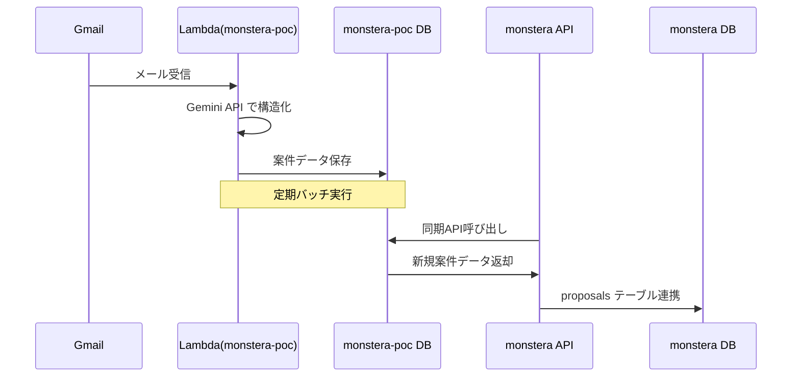

# 営業関連機能 基本設計書

> ⚠️ **注意**: この機能は未実装です。将来的な実装予定の設計書です。

## 📋 目次
1. [システム概要](#システム概要)
2. [機能一覧](#機能一覧)
3. [データベース設計](#データベース設計)
4. [画面設計](#画面設計)
5. [API設計](#api設計)
6. [権限設計](#権限設計)
7. [外部連携設計](#外部連携設計)
8. [開発計画](#開発計画)

---

## システム概要

### 目的
SES企業の営業活動効率化を目的とした管理機能の追加開発

### 対象ユーザー
- **営業担当者**: 提案活動、進捗管理、面談管理
- **管理部**: 全体進捗確認、延長確認管理、営業指標管理

### 基本方針
- 既存システム（monstera）との高い親和性
- 既存機能の最大限活用
- monstera-pocとのシームレスな連携

---

## 機能一覧

### 🎯 新規実装機能
| 機能名 | 概要 | 優先度 |
|--------|------|--------|
| **提案進捗状況管理** | エンジニア提案の進捗管理 | 高 |
| **営業進捗状況可視化** | 一覧表形式での進捗確認 | 高 |
| **面談日程管理** | カレンダー形式の面談管理 | 高 |
| **並行営業状況可視化** | エンジニア単位の複数案件管理 | 高 |
| **延長確認対象者一覧化** | 契約延長確認の自動管理 | 高 |
| **営業対象者一覧化** | 待機・退場エンジニア管理 | 高 |
| **顧客情報管理拡張** | 営業視点での顧客情報強化 | 高 |
| **提案案件自動取り込み** | monstera-poc連携 | 高 |
| **要員提案メール一斉送信** | テンプレート化メール送信 | 低 |

### ♻️ 既存機能流用
| 既存機能 | 流用先機能 | 流用内容 |
|----------|------------|----------|
| 営業パイプライン | 提案進捗状況管理 | ステータス管理基盤 |
| EmailService | 要員提案メール送信 | メール送信エンジン |
| DataTable | 各種一覧機能 | 一覧表示・検索基盤 |
| アラート機能 | 延長確認アラート | 通知エンジン |
| 取引先管理 | 顧客情報管理 | CRUD基盤 |
| エンジニア管理 | 営業対象者管理 | ユーザー情報基盤 |

---

## データベース設計

### 🆕 新規テーブル

#### 1. proposals（提案管理）
```sql
CREATE TABLE proposals (
    id VARCHAR(36) PRIMARY KEY,
    project_id VARCHAR(36) NOT NULL, -- monstera-poc案件ID
    engineer_id VARCHAR(36) NOT NULL REFERENCES users(id),
    client_id VARCHAR(36) NOT NULL REFERENCES clients(id),
    
    -- 提案情報
    proposal_date DATE NOT NULL,
    proposal_amount INTEGER,
    skill_sheet_url VARCHAR(500), -- スキルシートファイルパス
    
    -- ステータス管理
    status ENUM('preparing', 'submitted', 'interviewing', 'awaiting_response', 
                'offer_received', 'declined', 'accepted', 'rejected') NOT NULL DEFAULT 'preparing',
    
    -- 面談情報
    interview_date DATETIME,
    interview_location VARCHAR(255),
    interview_notes TEXT,
    
    -- 回答期限
    response_deadline DATE,
    
    -- 結果情報
    rejection_reason TEXT,
    acceptance_conditions TEXT,
    
    created_at TIMESTAMP DEFAULT CURRENT_TIMESTAMP,
    updated_at TIMESTAMP DEFAULT CURRENT_TIMESTAMP ON UPDATE CURRENT_TIMESTAMP,
    deleted_at TIMESTAMP NULL,
    
    INDEX idx_proposals_engineer (engineer_id),
    INDEX idx_proposals_project (project_id),
    INDEX idx_proposals_status (status),
    INDEX idx_proposals_date (proposal_date DESC)
);
```

#### 2. contract_extensions（延長確認管理）
```sql
CREATE TABLE contract_extensions (
    id VARCHAR(36) PRIMARY KEY,
    engineer_id VARCHAR(36) NOT NULL REFERENCES users(id),
    project_id VARCHAR(36), -- 現在参画中の案件
    
    -- 契約情報
    current_contract_end_date DATE NOT NULL,
    extension_check_date DATE NOT NULL, -- 確認実施日
    
    -- 確認状況
    status ENUM('pending', 'requested', 'approved', 'leaving') NOT NULL DEFAULT 'pending',
    
    -- 確認内容
    extension_request_date DATE,
    client_response_date DATE,
    extension_period_months INTEGER,
    new_contract_end_date DATE,
    
    -- 備考
    notes TEXT,
    
    created_at TIMESTAMP DEFAULT CURRENT_TIMESTAMP,
    updated_at TIMESTAMP DEFAULT CURRENT_TIMESTAMP ON UPDATE CURRENT_TIMESTAMP,
    deleted_at TIMESTAMP NULL,
    
    INDEX idx_extensions_engineer (engineer_id),
    INDEX idx_extensions_status (status),
    INDEX idx_extensions_check_date (extension_check_date)
);
```

#### 3. interview_schedules（面談日程管理）
```sql
CREATE TABLE interview_schedules (
    id VARCHAR(36) PRIMARY KEY,
    proposal_id VARCHAR(36) NOT NULL REFERENCES proposals(id),
    
    -- 面談情報
    scheduled_date DATETIME NOT NULL,
    end_time DATETIME,
    location VARCHAR(255),
    meeting_type ENUM('onsite', 'online', 'hybrid') DEFAULT 'onsite',
    meeting_url VARCHAR(500), -- オンライン面談URL
    
    -- 参加者情報
    client_attendees JSON, -- [{name, role, email}]
    engineer_attendees JSON, -- 同行者情報
    
    -- リマインダー
    reminder_sent_at TIMESTAMP NULL,
    
    -- ステータス
    status ENUM('scheduled', 'completed', 'cancelled', 'rescheduled') DEFAULT 'scheduled',
    
    -- 結果
    interview_result TEXT,
    next_steps TEXT,
    
    created_at TIMESTAMP DEFAULT CURRENT_TIMESTAMP,
    updated_at TIMESTAMP DEFAULT CURRENT_TIMESTAMP ON UPDATE CURRENT_TIMESTAMP,
    deleted_at TIMESTAMP NULL,
    
    INDEX idx_interviews_proposal (proposal_id),
    INDEX idx_interviews_date (scheduled_date),
    INDEX idx_interviews_status (status)
);
```

#### 4. email_templates（メールテンプレート）
```sql
CREATE TABLE email_templates (
    id VARCHAR(36) PRIMARY KEY,
    name VARCHAR(100) NOT NULL,
    subject VARCHAR(200) NOT NULL,
    body_html TEXT NOT NULL,
    body_text TEXT,
    
    -- 変数定義
    variables JSON, -- 利用可能な変数リスト
    
    -- 分類
    category VARCHAR(50), -- 'proposal', 'interview', 'extension'
    is_active BOOLEAN DEFAULT TRUE,
    
    created_at TIMESTAMP DEFAULT CURRENT_TIMESTAMP,
    updated_at TIMESTAMP DEFAULT CURRENT_TIMESTAMP ON UPDATE CURRENT_TIMESTAMP,
    deleted_at TIMESTAMP NULL,
    
    INDEX idx_templates_category (category),
    INDEX idx_templates_active (is_active)
);
```

#### 5. email_campaigns（メール送信履歴）
```sql
CREATE TABLE email_campaigns (
    id VARCHAR(36) PRIMARY KEY,
    template_id VARCHAR(36) REFERENCES email_templates(id),
    sender_id VARCHAR(36) NOT NULL REFERENCES users(id),
    
    -- 送信情報
    subject VARCHAR(200) NOT NULL,
    recipient_count INTEGER DEFAULT 0,
    sent_count INTEGER DEFAULT 0,
    delivered_count INTEGER DEFAULT 0,
    opened_count INTEGER DEFAULT 0,
    
    -- ステータス
    status ENUM('draft', 'sending', 'completed', 'failed') DEFAULT 'draft',
    
    -- 送信対象条件
    target_conditions JSON, -- 送信対象の抽出条件
    
    sent_at TIMESTAMP NULL,
    completed_at TIMESTAMP NULL,
    
    created_at TIMESTAMP DEFAULT CURRENT_TIMESTAMP,
    updated_at TIMESTAMP DEFAULT CURRENT_TIMESTAMP ON UPDATE CURRENT_TIMESTAMP,
    
    INDEX idx_campaigns_sender (sender_id),
    INDEX idx_campaigns_status (status),
    INDEX idx_campaigns_sent_at (sent_at DESC)
);
```

### 🔄 既存テーブル拡張

#### clients テーブル追加項目
```sql
ALTER TABLE clients ADD COLUMN (
    -- 営業管理情報
    primary_sales_rep_id VARCHAR(36) REFERENCES users(id),
    business_status ENUM('active', 'inactive', 'suspended') DEFAULT 'active',
    company_size ENUM('small', 'medium', 'large', 'enterprise'),
    industry_type VARCHAR(100),
    
    -- 取引履歴
    business_start_date DATE,
    last_transaction_date DATE,
    annual_revenue INTEGER, -- 年間売上（万円）
    
    -- 企業詳細
    website_url VARCHAR(255),
    employee_count INTEGER,
    capital_amount BIGINT, -- 資本金
    stock_exchange VARCHAR(50), -- 上場取引所
    
    INDEX idx_clients_sales_rep (primary_sales_rep_id),
    INDEX idx_clients_business_status (business_status)
);
```

### 🔗 monstera-poc連携テーブル

#### poc_projects（案件情報同期）
```sql
CREATE TABLE poc_projects (
    id VARCHAR(36) PRIMARY KEY, -- monstera-poc側のproject_id
    sync_status ENUM('pending', 'synced', 'error') DEFAULT 'pending',
    last_synced_at TIMESTAMP NULL,
    sync_error_message TEXT,
    
    -- 案件基本情報（monstera-pocから同期）
    project_data JSON, -- 元データのJSONバックアップ
    
    created_at TIMESTAMP DEFAULT CURRENT_TIMESTAMP,
    updated_at TIMESTAMP DEFAULT CURRENT_TIMESTAMP ON UPDATE CURRENT_TIMESTAMP,
    
    INDEX idx_poc_projects_sync_status (sync_status),
    INDEX idx_poc_projects_synced_at (last_synced_at DESC)
);
```

---

## 画面設計

### 📱 メニュー構成
```
/admin
├── 営業管理/
│   ├── 📊 営業ダッシュボード
│   ├── 📋 提案管理
│   ├── 📅 面談スケジュール
│   ├── 👥 営業対象者一覧
│   ├── 🔄 延長確認管理
│   ├── 📧 メール送信
│   └── 🏢 顧客管理（拡張）
```

### 🎨 主要画面設計

#### 1. 営業ダッシュボード (`/admin/sales/dashboard`)
**表示内容**
- 提案数サマリー（ステータス別）
- 今月の面談予定
- 延長確認対象者アラート
- 営業対象者数
- 成約率・売上トレンド

**UI コンポーネント**
- `MetricCards`: 指標カード群
- `AlertSection`: アラート表示
- `TrendChart`: トレンドグラフ（Chart.js使用）

#### 2. 提案管理 (`/admin/sales/proposals`)
**機能**
- 提案一覧（DataTable使用）
- 提案詳細モーダル
- ステータス一括更新
- 絞り込み（エンジニア、期間、ステータス）

**並行営業状況表示**
- エンジニア選択 → 該当エンジニアの全提案表示
- 案件詳細ポップアップ
- 進捗ステータス色分け

#### 3. 面談スケジュール (`/admin/sales/interviews`)
**UI ライブラリ**: FullCalendar.js
**機能**
- 月表示・週表示・日表示
- 面談登録・編集モーダル
- リマインダー設定
- 結果入力フォーム

#### 4. 営業対象者一覧 (`/admin/sales/targets`)
**抽出条件設定**
- 待機エンジニア
- 契約終了予定エンジニア（延長確認で「退場」）
- 抽出期間設定

**表示項目**
- エンジニア情報
- スキル概要
- 希望条件
- 最終稼働案件

#### 5. 延長確認管理 (`/admin/sales/extensions`)
**自動抽出機能**
- 契約終了1ヶ月前のエンジニア自動表示
- 設定変更可能（管理画面）

**ステータス管理**
- 未確認 → 継続依頼 → 承諾済/退場
- 一括ステータス更新
- アラート通知設定

---

## API設計

### 🔌 エンドポイント一覧

#### 提案管理API
```
GET    /api/v1/proposals              # 提案一覧
POST   /api/v1/proposals              # 提案作成
GET    /api/v1/proposals/{id}         # 提案詳細
PUT    /api/v1/proposals/{id}         # 提案更新
DELETE /api/v1/proposals/{id}         # 提案削除
PUT    /api/v1/proposals/{id}/status  # ステータス更新
GET    /api/v1/proposals/engineer/{engineerId} # エンジニア別提案
```

#### 面談管理API
```
GET    /api/v1/interviews             # 面談一覧
POST   /api/v1/interviews             # 面談予約
PUT    /api/v1/interviews/{id}        # 面談更新
DELETE /api/v1/interviews/{id}        # 面談キャンセル
POST   /api/v1/interviews/{id}/reminder # リマインダー送信
```

#### 延長確認API
```
GET    /api/v1/contract-extensions    # 延長確認一覧
POST   /api/v1/contract-extensions    # 延長確認作成
PUT    /api/v1/contract-extensions/{id}/status # ステータス更新
GET    /api/v1/contract-extensions/targets # 対象者自動抽出
```

#### メール送信API
```
GET    /api/v1/email-templates        # テンプレート一覧
POST   /api/v1/email-campaigns        # キャンペーン作成
POST   /api/v1/email-campaigns/{id}/send # 一斉送信実行
GET    /api/v1/email-campaigns/{id}/stats # 送信統計
```

#### 営業対象者API
```
GET    /api/v1/sales-targets          # 営業対象者一覧
POST   /api/v1/sales-targets/extract  # 条件指定抽出
```

#### 案件同期API
```
GET    /api/v1/poc-projects/sync      # 同期状況確認
POST   /api/v1/poc-projects/sync      # 手動同期実行
```

### 📋 リクエスト/レスポンス例

#### 提案作成
```json
// POST /api/v1/proposals
{
  "project_id": "uuid",
  "engineer_id": "uuid", 
  "client_id": "uuid",
  "proposal_date": "2025-01-15",
  "proposal_amount": 800000,
  "skill_sheet_url": "/uploads/skillsheets/engineer1.pdf",
  "response_deadline": "2025-01-25"
}

// Response
{
  "data": {
    "id": "uuid",
    "status": "preparing",
    "created_at": "2025-01-15T10:00:00Z"
  }
}
```

---

## 権限設計

### 👤 新規ロール追加

#### sales_rep（営業担当者）
**権限範囲**
- 自分が担当する提案の作成・編集
- 面談スケジュール管理
- 営業対象者閲覧
- メール送信（承認制）
- 営業進捗レポート閲覧

#### sales_manager（営業管理者）
**権限範囲**
- 全提案の閲覧・編集
- 延長確認管理
- 営業指標管理
- メール送信承認
- 設定変更

### 🔐 権限マトリックス

| 機能 | admin | sales_manager | sales_rep | 備考 |
|------|-------|---------------|-----------|------|
| 提案管理 | 全て | 全て | 担当分のみ | |
| 面談管理 | 全て | 全て | 担当分のみ | |
| 延長確認 | 全て | 全て | 閲覧のみ | |
| 営業対象者 | 全て | 全て | 閲覧のみ | |
| メール送信 | 全て | 承認・実行 | 申請のみ | |
| 設定変更 | 全て | 一部 | なし | |

---

## 外部連携設計

### 🔄 monstera-poc 連携

#### 連携フロー


#### 同期仕様
**頻度**: 1日1回（深夜バッチ）
**対象**: 新規・更新案件
**エラーハンドリング**: 
- 同期失敗時はアラート通知
- 重複チェック（project_id）
- データ整合性検証

### 📊 データマッピング
```yaml
monstera-poc.projects -> monstera:
  - id -> poc_projects.id
  - project_name -> proposals.project_name
  - min_price/max_price -> proposals.proposal_amount
  - client_industry -> clients.industry_type
  - required_skills -> proposals.required_skills
```

---

## 開発計画

### 🎯 フェーズ1: 基盤機能（2-3週間）
1. **データベース設計・マイグレーション**
   - 新規テーブル作成
   - 既存テーブル拡張
   - インデックス設定

2. **権限管理拡張**
   - 新ロール追加
   - 権限チェック機能拡張

3. **基本API実装**
   - 提案管理CRUD
   - 面談管理CRUD

### 🎯 フェーズ2: コア機能（3-4週間）
1. **提案進捗状況管理**
   - 一覧・詳細画面
   - ステータス管理
   - 並行営業状況表示

2. **面談日程管理**
   - カレンダー機能
   - 面談登録・編集
   - リマインダー機能

3. **延長確認管理**
   - 自動抽出バッチ
   - ステータス管理
   - アラート機能

### 🎯 フェーズ3: 高度機能（2-3週間）
1. **営業対象者管理**
   - 条件抽出機能
   - 一覧表示

2. **営業進捗可視化**
   - ダッシュボード
   - 指標表示

3. **顧客情報管理拡張**
   - 項目追加
   - 営業履歴表示

### 🎯 フェーズ4: 連携・完成（2週間）
1. **monstera-poc連携**
   - 同期バッチ実装
   - エラーハンドリング

2. **メール送信機能**
   - テンプレート管理
   - 一斉送信機能

3. **総合テスト・調整**

### 📅 全体スケジュール
**合計期間**: 約10-12週間
**並行開発**: フロントエンド・バックエンド同時進行
**テスト期間**: 各フェーズ後に統合テスト実施

---

## 付録

### 🛠️ 使用技術スタック
- **フロントエンド**: React, MUI, FullCalendar.js, Chart.js
- **バックエンド**: Go, Gin, GORM
- **データベース**: PostgreSQL
- **外部連携**: REST API, バッチ処理

### 📚 参考資料
- [Monstera開発ガイド](./CLAUDE.md)
- [既存営業パイプライン仕様](./docs/01_backend/specification.md)
- [エラーハンドリング規約](./docs/06_standards/error-code-standards.md)

---

*この基本設計書は営業関連機能開発の指針となるドキュメントです。実装中の詳細な仕様変更や追加要件については、都度このドキュメントを更新してください。*