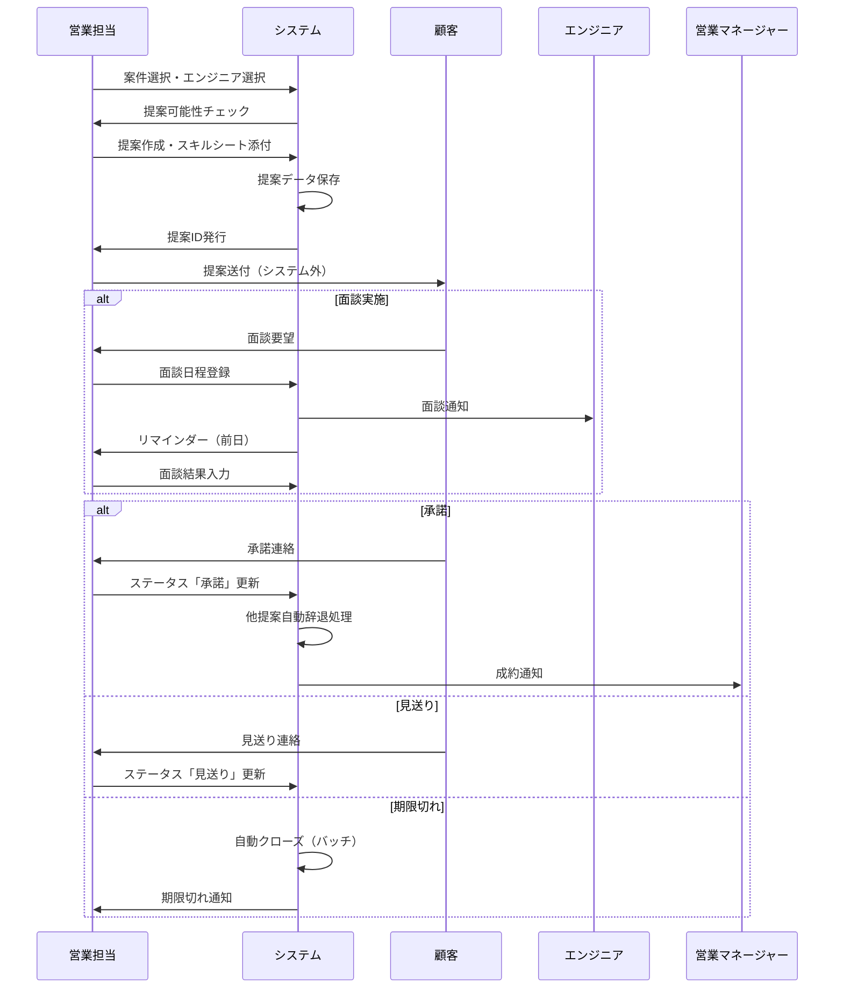
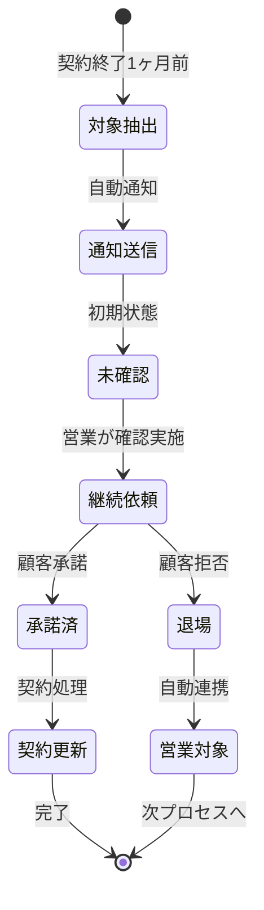

# 営業関連機能 詳細設計書

## 📋 目次
1. [画面詳細設計](#画面詳細設計)
2. [API詳細設計](#api詳細設計)
3. [バッチ処理詳細設計](#バッチ処理詳細設計)
4. [データベース詳細設計](#データベース詳細設計)
5. [業務フロー詳細](#業務フロー詳細)
6. [通知・アラート詳細](#通知アラート詳細)
7. [データ連携詳細](#データ連携詳細)
8. [セキュリティ詳細](#セキュリティ詳細)
9. [パフォーマンス対策](#パフォーマンス対策)
10. [エラーハンドリング](#エラーハンドリング)

---

## 画面詳細設計

### 🎨 共通コンポーネント設計

#### レスポンシブ対応
```typescript
// useResponsive.ts
const breakpoints = {
  mobile: '(max-width: 768px)',
  tablet: '(min-width: 769px) and (max-width: 1024px)',
  desktop: '(min-width: 1025px)'
};
```

#### 共通レイアウト
```typescript
// SalesLayout.tsx
interface SalesLayoutProps {
  title: string;
  actions?: ReactNode;
  children: ReactNode;
}

const SalesLayout: React.FC<SalesLayoutProps> = ({
  title,
  actions,
  children
}) => {
  return (
    <Box sx={{ p: { xs: 2, sm: 3 } }}>
      <Box sx={{ 
        display: 'flex', 
        justifyContent: 'space-between',
        flexDirection: { xs: 'column', sm: 'row' },
        mb: 3 
      }}>
        <Typography variant="h4">{title}</Typography>
        {actions && <Box sx={{ mt: { xs: 2, sm: 0 } }}>{actions}</Box>}
      </Box>
      {children}
    </Box>
  );
};
```

### 📊 営業ダッシュボード詳細

#### コンポーネント構成
```
SalesDashboard/
├── index.tsx
├── components/
│   ├── MetricCard.tsx      # 指標カード
│   ├── ProposalChart.tsx   # 提案状況グラフ
│   ├── AlertSection.tsx    # アラート表示
│   └── RecentActivities.tsx # 最近の活動
└── hooks/
    └── useDashboardData.ts
```

#### MetricCard実装
```typescript
interface MetricCardProps {
  title: string;
  value: number | string;
  unit?: string;
  trend?: {
    value: number;
    isPositive: boolean;
  };
  icon: ReactNode;
  color: string;
}

const MetricCard: React.FC<MetricCardProps> = ({
  title, value, unit, trend, icon, color
}) => {
  return (
    <Card sx={{ height: '100%' }}>
      <CardContent>
        <Box sx={{ display: 'flex', justifyContent: 'space-between' }}>
          <Box>
            <Typography color="textSecondary" gutterBottom>
              {title}
            </Typography>
            <Typography variant="h4" component="div">
              {value}{unit && <Typography variant="h6" component="span">{unit}</Typography>}
            </Typography>
            {trend && (
              <Box sx={{ display: 'flex', alignItems: 'center', mt: 1 }}>
                {trend.isPositive ? <TrendingUp color="success" /> : <TrendingDown color="error" />}
                <Typography variant="body2" color={trend.isPositive ? 'success.main' : 'error.main'}>
                  {trend.value}%
                </Typography>
              </Box>
            )}
          </Box>
          <Box sx={{ 
            backgroundColor: `${color}20`,
            borderRadius: 2,
            p: 1.5,
            display: 'flex',
            alignItems: 'center'
          }}>
            {icon}
          </Box>
        </Box>
      </CardContent>
    </Card>
  );
};
```

### 📋 提案管理画面詳細

#### 画面レイアウト
```typescript
// ProposalManagement/index.tsx
const ProposalManagement: React.FC = () => {
  const [selectedProposal, setSelectedProposal] = useState<Proposal | null>(null);
  const [statusChangeDialog, setStatusChangeDialog] = useState({
    open: false,
    proposal: null,
    newStatus: null
  });
  
  return (
    <SalesLayout
      title="提案管理"
      actions={
        <Box sx={{ display: 'flex', gap: 2 }}>
          <Button variant="contained" onClick={handleCreateProposal}>
            新規提案
          </Button>
          <Button variant="outlined" onClick={handleManualImport}>
            案件手動登録
          </Button>
        </Box>
      }
    >
      <ProposalFilters onFilterChange={handleFilterChange} />
      <ProposalDataTable 
        onRowClick={setSelectedProposal}
        onStatusChange={handleStatusChange}
      />
      <ProposalDetailDialog 
        proposal={selectedProposal}
        onClose={() => setSelectedProposal(null)}
      />
      <StatusChangeDialog {...statusChangeDialog} />
    </SalesLayout>
  );
};
```

#### ステータス変更確認ダイアログ
```typescript
interface StatusChangeDialogProps {
  open: boolean;
  proposal: Proposal | null;
  newStatus: ProposalStatus | null;
  onConfirm: () => void;
  onCancel: () => void;
}

const StatusChangeDialog: React.FC<StatusChangeDialogProps> = ({
  open, proposal, newStatus, onConfirm, onCancel
}) => {
  const getWarningMessage = () => {
    if (newStatus === 'accepted' && proposal) {
      const otherProposals = useOtherActiveProposals(proposal.engineerId);
      if (otherProposals.length > 0) {
        return `このエンジニアの他の${otherProposals.length}件の提案が自動的に「辞退」になります。`;
      }
    }
    return null;
  };

  return (
    <Dialog open={open} onClose={onCancel}>
      <DialogTitle>ステータス変更確認</DialogTitle>
      <DialogContent>
        <Typography>
          提案のステータスを「{getStatusLabel(newStatus)}」に変更しますか？
        </Typography>
        {getWarningMessage() && (
          <Alert severity="warning" sx={{ mt: 2 }}>
            {getWarningMessage()}
          </Alert>
        )}
      </DialogContent>
      <DialogActions>
        <Button onClick={onCancel}>キャンセル</Button>
        <Button onClick={onConfirm} variant="contained" color="primary">
          変更する
        </Button>
      </DialogActions>
    </Dialog>
  );
};
```

#### スキルシートアップロード
```typescript
const SkillSheetUpload: React.FC<{
  onUpload: (file: File) => void;
  currentFile?: string;
}> = ({ onUpload, currentFile }) => {
  const handleFileChange = (event: React.ChangeEvent<HTMLInputElement>) => {
    const file = event.target.files?.[0];
    if (!file) return;

    // ファイル検証
    const validTypes = ['application/pdf', 'application/vnd.ms-excel', 
                       'application/vnd.openxmlformats-officedocument.spreadsheetml.sheet'];
    if (!validTypes.includes(file.type)) {
      showError('Excel または PDF ファイルを選択してください');
      return;
    }

    if (file.size > 1024 * 1024) { // 1MB
      showError('ファイルサイズは1MB以内にしてください');
      return;
    }

    onUpload(file);
  };

  return (
    <Box>
      <input
        accept=".pdf,.xls,.xlsx"
        id="skill-sheet-upload"
        type="file"
        hidden
        onChange={handleFileChange}
      />
      <label htmlFor="skill-sheet-upload">
        <Button
          variant="outlined"
          component="span"
          startIcon={<CloudUpload />}
        >
          スキルシートアップロード
        </Button>
      </label>
      {currentFile && (
        <Typography variant="caption" display="block" sx={{ mt: 1 }}>
          現在のファイル: {currentFile}
        </Typography>
      )}
    </Box>
  );
};
```

#### 金額自動計算
```typescript
const AmountCalculator: React.FC<{
  type: 'monthly' | 'hourly';
  baseAmount: number;
  onChange: (calculated: CalculatedAmount) => void;
}> = ({ type, baseAmount, onChange }) => {
  const [workingHours, setWorkingHours] = useState(160); // デフォルト160時間

  useEffect(() => {
    if (type === 'monthly') {
      onChange({
        monthly: baseAmount,
        hourly: Math.round(baseAmount / workingHours)
      });
    } else {
      onChange({
        monthly: baseAmount * workingHours,
        hourly: baseAmount
      });
    }
  }, [type, baseAmount, workingHours]);

  return (
    <Box sx={{ display: 'flex', gap: 2, alignItems: 'center' }}>
      <FormControl size="small">
        <Select value={type} onChange={(e) => setType(e.target.value)}>
          <MenuItem value="monthly">月額</MenuItem>
          <MenuItem value="hourly">時給</MenuItem>
        </Select>
      </FormControl>
      <TextField
        type="number"
        value={baseAmount}
        onChange={(e) => setBaseAmount(Number(e.target.value))}
        InputProps={{
          endAdornment: <InputAdornment position="end">
            {type === 'monthly' ? '円/月' : '円/時'}
          </InputAdornment>
        }}
      />
      {type === 'hourly' && (
        <TextField
          type="number"
          value={workingHours}
          onChange={(e) => setWorkingHours(Number(e.target.value))}
          label="稼働時間"
          size="small"
          sx={{ width: 100 }}
        />
      )}
    </Box>
  );
};
```

### 📅 面談日程管理詳細

#### カレンダー実装
```typescript
// InterviewCalendar.tsx
import FullCalendar from '@fullcalendar/react';
import dayGridPlugin from '@fullcalendar/daygrid';
import timeGridPlugin from '@fullcalendar/timegrid';
import interactionPlugin from '@fullcalendar/interaction';
import jaLocale from '@fullcalendar/core/locales/ja';

const InterviewCalendar: React.FC = () => {
  const [interviews, setInterviews] = useState<Interview[]>([]);
  const [selectedInterview, setSelectedInterview] = useState<Interview | null>(null);
  
  const calendarOptions = {
    plugins: [dayGridPlugin, timeGridPlugin, interactionPlugin],
    initialView: 'dayGridMonth',
    locale: jaLocale,
    headerToolbar: {
      left: 'prev,next today',
      center: 'title',
      right: 'dayGridMonth,timeGridWeek,timeGridDay'
    },
    businessHours: {
      daysOfWeek: [1, 2, 3, 4, 5],
      startTime: '09:00',
      endTime: '18:00'
    },
    events: interviews.map(interview => ({
      id: interview.id,
      title: `${interview.engineerName} - ${interview.clientName}`,
      start: interview.scheduledDate,
      end: interview.endTime || addHours(interview.scheduledDate, 1), // デフォルト1時間
      backgroundColor: getStatusColor(interview.status),
      extendedProps: interview
    })),
    dateClick: handleDateClick,
    eventClick: handleEventClick,
    eventDrop: handleEventDrop,
    eventResize: handleEventResize,
    // モバイル対応
    height: 'auto',
    aspectRatio: window.innerWidth < 768 ? 1 : 1.8
  };

  return (
    <>
      <FullCalendar {...calendarOptions} />
      <InterviewDialog
        interview={selectedInterview}
        onClose={() => setSelectedInterview(null)}
        onSave={handleSaveInterview}
      />
    </>
  );
};
```

#### 面談登録ダイアログ
```typescript
const InterviewDialog: React.FC<InterviewDialogProps> = ({
  interview, onClose, onSave
}) => {
  const [formData, setFormData] = useState<InterviewFormData>({
    proposalId: '',
    scheduledDate: new Date(),
    duration: 60, // デフォルト1時間
    location: '',
    meetingType: 'onsite',
    meetingUrl: '',
    clientAttendees: [],
    engineerAttendees: [],
    notes: ''
  });

  const handleDurationChange = (minutes: number) => {
    setFormData(prev => ({
      ...prev,
      duration: minutes,
      endTime: addMinutes(prev.scheduledDate, minutes)
    }));
  };

  return (
    <Dialog open={!!interview} onClose={onClose} maxWidth="md" fullWidth>
      <DialogTitle>面談予定登録</DialogTitle>
      <DialogContent>
        <Grid container spacing={2} sx={{ mt: 1 }}>
          <Grid item xs={12} md={6}>
            <DateTimePicker
              label="面談日時"
              value={formData.scheduledDate}
              onChange={(date) => setFormData({...formData, scheduledDate: date})}
              renderInput={(params) => <TextField {...params} fullWidth />}
            />
          </Grid>
          <Grid item xs={12} md={6}>
            <FormControl fullWidth>
              <InputLabel>面談時間</InputLabel>
              <Select
                value={formData.duration}
                onChange={(e) => handleDurationChange(Number(e.target.value))}
              >
                <MenuItem value={30}>30分</MenuItem>
                <MenuItem value={60}>1時間</MenuItem>
                <MenuItem value={90}>1時間30分</MenuItem>
                <MenuItem value={120}>2時間</MenuItem>
                <MenuItem value={0}>カスタム</MenuItem>
              </Select>
            </FormControl>
          </Grid>
          <Grid item xs={12} md={6}>
            <FormControl fullWidth>
              <InputLabel>面談形式</InputLabel>
              <Select
                value={formData.meetingType}
                onChange={(e) => setFormData({...formData, meetingType: e.target.value})}
              >
                <MenuItem value="onsite">対面</MenuItem>
                <MenuItem value="online">オンライン</MenuItem>
                <MenuItem value="hybrid">ハイブリッド</MenuItem>
              </Select>
            </FormControl>
          </Grid>
          <Grid item xs={12} md={6}>
            <TextField
              fullWidth
              label="場所"
              value={formData.location}
              onChange={(e) => setFormData({...formData, location: e.target.value})}
              disabled={formData.meetingType === 'online'}
            />
          </Grid>
          {formData.meetingType !== 'onsite' && (
            <Grid item xs={12}>
              <TextField
                fullWidth
                label="オンライン面談URL"
                value={formData.meetingUrl}
                onChange={(e) => setFormData({...formData, meetingUrl: e.target.value})}
                placeholder="https://zoom.us/j/..."
              />
            </Grid>
          )}
        </Grid>
      </DialogContent>
      <DialogActions>
        <Button onClick={onClose}>キャンセル</Button>
        <Button onClick={() => onSave(formData)} variant="contained">
          登録
        </Button>
      </DialogActions>
    </Dialog>
  );
};
```

### 👥 営業対象者一覧詳細

#### フィルター実装
```typescript
interface SalesTargetFilters {
  status: ('waiting' | 'leaving')[];
  skills: string[];
  availableFrom: Date | null;
  availableTo: Date | null;
  experienceYears: { min: number; max: number };
}

const SalesTargetFilterPanel: React.FC<{
  onFilterChange: (filters: SalesTargetFilters) => void;
}> = ({ onFilterChange }) => {
  const [filters, setFilters] = useState<SalesTargetFilters>({
    status: ['waiting', 'leaving'],
    skills: [],
    availableFrom: null,
    availableTo: null,
    experienceYears: { min: 0, max: 99 }
  });

  const availableSkills = useAvailableSkills();

  return (
    <Accordion>
      <AccordionSummary expandIcon={<ExpandMore />}>
        <Typography>フィルター条件</Typography>
      </AccordionSummary>
      <AccordionDetails>
        <Grid container spacing={2}>
          <Grid item xs={12} md={4}>
            <FormControl fullWidth>
              <InputLabel>対象者ステータス</InputLabel>
              <Select
                multiple
                value={filters.status}
                onChange={(e) => setFilters({...filters, status: e.target.value})}
                renderValue={(selected) => selected.join(', ')}
              >
                <MenuItem value="waiting">
                  <Checkbox checked={filters.status.includes('waiting')} />
                  <ListItemText primary="待機中" />
                </MenuItem>
                <MenuItem value="leaving">
                  <Checkbox checked={filters.status.includes('leaving')} />
                  <ListItemText primary="退場予定" />
                </MenuItem>
              </Select>
            </FormControl>
          </Grid>
          <Grid item xs={12} md={4}>
            <Autocomplete
              multiple
              options={availableSkills}
              value={filters.skills}
              onChange={(_, value) => setFilters({...filters, skills: value})}
              renderInput={(params) => (
                <TextField {...params} label="スキル" placeholder="スキルを選択" />
              )}
            />
          </Grid>
          <Grid item xs={12} md={4}>
            <Button
              fullWidth
              variant="contained"
              onClick={() => onFilterChange(filters)}
              sx={{ height: '56px' }}
            >
              フィルター適用
            </Button>
          </Grid>
        </Grid>
      </AccordionDetails>
    </Accordion>
  );
};
```

#### データテーブル実装
```typescript
const SalesTargetDataTable: React.FC = () => {
  const [sortBy, setSortBy] = useState<{
    field: 'waitingDays' | 'employeeNumber';
    order: 'asc' | 'desc';
  }>({
    field: 'waitingDays',
    order: 'desc'
  });

  const columns: GridColDef[] = [
    {
      field: 'employeeNumber',
      headerName: '社員番号',
      width: 120,
      sortable: true
    },
    {
      field: 'name',
      headerName: '氏名',
      width: 150,
      renderCell: (params) => (
        <Link
          component={RouterLink}
          to={`/admin/engineers/${params.row.id}`}
          sx={{ textDecoration: 'none' }}
        >
          {params.value}
        </Link>
      )
    },
    {
      field: 'status',
      headerName: 'ステータス',
      width: 120,
      renderCell: (params) => (
        <Chip
          label={params.value === 'waiting' ? '待機中' : '退場予定'}
          color={params.value === 'waiting' ? 'warning' : 'error'}
          size="small"
        />
      )
    },
    {
      field: 'waitingDays',
      headerName: '待機日数',
      width: 100,
      sortable: true,
      renderCell: (params) => `${params.value}日`
    },
    {
      field: 'skills',
      headerName: '主要スキル',
      width: 300,
      renderCell: (params) => (
        <Box sx={{ display: 'flex', gap: 0.5, flexWrap: 'wrap' }}>
          {params.value.slice(0, 3).map((skill: string) => (
            <Chip key={skill} label={skill} size="small" />
          ))}
          {params.value.length > 3 && (
            <Chip label={`+${params.value.length - 3}`} size="small" variant="outlined" />
          )}
        </Box>
      )
    },
    {
      field: 'lastProject',
      headerName: '最終案件',
      width: 200
    },
    {
      field: 'availableDate',
      headerName: '稼働可能日',
      width: 120,
      valueFormatter: (params) => formatDate(params.value)
    },
    {
      field: 'actions',
      headerName: 'アクション',
      width: 150,
      sortable: false,
      renderCell: (params) => (
        <Button
          size="small"
          variant="outlined"
          onClick={() => handleCreateProposal(params.row.id)}
        >
          提案作成
        </Button>
      )
    }
  ];

  return (
    <DataGrid
      rows={salesTargets}
      columns={columns}
      pageSize={20}
      rowsPerPageOptions={[20, 50, 100]}
      sortModel={[{
        field: sortBy.field,
        sort: sortBy.order
      }]}
      onSortModelChange={(model) => {
        if (model.length > 0) {
          setSortBy({
            field: model[0].field as any,
            order: model[0].sort as any
          });
        }
      }}
      autoHeight
      disableSelectionOnClick
      sx={{
        '& .MuiDataGrid-cell': {
          fontSize: { xs: '0.75rem', sm: '0.875rem' }
        }
      }}
    />
  );
};
```

### 🔄 延長確認管理詳細

#### 設定画面
```typescript
const ExtensionSettings: React.FC = () => {
  const [settings, setSettings] = useState({
    checkBeforeDays: 30,
    reminderEnabled: true,
    reminderDays: [7, 3, 1],
    autoNotification: true,
    notificationChannels: ['email', 'slack']
  });

  return (
    <Card>
      <CardContent>
        <Typography variant="h6" gutterBottom>
          延長確認設定
        </Typography>
        <Grid container spacing={3}>
          <Grid item xs={12} md={6}>
            <TextField
              fullWidth
              type="number"
              label="確認開始日数（契約終了前）"
              value={settings.checkBeforeDays}
              onChange={(e) => setSettings({
                ...settings,
                checkBeforeDays: Number(e.target.value)
              })}
              InputProps={{
                endAdornment: <InputAdornment position="end">日前</InputAdornment>
              }}
            />
          </Grid>
          <Grid item xs={12} md={6}>
            <FormControlLabel
              control={
                <Switch
                  checked={settings.autoNotification}
                  onChange={(e) => setSettings({
                    ...settings,
                    autoNotification: e.target.checked
                  })}
                />
              }
              label="自動通知を有効にする"
            />
          </Grid>
          <Grid item xs={12}>
            <Typography variant="subtitle2" gutterBottom>
              通知チャンネル
            </Typography>
            <FormGroup row>
              <FormControlLabel
                control={
                  <Checkbox
                    checked={settings.notificationChannels.includes('email')}
                    onChange={(e) => handleChannelChange('email', e.target.checked)}
                  />
                }
                label="メール"
              />
              <FormControlLabel
                control={
                  <Checkbox
                    checked={settings.notificationChannels.includes('slack')}
                    onChange={(e) => handleChannelChange('slack', e.target.checked)}
                  />
                }
                label="Slack"
              />
            </FormGroup>
          </Grid>
        </Grid>
      </CardContent>
      <CardActions>
        <Button variant="contained" onClick={handleSaveSettings}>
          設定を保存
        </Button>
      </CardActions>
    </Card>
  );
};
```

---

## API詳細設計

### 🔌 共通仕様

#### リクエストヘッダー
```typescript
interface RequestHeaders {
  'Authorization': `Bearer ${accessToken}`;
  'Content-Type': 'application/json';
  'X-Request-ID': string; // UUID
  'X-Client-Version': string; // アプリバージョン
}
```

#### レスポンス形式
```typescript
// 成功レスポンス
interface SuccessResponse<T> {
  data: T;
  meta?: {
    page?: number;
    limit?: number;
    total?: number;
    hasMore?: boolean;
  };
}

// エラーレスポンス
interface ErrorResponse {
  error: {
    code: string;
    message: string;
    details?: Record<string, any>;
  };
  request_id: string;
}
```

### 📋 提案管理API詳細

#### 提案一覧取得
```go
// GET /api/v1/proposals
type GetProposalsRequest struct {
    Page           int      `form:"page" binding:"min=1"`
    Limit          int      `form:"limit" binding:"min=1,max=100"`
    EngineerID     string   `form:"engineer_id"`
    ClientID       string   `form:"client_id"`
    Status         []string `form:"status"`
    DateFrom       string   `form:"date_from"` // YYYY-MM-DD
    DateTo         string   `form:"date_to"`   // YYYY-MM-DD
    ResponseDeadlineFrom string `form:"response_deadline_from"`
    ResponseDeadlineTo   string `form:"response_deadline_to"`
    SortBy         string   `form:"sort_by" binding:"oneof=created_at proposal_date response_deadline"`
    SortOrder      string   `form:"sort_order" binding:"oneof=asc desc"`
}

type GetProposalsResponse struct {
    Items []ProposalDTO `json:"items"`
    Total int64         `json:"total"`
}

type ProposalDTO struct {
    ID                  string    `json:"id"`
    ProjectID           string    `json:"project_id"`
    ProjectName         string    `json:"project_name"`
    EngineerID          string    `json:"engineer_id"`
    EngineerName        string    `json:"engineer_name"`
    ClientID            string    `json:"client_id"`
    ClientName          string    `json:"client_name"`
    ProposalDate        string    `json:"proposal_date"`
    ProposalAmount      int       `json:"proposal_amount"`
    AmountType          string    `json:"amount_type"` // monthly, hourly
    SkillSheetURL       string    `json:"skill_sheet_url"`
    Status              string    `json:"status"`
    StatusChangedAt     *string   `json:"status_changed_at"`
    InterviewDate       *string   `json:"interview_date"`
    ResponseDeadline    *string   `json:"response_deadline"`
    IsDeadlineExpired   bool      `json:"is_deadline_expired"`
    CreatedAt           string    `json:"created_at"`
    UpdatedAt           string    `json:"updated_at"`
}
```

#### 提案作成
```go
// POST /api/v1/proposals
type CreateProposalRequest struct {
    ProjectID        string `json:"project_id" binding:"required"`
    EngineerID       string `json:"engineer_id" binding:"required"`
    ClientID         string `json:"client_id" binding:"required"`
    ProposalDate     string `json:"proposal_date" binding:"required"`
    ProposalAmount   int    `json:"proposal_amount" binding:"required,min=1"`
    AmountType       string `json:"amount_type" binding:"required,oneof=monthly hourly"`
    WorkingHours     int    `json:"working_hours"` // 時給の場合の想定稼働時間
    ResponseDeadline string `json:"response_deadline"`
    Notes            string `json:"notes"`
}

type CreateProposalResponse struct {
    ID        string `json:"id"`
    Status    string `json:"status"`
    CreatedAt string `json:"created_at"`
}
```

#### ステータス更新
```go
// PUT /api/v1/proposals/{id}/status
type UpdateProposalStatusRequest struct {
    Status           string `json:"status" binding:"required"`
    RejectionReason  string `json:"rejection_reason"`  // status=declinedの場合
    AcceptanceConditions string `json:"acceptance_conditions"` // status=acceptedの場合
}

type UpdateProposalStatusResponse struct {
    UpdatedProposals []struct {
        ID        string `json:"id"`
        OldStatus string `json:"old_status"`
        NewStatus string `json:"new_status"`
    } `json:"updated_proposals"`
}

// ビジネスロジック
func (s *ProposalService) UpdateStatus(ctx context.Context, id string, req UpdateProposalStatusRequest) (*UpdateProposalStatusResponse, error) {
    // トランザクション開始
    tx := s.db.Begin()
    
    // 承諾の場合、同一エンジニアの他の提案を辞退に
    if req.Status == "accepted" {
        proposal, err := s.repo.GetByID(ctx, id)
        if err != nil {
            return nil, err
        }
        
        otherProposals, err := s.repo.GetActiveProposalsByEngineer(ctx, proposal.EngineerID)
        if err != nil {
            return nil, err
        }
        
        for _, p := range otherProposals {
            if p.ID != id {
                p.Status = "rejected"
                p.RejectionReason = "他案件承諾のため自動辞退"
                if err := s.repo.Update(ctx, p); err != nil {
                    tx.Rollback()
                    return nil, err
                }
            }
        }
    }
    
    tx.Commit()
    return response, nil
}
```

### 📅 面談管理API詳細

#### 面談スケジュール取得
```go
// GET /api/v1/interviews
type GetInterviewsRequest struct {
    DateFrom    string `form:"date_from" binding:"required"`
    DateTo      string `form:"date_to" binding:"required"`
    EngineerID  string `form:"engineer_id"`
    ClientID    string `form:"client_id"`
    Status      string `form:"status"`
}

type InterviewEventDTO struct {
    ID             string         `json:"id"`
    Title          string         `json:"title"`
    Start          string         `json:"start"`
    End            string         `json:"end"`
    BackgroundColor string        `json:"backgroundColor"`
    ExtendedProps  InterviewProps `json:"extendedProps"`
}

type InterviewProps struct {
    ProposalID      string   `json:"proposal_id"`
    EngineerName    string   `json:"engineer_name"`
    ClientName      string   `json:"client_name"`
    Location        string   `json:"location"`
    MeetingType     string   `json:"meeting_type"`
    MeetingURL      string   `json:"meeting_url"`
    Status          string   `json:"status"`
    ClientAttendees []string `json:"client_attendees"`
}
```

#### リマインダー送信
```go
// POST /api/v1/interviews/{id}/reminder
type SendReminderRequest struct {
    Recipients []string `json:"recipients"` // engineer, client, both
}

func (s *InterviewService) SendReminder(ctx context.Context, id string, req SendReminderRequest) error {
    interview, err := s.repo.GetByID(ctx, id)
    if err != nil {
        return err
    }
    
    // リマインダー送信処理
    for _, recipient := range req.Recipients {
        switch recipient {
        case "engineer":
            if err := s.notificationService.SendInterviewReminder(
                ctx, 
                interview.EngineerEmail,
                interview,
                "engineer_reminder"
            ); err != nil {
                return err
            }
        case "client":
            // クライアント向けリマインダー
        }
    }
    
    // 送信記録更新
    interview.ReminderSentAt = utils.TimePtr(time.Now())
    return s.repo.Update(ctx, interview)
}
```

### 🔄 延長確認API詳細

#### 対象者自動抽出
```go
// GET /api/v1/contract-extensions/targets
type GetExtensionTargetsResponse struct {
    Targets []ExtensionTargetDTO `json:"targets"`
    Total   int                  `json:"total"`
}

type ExtensionTargetDTO struct {
    EngineerID          string `json:"engineer_id"`
    EngineerName        string `json:"engineer_name"`
    ProjectID           string `json:"project_id"`
    ProjectName         string `json:"project_name"`
    ClientName          string `json:"client_name"`
    ContractEndDate     string `json:"contract_end_date"`
    DaysUntilEnd        int    `json:"days_until_end"`
    ExtensionStatus     string `json:"extension_status"`
    LastExtensionCheck  string `json:"last_extension_check"`
}

func (s *ExtensionService) GetTargets(ctx context.Context) (*GetExtensionTargetsResponse, error) {
    // 設定取得
    settings, err := s.settingsRepo.GetExtensionSettings(ctx)
    if err != nil {
        return nil, err
    }
    
    // 対象日計算
    targetDate := time.Now().AddDate(0, 0, settings.CheckBeforeDays)
    
    // 対象者抽出
    targets, err := s.repo.GetEngineersWithContractEndingBefore(ctx, targetDate)
    if err != nil {
        return nil, err
    }
    
    // 既存の延長確認レコードと突合
    for i, target := range targets {
        extension, _ := s.repo.GetLatestByEngineerID(ctx, target.EngineerID)
        if extension != nil {
            targets[i].ExtensionStatus = extension.Status
            targets[i].LastExtensionCheck = extension.CreatedAt.Format("2006-01-02")
        }
    }
    
    return &GetExtensionTargetsResponse{
        Targets: targets,
        Total:   len(targets),
    }, nil
}
```

### 📧 メール送信API詳細

#### テンプレート管理
```go
// POST /api/v1/email-templates
type CreateEmailTemplateRequest struct {
    Name      string                 `json:"name" binding:"required"`
    Subject   string                 `json:"subject" binding:"required"`
    BodyHTML  string                 `json:"body_html" binding:"required"`
    BodyText  string                 `json:"body_text"`
    Category  string                 `json:"category"`
    Variables []TemplateVariable     `json:"variables"`
}

type TemplateVariable struct {
    Name        string `json:"name"`
    Description string `json:"description"`
    DefaultValue string `json:"default_value"`
}

// テンプレート例
const proposalTemplate = `
<p>{{.ClientContactPerson}} 様</p>

<p>お世話になっております。{{.CompanyName}}の{{.SenderName}}です。</p>

<p>先日ご相談いただきました案件について、
弊社エンジニア {{.EngineerName}} をご提案させていただきます。</p>

<p>【エンジニア情報】<br>
氏名: {{.EngineerName}}<br>
経験年数: {{.ExperienceYears}}年<br>
主要スキル: {{.MainSkills}}<br>
稼働可能日: {{.AvailableDate}}</p>

<p>詳細なスキルシートを添付いたしましたので、
ご確認いただけますと幸いです。</p>

<p>ご不明な点がございましたら、お気軽にお問い合わせください。</p>

<p>{{.SenderName}}<br>
{{.SenderEmail}}<br>
{{.SenderPhone}}</p>
`
```

#### 一斉送信実行
```go
// POST /api/v1/email-campaigns/{id}/send
type SendCampaignRequest struct {
    TestMode bool     `json:"test_mode"` // テスト送信モード
    TestEmails []string `json:"test_emails"` // テスト送信先
}

func (s *EmailService) SendCampaign(ctx context.Context, campaignID string, req SendCampaignRequest) error {
    campaign, err := s.campaignRepo.GetByID(ctx, campaignID)
    if err != nil {
        return err
    }
    
    // 送信対象取得
    targets, err := s.getTargetsByConditions(ctx, campaign.TargetConditions)
    if err != nil {
        return err
    }
    
    // テンプレート取得
    template, err := s.templateRepo.GetByID(ctx, campaign.TemplateID)
    if err != nil {
        return err
    }
    
    // バッチ送信
    batchSize := 50
    for i := 0; i < len(targets); i += batchSize {
        end := i + batchSize
        if end > len(targets) {
            end = len(targets)
        }
        
        batch := targets[i:end]
        go s.sendBatch(ctx, campaign, template, batch)
    }
    
    return nil
}

func (s *EmailService) sendBatch(ctx context.Context, campaign *Campaign, template *EmailTemplate, targets []EmailTarget) {
    for _, target := range targets {
        // プレースホルダー置換
        variables := s.buildVariables(target)
        subject := s.replacePlaceholders(template.Subject, variables)
        bodyHTML := s.replacePlaceholders(template.BodyHTML, variables)
        
        // 送信
        if err := s.mailer.Send(ctx, Mail{
            To:      target.Email,
            Subject: subject,
            HTML:    bodyHTML,
            Text:    bodyText,
        }); err != nil {
            s.logger.Error("Failed to send email", zap.Error(err))
            continue
        }
        
        // 送信記録
        s.recordSent(ctx, campaign.ID, target.ID)
    }
}
```

### 🔄 案件同期API詳細

#### 手動案件登録
```go
// POST /api/v1/projects/manual-import
type ManualImportProjectRequest struct {
    EmailContent string `json:"email_content" binding:"required"`
    ClientID     string `json:"client_id"`
}

func (s *ProjectService) ManualImport(ctx context.Context, req ManualImportProjectRequest) (*Project, error) {
    // monstera-poc APIを呼び出し
    structuredData, err := s.pocClient.ExtractProjectFromEmail(ctx, req.EmailContent)
    if err != nil {
        return nil, fmt.Errorf("構造化データ抽出エラー: %w", err)
    }
    
    // データマッピング
    project := &Project{
        ID:           uuid.New().String(),
        Name:         structuredData.ProjectName,
        ClientID:     req.ClientID,
        MinPrice:     structuredData.MinPrice,
        MaxPrice:     structuredData.MaxPrice,
        StartDate:    structuredData.StartDate,
        Description:  structuredData.Description,
        RequiredSkills: structuredData.RequiredSkills,
        SourceType:   "manual",
        SourceData:   structuredData,
    }
    
    // 保存
    if err := s.repo.Create(ctx, project); err != nil {
        return nil, err
    }
    
    return project, nil
}
```

---

## バッチ処理詳細設計

### ⏰ バッチ一覧

| バッチ名 | 実行頻度 | 処理内容 |
|---------|---------|---------|
| 提案期限チェック | 毎日 0:00 | 回答期限切れ提案の自動クローズ |
| 延長確認対象抽出 | 毎日 9:00 | 契約終了予定者の抽出・通知 |
| 面談リマインダー | 毎日 10:00, 15:00 | 翌日面談のリマインダー送信 |
| 案件データ同期 | 毎日 2:00 | monstera-poc からの案件取得 |
| レポート生成 | 月初 1:00 | 月次営業レポート生成 |

### 📝 バッチ実装詳細

#### 提案期限チェックバッチ
```go
// batch/proposal_deadline_checker.go
type ProposalDeadlineChecker struct {
    proposalService *service.ProposalService
    notificationService *service.NotificationService
    logger *zap.Logger
}

func (b *ProposalDeadlineChecker) Run(ctx context.Context) error {
    b.logger.Info("Starting proposal deadline check batch")
    
    // 期限切れ提案取得
    expiredProposals, err := b.proposalService.GetExpiredProposals(ctx)
    if err != nil {
        return fmt.Errorf("failed to get expired proposals: %w", err)
    }
    
    b.logger.Info("Found expired proposals", zap.Int("count", len(expiredProposals)))
    
    // 一括更新
    var updatedCount int
    for _, proposal := range expiredProposals {
        // ステータス更新
        if err := b.proposalService.UpdateStatus(ctx, proposal.ID, UpdateStatusRequest{
            Status: "declined",
            RejectionReason: "回答期限切れによる自動クローズ",
        }); err != nil {
            b.logger.Error("Failed to update proposal status", 
                zap.String("proposal_id", proposal.ID),
                zap.Error(err))
            continue
        }
        
        // 通知送信
        if err := b.notificationService.SendProposalExpiredNotification(ctx, proposal); err != nil {
            b.logger.Error("Failed to send notification",
                zap.String("proposal_id", proposal.ID),
                zap.Error(err))
        }
        
        updatedCount++
    }
    
    b.logger.Info("Proposal deadline check completed",
        zap.Int("updated_count", updatedCount))
    
    return nil
}
```

#### 延長確認対象抽出バッチ
```go
// batch/extension_target_extractor.go
func (b *ExtensionTargetExtractor) Run(ctx context.Context) error {
    // 設定取得
    settings, err := b.settingsService.GetExtensionSettings(ctx)
    if err != nil {
        return err
    }
    
    // 対象者抽出
    targets, err := b.extensionService.ExtractTargets(ctx, settings.CheckBeforeDays)
    if err != nil {
        return err
    }
    
    // 通知グループ化（営業担当者別）
    targetsBySalesRep := make(map[string][]ExtensionTarget)
    for _, target := range targets {
        salesRepID := target.SalesRepID
        if salesRepID == "" {
            salesRepID = "unassigned"
        }
        targetsBySalesRep[salesRepID] = append(targetsBySalesRep[salesRepID], target)
    }
    
    // 営業担当者への通知
    for salesRepID, repTargets := range targetsBySalesRep {
        if salesRepID == "unassigned" {
            // 未割当の場合は営業マネージャーに通知
            if err := b.notifyManagers(ctx, repTargets); err != nil {
                b.logger.Error("Failed to notify managers", zap.Error(err))
            }
            continue
        }
        
        // 担当者に通知
        if err := b.notifySalesRep(ctx, salesRepID, repTargets); err != nil {
            b.logger.Error("Failed to notify sales rep",
                zap.String("sales_rep_id", salesRepID),
                zap.Error(err))
        }
    }
    
    return nil
}
```

#### 案件データ同期バッチ
```go
// batch/project_sync.go
func (b *ProjectSyncBatch) Run(ctx context.Context) error {
    // 最終同期日時取得
    lastSync, err := b.syncRepo.GetLastSyncTime(ctx)
    if err != nil {
        lastSync = time.Now().AddDate(0, 0, -1) // デフォルト1日前
    }
    
    // monstera-poc から新規/更新案件取得
    projects, err := b.pocClient.GetProjectsSince(ctx, lastSync)
    if err != nil {
        return fmt.Errorf("failed to fetch projects from poc: %w", err)
    }
    
    b.logger.Info("Fetched projects from poc", zap.Int("count", len(projects)))
    
    // 同期処理
    var syncErrors []error
    for _, pocProject := range projects {
        if err := b.syncProject(ctx, pocProject); err != nil {
            syncErrors = append(syncErrors, err)
            b.logger.Error("Failed to sync project",
                zap.String("poc_project_id", pocProject.ID),
                zap.Error(err))
        }
    }
    
    // 同期記録更新
    if err := b.syncRepo.UpdateLastSyncTime(ctx, time.Now()); err != nil {
        b.logger.Error("Failed to update sync time", zap.Error(err))
    }
    
    if len(syncErrors) > 0 {
        return fmt.Errorf("sync completed with %d errors", len(syncErrors))
    }
    
    return nil
}

func (b *ProjectSyncBatch) syncProject(ctx context.Context, pocProject PocProject) error {
    // 既存チェック
    existing, err := b.projectRepo.GetByPocID(ctx, pocProject.ID)
    if err != nil && !errors.Is(err, gorm.ErrRecordNotFound) {
        return err
    }
    
    // マッピング
    project := b.mapPocProjectToProject(pocProject)
    
    if existing != nil {
        // 更新
        project.ID = existing.ID
        return b.projectRepo.Update(ctx, project)
    }
    
    // 新規作成
    return b.projectRepo.Create(ctx, project)
}
```

### 📊 月次レポート生成バッチ
```go
// batch/monthly_report_generator.go
type MonthlyReportData struct {
    Period          string
    ProposalSummary struct {
        Total      int
        ByStatus   map[string]int
        SuccessRate float64
    }
    RevenueSummary struct {
        Projected  int64
        Actual     int64
        Growth     float64
    }
    EngineerUtilization struct {
        Active    int
        Waiting   int
        Rate      float64
    }
    TopClients []ClientRevenue
}

func (b *MonthlyReportGenerator) Run(ctx context.Context) error {
    // 前月のデータ集計
    now := time.Now()
    startDate := time.Date(now.Year(), now.Month()-1, 1, 0, 0, 0, 0, time.Local)
    endDate := startDate.AddDate(0, 1, 0).Add(-time.Second)
    
    reportData, err := b.collectReportData(ctx, startDate, endDate)
    if err != nil {
        return err
    }
    
    // レポート生成（PDF）
    pdfPath, err := b.generatePDF(reportData)
    if err != nil {
        return err
    }
    
    // 配信
    recipients, err := b.userService.GetReportRecipients(ctx)
    if err != nil {
        return err
    }
    
    for _, recipient := range recipients {
        if err := b.emailService.SendMonthlyReport(ctx, recipient, pdfPath); err != nil {
            b.logger.Error("Failed to send report",
                zap.String("recipient", recipient.Email),
                zap.Error(err))
        }
    }
    
    return nil
}
```

---

## データベース詳細設計

### 🗄️ インデックス設計

```sql
-- 提案管理の検索性能向上
CREATE INDEX idx_proposals_composite ON proposals(engineer_id, status, proposal_date DESC);
CREATE INDEX idx_proposals_deadline ON proposals(response_deadline) 
  WHERE response_deadline IS NOT NULL AND status IN ('submitted', 'interviewing', 'awaiting_response');

-- 延長確認の効率化
CREATE INDEX idx_contract_extensions_check ON contract_extensions(current_contract_end_date, status)
  WHERE deleted_at IS NULL;

-- 面談カレンダー表示最適化
CREATE INDEX idx_interviews_calendar ON interview_schedules(scheduled_date, status)
  WHERE deleted_at IS NULL;
CREATE INDEX idx_interviews_reminder ON interview_schedules(scheduled_date, reminder_sent_at)
  WHERE status = 'scheduled' AND reminder_sent_at IS NULL;
```

### 🔒 制約とトリガー

```sql
-- 提案ステータス遷移制約
DELIMITER //
CREATE TRIGGER check_proposal_status_transition
BEFORE UPDATE ON proposals
FOR EACH ROW
BEGIN
    -- 最終ステータスからの変更を禁止
    IF OLD.status IN ('accepted', 'rejected', 'declined') 
       AND NEW.status != OLD.status THEN
        SIGNAL SQLSTATE '45000' 
        SET MESSAGE_TEXT = '最終ステータスからの変更はできません';
    END IF;
    
    -- 承諾時の他提案自動辞退
    IF NEW.status = 'accepted' AND OLD.status != 'accepted' THEN
        UPDATE proposals 
        SET status = 'rejected',
            rejection_reason = '他案件承諾のため自動辞退',
            updated_at = NOW()
        WHERE engineer_id = NEW.engineer_id 
          AND id != NEW.id 
          AND status NOT IN ('accepted', 'rejected', 'declined');
    END IF;
END//
DELIMITER ;
```

### 📊 パーティショニング設計

```sql
-- 提案テーブルのパーティショニング（月単位）
ALTER TABLE proposals PARTITION BY RANGE (YEAR(proposal_date) * 100 + MONTH(proposal_date)) (
    PARTITION p202501 VALUES LESS THAN (202502),
    PARTITION p202502 VALUES LESS THAN (202503),
    -- ... 以降自動追加
    PARTITION p_future VALUES LESS THAN MAXVALUE
);

-- アーカイブ処理
CREATE PROCEDURE archive_old_proposals()
BEGIN
    DECLARE cutoff_date DATE DEFAULT DATE_SUB(CURDATE(), INTERVAL 1 YEAR);
    
    -- アーカイブテーブルへ移動
    INSERT INTO proposals_archive
    SELECT * FROM proposals 
    WHERE proposal_date < cutoff_date
      AND status IN ('accepted', 'rejected', 'declined');
    
    -- 元データ削除
    DELETE FROM proposals 
    WHERE proposal_date < cutoff_date
      AND status IN ('accepted', 'rejected', 'declined');
END;
```

---

## 業務フロー詳細

### 📈 提案フロー



### 🔄 延長確認フロー



---

## 通知・アラート詳細

### 📧 通知テンプレート

#### 提案期限アラート
```yaml
channel: email, slack
trigger: 回答期限3日前、1日前
template:
  subject: "【要対応】提案回答期限が近づいています"
  body: |
    {{.SalesRepName}} 様
    
    以下の提案の回答期限が近づいています。
    
    案件: {{.ProjectName}}
    顧客: {{.ClientName}}
    エンジニア: {{.EngineerName}}
    回答期限: {{.ResponseDeadline}}
    
    顧客への確認をお願いいたします。
```

#### 延長確認通知
```yaml
channel: email, slack
trigger: 契約終了30日前（設定可能）
template:
  slack:
    channel: "#sales-notifications"
    message: |
      :warning: 延長確認対象者のお知らせ
      
      以下のエンジニアの契約終了が近づいています：
      {{range .Targets}}
      • {{.EngineerName}} - {{.ClientName}} ({{.ContractEndDate}}まで)
      {{end}}
      
      <{{.SystemURL}}/admin/sales/extensions|延長確認管理画面>
```

### 🔔 Slack連携実装

```go
// notification/slack_notifier.go
type SlackNotifier struct {
    webhookURL string
    channel    string
    username   string
}

func (n *SlackNotifier) SendExtensionAlert(targets []ExtensionTarget) error {
    blocks := []slack.Block{
        slack.NewSectionBlock(
            slack.NewTextBlockObject("mrkdwn", ":warning: *延長確認対象者*", false, false),
            nil, nil,
        ),
    }
    
    for _, target := range targets {
        blocks = append(blocks, slack.NewSectionBlock(
            slack.NewTextBlockObject("mrkdwn", 
                fmt.Sprintf("*%s* (%s)\n契約終了: %s（残り%d日）\n担当: %s",
                    target.EngineerName,
                    target.ClientName,
                    target.ContractEndDate,
                    target.DaysUntilEnd,
                    target.SalesRepName,
                ), false, false),
            nil, nil,
        ))
    }
    
    // アクションボタン
    blocks = append(blocks, slack.NewActionBlock(
        "extension_actions",
        slack.NewButtonBlockElement(
            "view_details",
            "view_details",
            slack.NewTextBlockObject("plain_text", "詳細を確認", false, false),
        ),
    ))
    
    return n.client.PostMessage(n.channel, 
        slack.MsgOptionBlocks(blocks...),
        slack.MsgOptionUsername(n.username),
    )
}
```

---

## データ連携詳細

### 🔗 monstera-poc 連携

#### API クライアント実装
```go
// external/poc_client.go
type PocClient struct {
    baseURL    string
    httpClient *http.Client
    apiKey     string
}

func (c *PocClient) ExtractProjectFromEmail(ctx context.Context, emailContent string) (*StructuredProject, error) {
    payload := map[string]interface{}{
        "email_content": emailContent,
        "extract_type": "project",
    }
    
    req, err := http.NewRequestWithContext(ctx, "POST", 
        fmt.Sprintf("%s/api/extract", c.baseURL), 
        bytes.NewBuffer(mustMarshalJSON(payload)))
    if err != nil {
        return nil, err
    }
    
    req.Header.Set("Authorization", fmt.Sprintf("Bearer %s", c.apiKey))
    req.Header.Set("Content-Type", "application/json")
    
    resp, err := c.httpClient.Do(req)
    if err != nil {
        return nil, err
    }
    defer resp.Body.Close()
    
    if resp.StatusCode != http.StatusOK {
        return nil, fmt.Errorf("poc api error: %d", resp.StatusCode)
    }
    
    var result StructuredProject
    if err := json.NewDecoder(resp.Body).Decode(&result); err != nil {
        return nil, err
    }
    
    return &result, nil
}
```

#### データマッピング
```go
// service/project_mapping.go
func MapPocProjectToInternal(poc *PocProject) *Project {
    project := &Project{
        ID:          uuid.New().String(),
        PocID:       poc.ID,
        Name:        poc.ProjectName,
        Description: poc.Description,
        ClientID:    findOrCreateClient(poc.ClientInfo),
        MinPrice:    poc.MinPrice,
        MaxPrice:    poc.MaxPrice,
        StartDate:   parseStartDate(poc.StartDate, poc.StartDateText),
        WorkLocation: poc.WorkLocation,
        RemoteWorkType: mapRemoteType(poc.RemoteWorkType),
        RequiredSkills: mapSkills(poc.RequiredSkills),
        CreatedAt:   time.Now(),
    }
    
    // 即日可能フラグ
    if poc.IsImmediateAvailable || 
       strings.Contains(poc.StartDateText, "即日") {
        project.IsImmediateAvailable = true
    }
    
    return project
}
```

---

## セキュリティ詳細

### 🔐 アクセス制御

```go
// middleware/sales_auth.go
func SalesRoleRequired(allowedRoles ...string) gin.HandlerFunc {
    return func(c *gin.Context) {
        user := c.MustGet("user").(*User)
        
        // 権限チェック
        if !user.HasAnyRole(allowedRoles...) {
            c.JSON(http.StatusForbidden, gin.H{
                "error": "この機能へのアクセス権限がありません",
            })
            c.Abort()
            return
        }
        
        // 営業担当者の場合、自分の担当分のみ
        if user.Role == "sales_rep" && !user.IsManager {
            c.Set("filter_by_owner", user.ID)
        }
        
        c.Next()
    }
}
```

### 🛡️ データアクセス制御

```go
// repository/proposal_repository.go
func (r *ProposalRepository) GetList(ctx context.Context, filter ProposalFilter) ([]Proposal, error) {
    query := r.db.Model(&Proposal{}).Where("deleted_at IS NULL")
    
    // 権限に基づくフィルタリング
    if ownerID, ok := ctx.Value("filter_by_owner").(string); ok {
        query = query.Where("created_by = ?", ownerID)
    }
    
    // その他のフィルター適用
    if filter.EngineerID != "" {
        query = query.Where("engineer_id = ?", filter.EngineerID)
    }
    
    return proposals, query.Find(&proposals).Error
}
```

---

## パフォーマンス対策

### ⚡ キャッシュ戦略

```go
// cache/redis_cache.go
type CacheKey string

const (
    KeyDashboardMetrics CacheKey = "dashboard:metrics:%s" // %s = user_id
    KeyEngineerSkills   CacheKey = "engineer:skills:%s"  // %s = engineer_id
    KeyClientInfo       CacheKey = "client:info:%s"      // %s = client_id
)

func (c *RedisCache) GetDashboardMetrics(userID string) (*DashboardMetrics, error) {
    key := fmt.Sprintf(string(KeyDashboardMetrics), userID)
    
    var metrics DashboardMetrics
    err := c.GetJSON(key, &metrics)
    if err == redis.Nil {
        return nil, nil
    }
    
    return &metrics, err
}

func (c *RedisCache) SetDashboardMetrics(userID string, metrics *DashboardMetrics) error {
    key := fmt.Sprintf(string(KeyDashboardMetrics), userID)
    return c.SetJSON(key, metrics, 5*time.Minute) // 5分キャッシュ
}
```

### 📊 クエリ最適化

```go
// 提案一覧の効率的な取得
func (r *ProposalRepository) GetListOptimized(ctx context.Context, filter ProposalFilter) ([]ProposalListItem, error) {
    var items []ProposalListItem
    
    query := r.db.Table("proposals p").
        Select(`
            p.id, p.project_id, p.proposal_date, p.status,
            p.proposal_amount, p.response_deadline,
            e.name as engineer_name, e.employee_number,
            c.company_name as client_name,
            pr.project_name,
            CASE 
                WHEN p.response_deadline < NOW() AND p.status IN ('submitted', 'awaiting_response') 
                THEN 1 ELSE 0 
            END as is_deadline_expired
        `).
        Joins("JOIN users e ON p.engineer_id = e.id").
        Joins("JOIN clients c ON p.client_id = c.id").
        Joins("LEFT JOIN poc_projects pr ON p.project_id = pr.id").
        Where("p.deleted_at IS NULL")
    
    // インデックスを活用した絞り込み
    if filter.Status != nil && len(filter.Status) > 0 {
        query = query.Where("p.status IN ?", filter.Status)
    }
    
    // ソートとページネーション
    query = query.
        Order("p.proposal_date DESC").
        Limit(filter.Limit).
        Offset((filter.Page - 1) * filter.Limit)
    
    return items, query.Scan(&items).Error
}
```

### 🔄 バッチ処理最適化

```go
// 大量データの効率的な処理
func (b *ProposalBatch) ProcessLargeDataset(ctx context.Context) error {
    const batchSize = 1000
    offset := 0
    
    for {
        var proposals []Proposal
        err := b.db.Model(&Proposal{}).
            Where("status = ? AND response_deadline < ?", "awaiting_response", time.Now()).
            Limit(batchSize).
            Offset(offset).
            Find(&proposals).Error
            
        if err != nil {
            return err
        }
        
        if len(proposals) == 0 {
            break
        }
        
        // バッチ更新
        ids := make([]string, len(proposals))
        for i, p := range proposals {
            ids[i] = p.ID
        }
        
        err = b.db.Model(&Proposal{}).
            Where("id IN ?", ids).
            Updates(map[string]interface{}{
                "status": "declined",
                "rejection_reason": "回答期限切れによる自動クローズ",
                "updated_at": time.Now(),
            }).Error
            
        if err != nil {
            return err
        }
        
        offset += batchSize
        
        // CPU負荷軽減
        time.Sleep(100 * time.Millisecond)
    }
    
    return nil
}
```

---

## エラーハンドリング

### ❌ エラーコード定義

```go
// constants/error_codes.go
const (
    // 提案関連エラー
    ErrCodeProposalNotFound      = "PROP001"
    ErrCodeProposalDuplicate     = "PROP002"
    ErrCodeProposalStatusInvalid = "PROP003"
    ErrCodeProposalDeadlinePassed = "PROP004"
    
    // 面談関連エラー
    ErrCodeInterviewConflict     = "INTV001"
    ErrCodeInterviewNotFound     = "INTV002"
    ErrCodeInterviewPastDate     = "INTV003"
    
    // 権限関連エラー
    ErrCodeUnauthorized          = "AUTH001"
    ErrCodeForbidden             = "AUTH002"
    
    // 外部連携エラー
    ErrCodePocConnectionFailed   = "EXT001"
    ErrCodePocDataInvalid        = "EXT002"
)
```

### 🔧 エラーハンドリング実装

```go
// utils/error_handler.go
type AppError struct {
    Code    string `json:"code"`
    Message string `json:"message"`
    Details map[string]interface{} `json:"details,omitempty"`
}

func HandleProposalError(c *gin.Context, err error) {
    var appErr *AppError
    
    switch {
    case errors.Is(err, gorm.ErrRecordNotFound):
        appErr = &AppError{
            Code:    ErrCodeProposalNotFound,
            Message: "指定された提案が見つかりません",
        }
        c.JSON(http.StatusNotFound, gin.H{"error": appErr})
        
    case errors.As(err, &ValidationError{}):
        var valErr *ValidationError
        errors.As(err, &valErr)
        appErr = &AppError{
            Code:    ErrCodeProposalStatusInvalid,
            Message: "入力値が不正です",
            Details: valErr.Fields,
        }
        c.JSON(http.StatusBadRequest, gin.H{"error": appErr})
        
    default:
        // 予期しないエラー
        logger.Error("Unexpected error", zap.Error(err))
        appErr = &AppError{
            Code:    "SYSTEM001",
            Message: "システムエラーが発生しました",
        }
        c.JSON(http.StatusInternalServerError, gin.H{"error": appErr})
    }
}
```

### 📱 フロントエンドエラー表示

```typescript
// hooks/useErrorHandler.ts
export const useProposalErrorHandler = () => {
  const { showError } = useToast();
  
  const handleError = (error: AppError) => {
    switch (error.code) {
      case 'PROP001':
        showError('提案が見つかりません。画面を更新してください。');
        break;
      case 'PROP003':
        showError('このステータスへの変更はできません。');
        break;
      case 'PROP004':
        showError('回答期限を過ぎているため、操作できません。');
        break;
      case 'AUTH002':
        showError('この操作を行う権限がありません。');
        break;
      case 'EXT001':
        showError('外部システムとの通信に失敗しました。しばらく待ってから再試行してください。');
        break;
      default:
        showError(error.message || 'エラーが発生しました。');
    }
  };
  
  return { handleError };
};
```

---

## 📝 実装チェックリスト

### フロントエンド
- [ ] レスポンシブ対応（モバイル、タブレット、デスクトップ）
- [ ] オフライン時の適切なエラー表示
- [ ] ローディング状態の表示
- [ ] 入力値バリデーション
- [ ] アクセシビリティ対応（キーボード操作、スクリーンリーダー）

### バックエンド
- [ ] 入力値検証
- [ ] 権限チェック
- [ ] トランザクション管理
- [ ] エラーロギング
- [ ] パフォーマンスモニタリング

### インフラ
- [ ] データベースバックアップ設定
- [ ] ログローテーション設定
- [ ] 監視アラート設定
- [ ] スケーリング対応

### セキュリティ
- [ ] SQLインジェクション対策
- [ ] XSS対策
- [ ] CSRF対策
- [ ] 適切な認証・認可
- [ ] 機密情報の暗号化

---

*この詳細設計書は営業関連機能の実装指針です。実装時は既存のコーディング規約とアーキテクチャパターンに従ってください。*