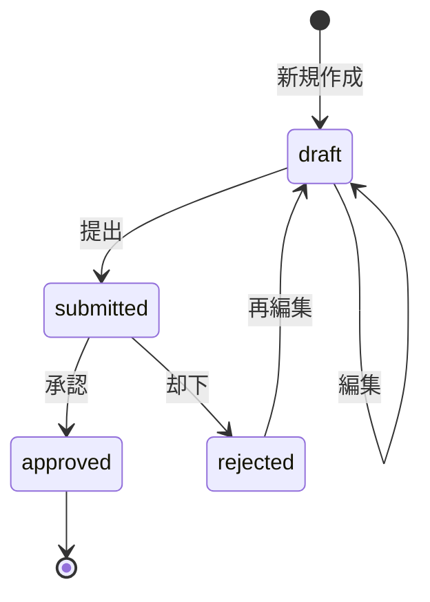

# 週報提出機能 基本設計書

## 1. 概要

### 1.1 目的
SES企業のエンジニア社員が日々の勤怠記録と週間総括を管理し、承認フローを通じて労務管理を効率化する機能を提供する。

### 1.2 対象範囲
- 週報の作成・編集・提出
- 日次勤怠記録の管理（自社・客先並列）
- 承認ワークフロー
- デフォルト設定管理

### 1.3 前提条件
- JWT認証によるユーザー識別
- 役割ベースアクセス制御（一般/マネージャー/管理者）
- 週単位の管理（月曜日開始、日曜日終了）

## 2. 機能仕様

### 2.1 機能一覧

| 機能ID | 機能名 | 概要 |
|--------|--------|------|
| WR-001 | 週報作成 | 新規週報の作成とデフォルト値設定 |
| WR-002 | 週報編集 | 下書き状態の週報編集 |
| WR-003 | 日次勤怠入力 | 7日分の勤怠記録入力 |
| WR-004 | 週報提出 | バリデーション後の提出処理 |
| WR-005 | 週報承認 | 管理者による承認・却下 |
| WR-006 | 週報一覧 | ユーザー・管理者向け一覧表示 |
| WR-007 | デフォルト設定 | 個人の勤務時間テンプレート管理 |

### 2.2 ライフサイクル



### 2.3 ステータス定義

| ステータス | 値 | 説明 | 編集可否 |
|------------|-----|------|----------|
| 下書き | draft | 作成中・編集可能 | ○ |
| 提出済み | submitted | 提出完了・承認待ち | × |
| 承認済み | approved | 承認完了 | 管理者のみ |
| 却下 | rejected | 差し戻し・再編集必要 | ○ |

## 3. データ設計

### 3.1 エンティティ関係図

```mermaid
erDiagram
    users ||--o{ weekly_reports : creates
    weekly_reports ||--o{ daily_records : contains
    users ||--o{ default_settings : has
    departments ||--o{ users : belongs_to
    
    users {
        uuid id PK
        string name
        string email
        enum role
        uuid department_id FK
    }
    
    weekly_reports {
        uuid id PK
        uuid user_id FK
        date start_date
        date end_date
        enum status
        int mood
        text weekly_remarks
        string workplace_name
        decimal workplace_hours
        boolean workplace_change_requested
        decimal total_work_hours
        decimal client_total_work_hours
        timestamp submitted_at
        text manager_comment
        timestamps created_at,updated_at
    }
    
    daily_records {
        uuid id PK
        uuid weekly_report_id FK
        date date
        time start_time
        time end_time
        decimal break_time
        time client_start_time
        time client_end_time
        decimal client_break_time
        boolean has_client_work
        text remarks
        boolean is_holiday_work
        timestamps created_at,updated_at
    }
    
    default_settings {
        uuid id PK
        uuid user_id FK
        time default_start_time
        time default_end_time
        decimal default_break_time
        json weekday_settings
        timestamps created_at,updated_at
    }
```

### 3.2 主要テーブル定義

#### 3.2.1 weekly_reports テーブル

| カラム名 | 型 | 制約 | 説明 |
|----------|-----|------|------|
| id | uuid | PK, NOT NULL | 週報ID |
| user_id | uuid | FK, NOT NULL | 作成者ID |
| start_date | date | NOT NULL | 週開始日（月曜日） |
| end_date | date | NOT NULL | 週終了日（日曜日） |
| status | enum | NOT NULL, DEFAULT 'draft' | ステータス |
| mood | int | CHECK(1-5) | 今週の気分 |
| weekly_remarks | text | | 週間総括 |
| workplace_name | varchar(255) | | 勤務地名 |
| workplace_hours | decimal(4,2) | | 勤務地時間 |
| workplace_change_requested | boolean | DEFAULT false | 勤務地変更申請 |
| total_work_hours | decimal(5,2) | | 自社稼働時間合計 |
| client_total_work_hours | decimal(5,2) | | 客先稼働時間合計 |
| submitted_at | timestamp | | 提出日時 |
| manager_comment | text | | 管理者コメント |

#### 3.2.2 daily_records テーブル

| カラム名 | 型 | 制約 | 説明 |
|----------|-----|------|------|
| id | uuid | PK, NOT NULL | 日次記録ID |
| weekly_report_id | uuid | FK, NOT NULL | 週報ID |
| date | date | NOT NULL | 対象日 |
| start_time | time | | 自社勤怠開始時間 |
| end_time | time | | 自社勤怠終了時間 |
| break_time | decimal(3,2) | DEFAULT 0 | 自社勤怠休憩時間 |
| client_start_time | time | | 客先勤怠開始時間 |
| client_end_time | time | | 客先勤怠終了時間 |
| client_break_time | decimal(3,2) | DEFAULT 0 | 客先勤怠休憩時間 |
| has_client_work | boolean | DEFAULT false | 客先勤怠フラグ |
| remarks | text | | 備考 |
| is_holiday_work | boolean | DEFAULT false | 休日出勤フラグ |

### 3.3 インデックス設計

#### 3.3.1 パフォーマンス重視インデックス

```sql
-- 週報検索用複合インデックス
CREATE INDEX idx_weekly_reports_user_date ON weekly_reports(user_id, start_date, status);

-- 日次記録検索用
CREATE INDEX idx_daily_records_weekly_date ON daily_records(weekly_report_id, date);

-- 承認フロー用
CREATE INDEX idx_weekly_reports_status_submitted ON weekly_reports(status, submitted_at);

-- 月次集計用カバリングインデックス
CREATE INDEX idx_weekly_reports_monthly_summary ON weekly_reports(user_id, start_date, total_work_hours, client_total_work_hours, status);
```

## 4. API設計

### 4.1 RESTful API エンドポイント

#### 4.1.1 週報管理API

| メソッド | エンドポイント | 説明 | 権限 |
|----------|----------------|------|------|
| POST | /api/v1/weekly-reports | 新規週報作成 | 認証済み |
| GET | /api/v1/weekly-reports | 週報一覧取得 | 認証済み |
| GET | /api/v1/weekly-reports/:id | 週報詳細取得 | 所有者・管理者 |
| PUT | /api/v1/weekly-reports/:id | 週報更新 | 所有者・管理者 |
| DELETE | /api/v1/weekly-reports/:id | 週報削除 | 所有者・管理者 |
| POST | /api/v1/weekly-reports/:id/submit | 週報提出 | 所有者 |
| GET | /api/v1/weekly-reports/by-date-range | 日付範囲検索 | 認証済み |

#### 4.1.2 リクエスト・レスポンス仕様

##### 週報作成 (POST /api/v1/weekly-reports)

**リクエスト**
```json
{
  "start_date": "2024-01-01",
  "end_date": "2024-01-07",
  "mood": 3,
  "weekly_remarks": "今週の総括コメント",
  "workplace_name": "客先A社",
  "workplace_hours": 40.0,
  "workplace_change_requested": false,
  "daily_records": [
    {
      "date": "2024-01-01",
      "start_time": "09:00",
      "end_time": "18:00",
      "break_time": 1.0,
      "client_start_time": "09:30",
      "client_end_time": "18:30",
      "client_break_time": 1.0,
      "has_client_work": true,
      "remarks": "案件Aの開発作業",
      "is_holiday_work": false
    }
  ]
}
```

**レスポンス**
```json
{
  "data": {
    "id": "uuid",
    "user_id": "uuid",
    "start_date": "2024-01-01",
    "end_date": "2024-01-07",
    "status": "draft",
    "mood": 3,
    "weekly_remarks": "今週の総括コメント",
    "workplace_name": "客先A社",
    "workplace_hours": 40.0,
    "workplace_change_requested": false,
    "total_work_hours": 40.0,
    "client_total_work_hours": 40.0,
    "submitted_at": null,
    "manager_comment": null,
    "daily_records": [...],
    "created_at": "2024-01-01T00:00:00Z",
    "updated_at": "2024-01-01T00:00:00Z"
  }
}
```

### 4.2 エラー設計

#### 4.2.1 HTTPステータスコード

| ステータス | 用途 | 説明 |
|------------|------|------|
| 200 | 成功 | 正常処理完了 |
| 201 | 作成成功 | リソース作成完了 |
| 400 | バリデーションエラー | 入力値不正 |
| 401 | 認証エラー | 未認証・トークン無効 |
| 403 | 権限エラー | アクセス権限なし |
| 404 | リソース未存在 | 指定リソースが存在しない |
| 409 | 競合エラー | 重複データ・状態不整合 |
| 500 | サーバーエラー | 内部エラー |

#### 4.2.2 エラーレスポンス形式

```json
{
  "error": "エラーメッセージ",
  "error_code": "WR_VALIDATION_ERROR",
  "details": {
    "field": "start_date",
    "message": "開始日は必須です"
  }
}
```

#### 4.2.3 主要エラーコード

| エラーコード | 説明 | HTTPステータス |
|--------------|------|----------------|
| WR_VALIDATION_ERROR | バリデーションエラー | 400 |
| WR_PERMISSION_DENIED | 権限エラー | 403 |
| WR_NOT_FOUND | 週報未存在 | 404 |
| WR_ALREADY_SUBMITTED | 提出済み週報の編集 | 409 |
| WR_DEADLINE_EXCEEDED | 提出期限超過 | 400 |
| WR_DUPLICATE_WEEK | 同一週の重複作成 | 409 |

## 5. ビジネスロジック設計

### 5.1 バリデーションルール

#### 5.1.1 週報レベルバリデーション

| 項目 | ルール | エラーメッセージ |
|------|--------|------------------|
| 開始日・終了日 | 7日間の範囲 | 週の期間は7日間である必要があります |
| 開始日 | 月曜日 | 開始日は月曜日である必要があります |
| 気分 | 1-5の整数 | 気分は1-5の値で入力してください |
| 週間総括 | 1000文字以内 | 週間総括は1000文字以内で入力してください |
| 勤務地時間 | 0以上 | 勤務地時間は0以上で入力してください |

#### 5.1.2 日次記録レベルバリデーション

| 項目 | ルール | エラーメッセージ |
|------|--------|------------------|
| 開始・終了時間 | 開始 < 終了 | 終了時間は開始時間より後に設定してください |
| 休憩時間 | 0.5時間単位 | 休憩時間は0.5時間単位で入力してください |
| 時間形式 | HH:mm | 時間はHH:mm形式で入力してください |
| 最低稼働日 | 1日以上 | 最低1日は稼働時間を入力してください |

### 5.2 自動計算ロジック

#### 5.2.1 日次稼働時間計算

```typescript
// 自社稼働時間 = 終了時間 - 開始時間 - 休憩時間
const workHours = (endTime - startTime) - breakTime;

// 客先稼働時間 = 客先終了時間 - 客先開始時間 - 客先休憩時間
const clientWorkHours = hasClientWork 
  ? (clientEndTime - clientStartTime) - clientBreakTime 
  : 0;
```

#### 5.2.2 週間合計計算

```typescript
// 週間自社稼働時間合計
const totalWorkHours = dailyRecords
  .map(record => calculateWorkHours(record))
  .reduce((sum, hours) => sum + hours, 0);

// 週間客先稼働時間合計
const clientTotalWorkHours = dailyRecords
  .filter(record => record.hasClientWork)
  .map(record => calculateClientWorkHours(record))
  .reduce((sum, hours) => sum + hours, 0);
```

### 5.3 権限制御ロジック

#### 5.3.1 アクセス権限マトリックス

| 操作 | 一般ユーザー | マネージャー | 管理者 |
|------|--------------|--------------|--------|
| 自分の週報作成 | ○ | ○ | ○ |
| 自分の週報編集（下書き） | ○ | ○ | ○ |
| 自分の週報提出 | ○ | ○ | ○ |
| 部下の週報閲覧 | × | ○ | ○ |
| 部下の週報承認 | × | ○ | ○ |
| 提出済み週報編集 | × | × | ○ |
| 全ユーザー週報閲覧 | × | × | ○ |

#### 5.3.2 編集権限制御

```typescript
function canEditWeeklyReport(report: WeeklyReport, user: User): boolean {
  // 管理者は常に編集可能
  if (user.role === 'admin') return true;
  
  // 所有者でない場合は編集不可
  if (report.userId !== user.id) return false;
  
  // 下書き・却下状態のみ編集可能
  return ['draft', 'rejected'].includes(report.status);
}
```

### 5.4 提出期限制御

#### 5.4.1 期限計算ロジック

```typescript
function calculateSubmissionDeadline(weekEndDate: Date): Date {
  // 週終了日（日曜日）の翌日（月曜日）正午
  const deadline = new Date(weekEndDate);
  deadline.setDate(deadline.getDate() + 1); // 翌日
  deadline.setHours(12, 0, 0, 0); // 正午
  return deadline;
}

function isSubmissionAllowed(weekEndDate: Date): boolean {
  const deadline = calculateSubmissionDeadline(weekEndDate);
  return new Date() <= deadline;
}
```

## 6. フロントエンド設計

### 6.1 コンポーネント構成

```
src/app/weekly-reports/
├── page.tsx                    # 週報一覧ページ
├── create/
│   └── page.tsx               # 週報作成ページ
├── [id]/
│   ├── page.tsx              # 週報詳細・編集ページ
│   └── edit/
│       └── page.tsx          # 週報編集ページ
└── components/
    ├── WeeklyReportList.tsx   # 週報一覧コンポーネント
    ├── WeeklyReportForm.tsx   # 週報フォーム
    ├── DailyRecordInput.tsx   # 日次入力コンポーネント
    ├── MoodSelector.tsx       # 気分選択コンポーネント
    ├── StatusBadge.tsx        # ステータスバッジ
    └── DefaultSettingsForm.tsx # デフォルト設定フォーム
```

### 6.2 状態管理設計

#### 6.2.1 React Query キー設計

```typescript
export const weeklyReportKeys = {
  all: ['weeklyReports'] as const,
  lists: () => [...weeklyReportKeys.all, 'list'] as const,
  list: (filters: string) => [...weeklyReportKeys.lists(), { filters }] as const,
  details: () => [...weeklyReportKeys.all, 'detail'] as const,
  detail: (id: string) => [...weeklyReportKeys.details(), id] as const,
  byDateRange: (startDate: string, endDate: string) => 
    [...weeklyReportKeys.all, 'byDateRange', { startDate, endDate }] as const,
};
```

#### 6.2.2 フォーム状態管理

```typescript
interface WeeklyReportFormData {
  startDate: string;
  endDate: string;
  mood: number;
  weeklyRemarks: string;
  workplaceName: string;
  workplaceHours: number;
  workplaceChangeRequested: boolean;
  dailyRecords: DailyRecordFormData[];
}

interface DailyRecordFormData {
  date: string;
  startTime: string;
  endTime: string;
  breakTime: number;
  clientStartTime?: string;
  clientEndTime?: string;
  clientBreakTime: number;
  hasClientWork: boolean;
  remarks: string;
  isHolidayWork: boolean;
}
```

### 6.3 UX設計

#### 6.3.1 自動保存機能

```typescript
// 5秒間入力がない場合に自動保存
const { mutate: autoSave } = useAutoSaveWeeklyReport();

const debouncedAutoSave = useCallback(
  debounce((data: WeeklyReportFormData) => {
    if (data.id && data.status === 'draft') {
      autoSave(data);
    }
  }, 5000),
  [autoSave]
);
```

#### 6.3.2 一括設定機能

```typescript
// 平日一括設定
function applyWeekdayDefaults(
  dailyRecords: DailyRecordFormData[],
  defaultSettings: DefaultSettings
): DailyRecordFormData[] {
  return dailyRecords.map(record => {
    const dayOfWeek = new Date(record.date).getDay();
    // 月曜(1)〜金曜(5)のみ適用
    if (dayOfWeek >= 1 && dayOfWeek <= 5) {
      return {
        ...record,
        startTime: defaultSettings.defaultStartTime,
        endTime: defaultSettings.defaultEndTime,
        breakTime: defaultSettings.defaultBreakTime,
      };
    }
    return record;
  });
}
```

## 7. バックエンド設計

### 7.1 アーキテクチャ

```
backend/
├── handlers/
│   └── weekly_report_handler.go    # HTTPハンドラー層
├── services/
│   └── weekly_report_service.go    # ビジネスロジック層
├── repositories/
│   └── weekly_report_repository.go # データアクセス層
├── models/
│   ├── weekly_report.go           # モデル定義
│   └── daily_record.go           # 日次記録モデル
└── middleware/
    ├── auth.go                   # 認証ミドルウェア
    └── permission.go            # 権限チェック
```

### 7.2 サービス層設計

#### 7.2.1 インターフェース定義

```go
type WeeklyReportService interface {
    CreateWeeklyReport(ctx context.Context, req *CreateWeeklyReportRequest) (*WeeklyReport, error)
    GetWeeklyReport(ctx context.Context, id uuid.UUID, userID uuid.UUID) (*WeeklyReport, error)
    UpdateWeeklyReport(ctx context.Context, req *UpdateWeeklyReportRequest) (*WeeklyReport, error)
    SubmitWeeklyReport(ctx context.Context, id uuid.UUID, userID uuid.UUID) error
    GetWeeklyReportsByUser(ctx context.Context, userID uuid.UUID, page, limit int) (*PaginatedWeeklyReports, error)
    DeleteWeeklyReport(ctx context.Context, id uuid.UUID, userID uuid.UUID) error
    ApproveWeeklyReport(ctx context.Context, id uuid.UUID, managerID uuid.UUID, comment string) error
    RejectWeeklyReport(ctx context.Context, id uuid.UUID, managerID uuid.UUID, comment string) error
}
```

#### 7.2.2 トランザクション管理

```go
func (s *weeklyReportService) CreateWeeklyReport(ctx context.Context, req *CreateWeeklyReportRequest) (*WeeklyReport, error) {
    var result *WeeklyReport
    
    err := s.db.Transaction(func(tx *gorm.DB) error {
        // 週報作成
        weeklyReportRepo := repository.NewWeeklyReportRepository(tx, s.logger)
        report, err := weeklyReportRepo.Create(ctx, req.ToModel())
        if err != nil {
            return err
        }
        
        // 日次記録一括作成
        dailyRepo := repository.NewDailyRecordRepository(tx, s.logger)
        for _, dailyReq := range req.DailyRecords {
            dailyReq.WeeklyReportID = report.ID
            _, err := dailyRepo.Create(ctx, dailyReq.ToModel())
            if err != nil {
                return err
            }
        }
        
        result = report
        return nil
    })
    
    return result, err
}
```

### 7.3 権限チェックミドルウェア

```go
func WeeklyReportPermissionMiddleware() gin.HandlerFunc {
    return func(c *gin.Context) {
        userID := middleware.GetUserIDFromContext(c)
        reportID := c.Param("id")
        
        // 管理者は全てアクセス可能
        if middleware.IsAdmin(c) {
            c.Next()
            return
        }
        
        // 所有者チェック
        if !checkWeeklyReportOwnership(userID, reportID) {
            middleware.RespondError(c, http.StatusForbidden, "この週報にアクセスする権限がありません")
            return
        }
        
        c.Next()
    }
}
```

## 8. テスト設計

### 8.1 テスト戦略

#### 8.1.1 テストピラミッド

```
E2E Tests (10%)
├── 週報提出フロー
├── 承認ワークフロー
└── 権限制御テスト

Integration Tests (20%)
├── API統合テスト
├── データベース連携テスト
└── 認証・認可テスト

Unit Tests (70%)
├── ビジネスロジックテスト
├── バリデーションテスト
├── 計算ロジックテスト
└── コンポーネントテスト
```

#### 8.1.2 主要テストケース

##### バックエンド単体テスト

```go
func TestWeeklyReportService_CreateWeeklyReport(t *testing.T) {
    tests := []struct {
        name        string
        request     *CreateWeeklyReportRequest
        expectError bool
        errorType   string
    }{
        {
            name: "正常ケース_新規週報作成",
            request: &CreateWeeklyReportRequest{
                UserID: validUserID,
                StartDate: "2024-01-01",
                EndDate: "2024-01-07",
                // ...
            },
            expectError: false,
        },
        {
            name: "異常ケース_重複週報作成",
            request: &CreateWeeklyReportRequest{
                UserID: validUserID,
                StartDate: "2024-01-01", // 既存と重複
                EndDate: "2024-01-07",
            },
            expectError: true,
            errorType: "DUPLICATE_WEEK",
        },
    }
    
    for _, tt := range tests {
        t.Run(tt.name, func(t *testing.T) {
            // テスト実行
        })
    }
}
```

##### フロントエンド単体テスト

```typescript
describe('WeeklyReportForm', () => {
  test('正常ケース: フォーム送信が成功する', async () => {
    const mockSubmit = jest.fn();
    render(<WeeklyReportForm onSubmit={mockSubmit} />);
    
    // フォーム入力
    await userEvent.type(screen.getByLabelText('週間総括'), '今週の総括');
    await userEvent.selectOptions(screen.getByLabelText('気分'), '3');
    
    // 送信
    await userEvent.click(screen.getByText('保存'));
    
    expect(mockSubmit).toHaveBeenCalledWith(
      expect.objectContaining({
        weeklyRemarks: '今週の総括',
        mood: 3,
      })
    );
  });
  
  test('異常ケース: バリデーションエラーが表示される', async () => {
    render(<WeeklyReportForm />);
    
    // 必須項目を空で送信
    await userEvent.click(screen.getByText('提出'));
    
    expect(screen.getByText('最低1日は稼働時間を入力してください')).toBeInTheDocument();
  });
});
```

## 9. 運用設計

### 9.1 パフォーマンス要件

| 項目 | 目標値 | 測定方法 |
|------|--------|----------|
| API応答時間 | 平均200ms以下 | APMツール |
| 画面表示時間 | 3秒以内 | Lighthouse |
| 同時接続ユーザー | 1000人 | 負荷テスト |
| データベース応答 | 50ms以下 | スロークエリログ |

### 9.2 監視・ログ設計

#### 9.2.1 ログレベル定義

| レベル | 用途 | 出力内容 |
|--------|------|----------|
| ERROR | システムエラー | スタックトレース、リクエストID |
| WARN | ビジネス警告 | バリデーションエラー、権限エラー |
| INFO | 重要な処理 | 週報提出、承認処理 |
| DEBUG | 開発デバッグ | SQL、API通信詳細 |

#### 9.2.2 メトリクス設計

```go
// Prometheus メトリクス
var (
    weeklyReportCreated = prometheus.NewCounterVec(
        prometheus.CounterOpts{
            Name: "weekly_report_created_total",
            Help: "週報作成数",
        },
        []string{"user_id", "status"},
    )
    
    weeklyReportSubmissionLatency = prometheus.NewHistogramVec(
        prometheus.HistogramOpts{
            Name: "weekly_report_submission_duration_seconds",
            Help: "週報提出処理時間",
        },
        []string{"status"},
    )
)
```

### 9.3 障害対応

#### 9.3.1 障害レベル定義

| レベル | 影響範囲 | 対応時間目標 | エスカレーション |
|--------|----------|--------------|------------------|
| Critical | 全ユーザー | 30分以内復旧 | 即座 |
| High | 特定機能 | 2時間以内復旧 | 1時間後 |
| Medium | 個別ユーザー | 8時間以内復旧 | 4時間後 |
| Low | UI不具合 | 24時間以内対応 | なし |

#### 9.3.2 復旧手順

1. **データベース障害**
   - レプリカへの切り替え
   - データ整合性チェック
   - プライマリ復旧後の同期

2. **アプリケーション障害**
   - ヘルスチェック確認
   - ログ解析
   - ロールバック実行

## 10. セキュリティ設計

### 10.1 認証・認可

#### 10.1.1 JWT設計

```typescript
interface JWTPayload {
  user_id: string;
  email: string;
  role: 'general' | 'manager' | 'admin';
  department_id: string;
  exp: number;
  iat: number;
}
```

#### 10.1.2 権限マトリックス詳細

| リソース | 操作 | 一般 | マネージャー | 管理者 | 条件 |
|----------|------|------|--------------|--------|------|
| weekly_reports | CREATE | ○ | ○ | ○ | 自分のみ |
| weekly_reports | READ | ○ | ○ | ○ | 自分・部下・全員 |
| weekly_reports | UPDATE | ○ | ○ | ○ | 自分のみ・下書き状態 |
| weekly_reports | DELETE | ○ | ○ | ○ | 自分のみ・下書き状態 |
| weekly_reports | SUBMIT | ○ | ○ | ○ | 自分のみ |
| weekly_reports | APPROVE | × | ○ | ○ | 部下・全員 |

### 10.2 データ保護

#### 10.2.1 機密情報の取り扱い

- **個人勤怠データ**: 暗号化保存、アクセスログ記録
- **管理者コメント**: 権限者のみ閲覧可能
- **API通信**: HTTPS強制、CSRF対策

#### 10.2.2 監査ログ

```go
type AuditLog struct {
    ID        uuid.UUID `gorm:"primaryKey"`
    UserID    uuid.UUID `gorm:"not null"`
    Action    string    `gorm:"not null"`    // CREATE, UPDATE, DELETE, SUBMIT, APPROVE
    Resource  string    `gorm:"not null"`    // weekly_report
    ResourceID uuid.UUID `gorm:"not null"`
    IPAddress string    `gorm:"not null"`
    UserAgent string
    CreatedAt time.Time
}
```

## 11. 今後の拡張性

### 11.1 機能拡張計画

#### 11.1.1 短期的拡張（3ヶ月以内）

- **モバイル対応**: PWA化、レスポンシブデザイン
- **通知機能**: 提出期限、承認完了の通知
- **CSV出力**: 月次・年次の勤怠データ出力

#### 11.1.2 中期的拡張（6ヶ月以内）

- **ワークフロー拡張**: 複数承認者、承認ルート設定
- **分析機能**: 勤怠傾向分析、ダッシュボード
- **API連携**: 給与システム、プロジェクト管理ツール

#### 11.1.3 長期的拡張（1年以内）

- **AI機能**: 異常勤怠の検知、最適な勤務パターンの提案
- **マルチテナント**: 複数企業対応
- **外部認証**: SAML、OAuth2連携

### 11.2 技術的拡張性

#### 11.2.1 スケーラビリティ

- **データベース**: 読み書き分離、シャーディング対応
- **アプリケーション**: マイクロサービス化、コンテナオーケストレーション
- **フロントエンド**: CDN活用、キャッシュ戦略最適化

#### 11.2.2 保守性

- **コード品質**: 静的解析、テストカバレッジ90%以上
- **ドキュメント**: OpenAPI仕様、コンポーネントライブラリ
- **CI/CD**: 自動テスト、段階的デプロイメント

---

本設計書は週報提出機能の基本設計を示しており、実装時には詳細設計に基づいて具体的な実装を行う。変更要求や追加仕様については、本設計書を基準として影響範囲を評価し、適切な設計変更を実施する。