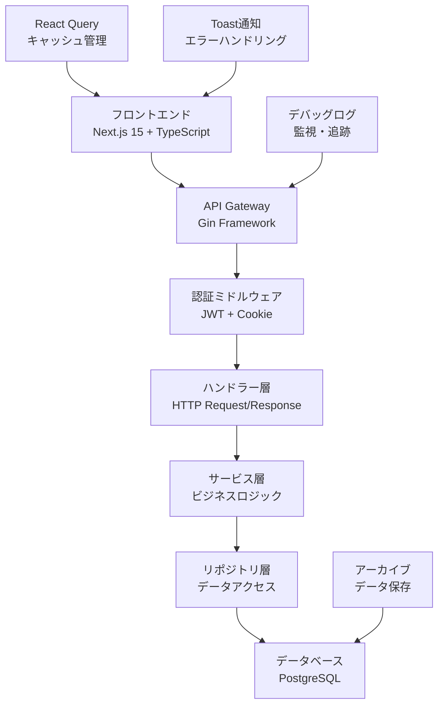

# 週報提出機能 詳細設計書

## 1. 概要

### 1.1 文書の目的
本文書は、Monsteraプロジェクトの週報提出機能における詳細設計を記載し、実装者が具体的なコーディングを行うための技術仕様を提供する。

### 1.2 対象読者
- バックエンドエンジニア
- フロントエンドエンジニア
- テストエンジニア
- システム運用エンジニア

### 1.3 文書構成
実装済みの週報機能を分析し、以下の観点で詳細設計を文書化している：
- データベース設計詳細
- API仕様詳細
- フロントエンド実装詳細  
- バックエンド実装詳細
- エラーハンドリング詳細

## 2. システム構成

### 2.1 アーキテクチャ概要



### 2.2 技術スタック詳細

#### フロントエンド
- **Framework**: Next.js 15.3.2 (App Router)
- **Language**: TypeScript 5.x
- **UI Library**: Material-UI v7
- **State Management**: React Query v5 + React Hook Form
- **HTTP Client**: axios
- **テスト**: Jest + Testing Library

#### バックエンド
- **Framework**: Go 1.22 + Gin v1.8.1
- **ORM**: GORM v1.25
- **認証**: JWT + HTTPOnly Cookie
- **ログ**: zap
- **バリデーション**: go-playground/validator

#### データベース
- **RDBMS**: PostgreSQL
- **マイグレーション**: golang-migrate
- **接続プール**: GORM Connection Pool

## 3. データベース詳細設計

### 3.1 テーブル構造

#### 3.1.1 weekly_reports テーブル

```sql
CREATE TABLE `weekly_reports` (
  `id` varchar(36) NOT NULL,
  `user_id` varchar(36) NOT NULL,
  `department_id` varchar(36) DEFAULT NULL,
  `department_name` varchar(100) DEFAULT NULL,
  `manager_id` varchar(36) DEFAULT NULL,
  `start_date` date NOT NULL,
  `end_date` date NOT NULL,
  `submission_deadline` date DEFAULT NULL,
  `is_late_submission` tinyint(1) DEFAULT '0',
  `status` enum('draft','submitted','approved','rejected') DEFAULT 'draft',
  `mood` int NOT NULL DEFAULT '3',
  `weekly_remarks` text,
  `workplace_name` varchar(100) DEFAULT NULL,
  `workplace_hours` varchar(100) DEFAULT NULL,
  `workplace_change_requested` tinyint(1) DEFAULT '0',
  `total_work_hours` decimal(5,2) DEFAULT NULL,
  `client_total_work_hours` decimal(5,2) DEFAULT '0.00',
  `client_work_hours` decimal(5,2) DEFAULT '0.00',
  `submitted_at` timestamp NULL DEFAULT NULL,
  `manager_comment` text,
  `commented_by` varchar(36) DEFAULT NULL,
  `commented_at` datetime(3) DEFAULT NULL,
  `revision_count` int NOT NULL DEFAULT '0',
  `last_accessed_at` timestamp NULL DEFAULT NULL,
  `metadata` json DEFAULT NULL,
  `created_at` timestamp NULL DEFAULT CURRENT_TIMESTAMP,
  `updated_at` timestamp NULL DEFAULT CURRENT_TIMESTAMP ON UPDATE CURRENT_TIMESTAMP,
  `deleted_at` timestamp NULL DEFAULT NULL,
  PRIMARY KEY (`id`),
  UNIQUE KEY `unique_user_week` (`user_id`,`start_date`,`deleted_at`),
  KEY `idx_weekly_reports_user_date` (`user_id`,`start_date` DESC),
  KEY `idx_weekly_reports_status_created` (`status`,`created_at` DESC),
  KEY `idx_weekly_reports_date_range` (`start_date`,`end_date`),
  KEY `idx_weekly_reports_deleted_status` (`deleted_at`,`status`),
  KEY `idx_weekly_reports_covering` (`user_id`,`status`,`start_date`,`end_date`,`total_work_hours`,`submitted_at`),
  KEY `idx_weekly_reports_unsubmitted` (`user_id`,`end_date`,`status`,`deleted_at`),
  FULLTEXT KEY `idx_weekly_reports_fulltext` (`weekly_remarks`),
  KEY `idx_weekly_reports_monthly` ((year(`start_date`)),(month(`start_date`)),`status`,`deleted_at`),
  CONSTRAINT `chk_weekly_reports_dates` CHECK ((`end_date` >= `start_date`)),
  CONSTRAINT `chk_weekly_reports_work_hours` CHECK ((`total_work_hours` >= 0)),
  CONSTRAINT `chk_weekly_reports_client_hours` CHECK ((`client_total_work_hours` >= 0)),
  CONSTRAINT `chk_weekly_reports_mood` CHECK ((`mood` between 1 and 5)),
  CONSTRAINT `chk_weekly_reports_revision_count` CHECK ((`revision_count` >= 0)),
  CONSTRAINT `fk_weekly_reports_user` FOREIGN KEY (`user_id`) REFERENCES `users` (`id`),
  CONSTRAINT `fk_weekly_reports_commented_by` FOREIGN KEY (`commented_by`) REFERENCES `users` (`id`),
  CONSTRAINT `fk_weekly_reports_manager` FOREIGN KEY (`manager_id`) REFERENCES `users` (`id`) ON DELETE SET NULL,
  CONSTRAINT `fk_weekly_reports_department` FOREIGN KEY (`department_id`) REFERENCES `departments` (`id`) ON DELETE SET NULL
) ENGINE=InnoDB DEFAULT CHARSET=utf8mb4 COLLATE=utf8mb4_unicode_ci;
```

#### 3.1.2 daily_records テーブル

```sql
CREATE TABLE `daily_records` (
  `id` varchar(36) NOT NULL,
  `weekly_report_id` varchar(36) NOT NULL,
  `date` date NOT NULL,
  `start_time` varchar(10) DEFAULT NULL,
  `end_time` varchar(10) DEFAULT NULL,
  `break_time` decimal(5,2) DEFAULT NULL,
  `work_hours` decimal(5,2) DEFAULT NULL,
  `client_start_time` varchar(10) DEFAULT NULL,
  `client_end_time` varchar(10) DEFAULT NULL,
  `client_break_time` decimal(5,2) DEFAULT NULL,
  `client_work_hours` decimal(5,2) DEFAULT NULL,
  `has_client_work` tinyint(1) DEFAULT '0',
  `remarks` text,
  `is_holiday_work` tinyint(1) DEFAULT '0',
  `created_at` timestamp NULL DEFAULT CURRENT_TIMESTAMP,
  `updated_at` timestamp NULL DEFAULT CURRENT_TIMESTAMP ON UPDATE CURRENT_TIMESTAMP,
  PRIMARY KEY (`id`),
  UNIQUE KEY `unique_weekly_report_date` (`weekly_report_id`,`date`),
  KEY `idx_daily_records_weekly_report` (`weekly_report_id`),
  KEY `idx_daily_records_date` (`date`),
  KEY `idx_daily_records_holiday_work` (`is_holiday_work`,`date`),
  KEY `idx_daily_records_work_hours` (`work_hours`),
  KEY `idx_daily_records_client_work` (`has_client_work`,`client_work_hours`),
  KEY `idx_daily_records_covering` (`weekly_report_id`,`date`,`work_hours`,`client_work_hours`,`is_holiday_work`),
  CONSTRAINT `fk_daily_records_weekly_report` FOREIGN KEY (`weekly_report_id`) REFERENCES `weekly_reports` (`id`) ON DELETE CASCADE
) ENGINE=InnoDB DEFAULT CHARSET=utf8mb4 COLLATE=utf8mb4_unicode_ci;
```

### 3.2 インデックス設計詳細

#### 3.2.1 最適化されたクエリパターン

**ユーザー別週報検索（最頻出）**
```sql
-- インデックス: idx_weekly_reports_user_date
SELECT * FROM weekly_reports 
WHERE user_id = ? AND start_date = ? 
ORDER BY start_date DESC;
```

**ステータス別一覧（管理者画面）**
```sql
-- インデックス: idx_weekly_reports_status_created
SELECT * FROM weekly_reports 
WHERE status = 'submitted' 
ORDER BY created_at DESC;
```

**月次集計クエリ**
```sql
-- インデックス: idx_weekly_reports_monthly
SELECT YEAR(start_date), MONTH(start_date), 
       COUNT(*), AVG(total_work_hours)
FROM weekly_reports 
WHERE status = 'approved' AND deleted_at IS NULL
GROUP BY YEAR(start_date), MONTH(start_date);
```

#### 3.2.2 カバリングインデックスの効果

```sql
-- 頻出カラムを含むカバリングインデックス
-- インデックス: idx_weekly_reports_covering
-- (user_id, status, start_date, end_date, total_work_hours, submitted_at)

-- このインデックスで以下のクエリはインデックスのみでデータ取得可能
SELECT user_id, status, start_date, end_date, total_work_hours, submitted_at
FROM weekly_reports 
WHERE user_id = ? AND status = 'submitted';
```

### 3.3 パフォーマンス最適化

#### 3.3.1 パーティショニング検討

```sql
-- 将来的な月次パーティショニング案
ALTER TABLE weekly_reports 
PARTITION BY RANGE (YEAR(start_date)) (
  PARTITION p2023 VALUES LESS THAN (2024),
  PARTITION p2024 VALUES LESS THAN (2025),
  PARTITION p2025 VALUES LESS THAN (2026),
  PARTITION p_future VALUES LESS THAN MAXVALUE
);
```

#### 3.3.2 アーカイブテーブル設計

```sql
CREATE TABLE `weekly_reports_archive` (
  -- 元データの全カラム
  `original_id` char(36) NOT NULL,
  `user_name` varchar(255) NOT NULL,
  `user_email` varchar(255) NOT NULL,
  `department_name` varchar(255) DEFAULT NULL,
  -- アーカイブ専用カラム
  `archived_at` timestamp DEFAULT CURRENT_TIMESTAMP,
  `archived_by` char(36) NOT NULL,
  `archive_reason` enum('retention_policy','manual','data_migration'),
  `fiscal_year` year NOT NULL,
  `fiscal_quarter` tinyint NOT NULL,
  -- ... 元テーブルの全カラム
  
  PRIMARY KEY (`id`),
  KEY `idx_archive_fiscal` (`fiscal_year`,`fiscal_quarter`),
  KEY `idx_archive_user` (`user_name`,`archived_at`),
  KEY `idx_archive_original` (`original_id`)
) ENGINE=InnoDB DEFAULT CHARSET=utf8mb4 COLLATE=utf8mb4_unicode_ci;
```

## 4. API詳細設計

### 4.1 認証・認可

#### 4.1.1 JWT実装詳細

**トークン構造**
```go
type JWTClaims struct {
    UserID       string `json:"user_id"`
    Email        string `json:"email"`
    Role         int    `json:"role"`         // 1:super_admin, 2:admin, 3:manager, 4:employee
    DepartmentID string `json:"department_id"`
    jwt.RegisteredClaims
}

// トークン生成
func GenerateTokens(user *model.User) (accessToken, refreshToken string, err error) {
    // アクセストークン（15分）
    accessClaims := JWTClaims{
        UserID:       user.ID.String(),
        Email:        user.Email,
        Role:         user.Role,
        DepartmentID: user.DepartmentID.String(),
        RegisteredClaims: jwt.RegisteredClaims{
            ExpiresAt: jwt.NewNumericDate(time.Now().Add(15 * time.Minute)),
            IssuedAt:  jwt.NewNumericDate(time.Now()),
        },
    }
    
    // リフレッシュトークン（7日）
    refreshClaims := jwt.RegisteredClaims{
        ExpiresAt: jwt.NewNumericDate(time.Now().Add(7 * 24 * time.Hour)),
        IssuedAt:  jwt.NewNumericDate(time.Now()),
    }
    
    // トークン署名・生成処理
}
```

#### 4.1.2 権限チェック実装

```go
// 週報アクセス権限チェック
func (w *WeeklyReportAuthMiddleware) RequireWeeklyReportAccess() gin.HandlerFunc {
    return func(c *gin.Context) {
        userID := middleware.GetUserIDFromContext(c)
        role := middleware.GetUserRoleFromContext(c)
        reportID := c.Param("id")
        
        // 管理者は全アクセス可能
        if role <= 2 { // super_admin or admin
            c.Next()
            return
        }
        
        // 週報の所有者チェック
        if !w.isOwnerOrManager(c, userID, reportID) {
            middleware.RespondError(c, http.StatusForbidden, 
                "この週報にアクセスする権限がありません")
            return
        }
        
        c.Next()
    }
}

// 編集権限チェック
func (w *WeeklyReportAuthMiddleware) RequireWeeklyReportEdit() gin.HandlerFunc {
    return func(c *gin.Context) {
        userID := middleware.GetUserIDFromContext(c)
        reportID := c.Param("id")
        
        // 週報の状態と所有者をチェック
        report, err := w.weeklyReportRepo.FindByID(c, uuid.MustParse(reportID))
        if err != nil {
            middleware.RespondError(c, http.StatusNotFound, "週報が見つかりません")
            return
        }
        
        // 提出済みは編集不可（管理者を除く）
        if report.Status == "submitted" && !w.isAdmin(c) {
            middleware.RespondError(c, http.StatusForbidden, 
                "提出済みの週報は編集できません")
            return
        }
        
        // 所有者のみ編集可能
        if report.UserID.String() != userID && !w.isAdmin(c) {
            middleware.RespondError(c, http.StatusForbidden, 
                "この週報を編集する権限がありません")
            return
        }
        
        c.Next()
    }
}
```

### 4.2 エンドポイント詳細仕様

#### 4.2.1 週報作成・更新API

**POST /api/v1/weekly-reports**

```go
// リクエスト構造体
type CreateWeeklyReportRequest struct {
    ID                       *string       `json:"id"`
    StartDate               string        `json:"start_date" binding:"required"`
    EndDate                 string        `json:"end_date" binding:"required"`
    Mood                    int           `json:"mood" binding:"min=1,max=5"`
    WeeklyMood             *string       `json:"weekly_mood"`  // 後方互換性
    WeeklyRemarks          string        `json:"weekly_remarks"`
    WorkplaceName          string        `json:"workplace_name"`
    WorkplaceHours         string        `json:"workplace_hours"`
    WorkplaceChangeRequested bool         `json:"workplace_change_requested"`
    Status                 *string       `json:"status"`
    DailyRecords           []DailyRecord `json:"daily_records"`
}

type DailyRecord struct {
    Date            string   `json:"date" binding:"required"`
    StartTime       *string  `json:"start_time"`
    EndTime         *string  `json:"end_time"`
    BreakTime       *float64 `json:"break_time"`
    WorkHours       *float64 `json:"work_hours"`
    ClientStartTime *string  `json:"client_start_time"`
    ClientEndTime   *string  `json:"client_end_time"`
    ClientBreakTime *float64 `json:"client_break_time"`
    ClientWorkHours *float64 `json:"client_work_hours"`
    HasClientWork   bool     `json:"has_client_work"`
    Remarks         *string  `json:"remarks"`
    IsHolidayWork   bool     `json:"is_holiday_work"`
}

// レスポンス構造体
type WeeklyReportResponse struct {
    ID                      string        `json:"id"`
    UserID                  string        `json:"user_id"`
    StartDate              string        `json:"start_date"`
    EndDate                string        `json:"end_date"`
    Status                 string        `json:"status"`
    Mood                   int           `json:"mood"`
    MoodString             string        `json:"mood_string"`
    WeeklyRemarks          string        `json:"weekly_remarks"`
    WorkplaceName          string        `json:"workplace_name"`
    WorkplaceHours         string        `json:"workplace_hours"`
    WorkplaceChangeRequested bool         `json:"workplace_change_requested"`
    TotalWorkHours         float64       `json:"total_work_hours"`
    ClientTotalWorkHours   float64       `json:"client_total_work_hours"`
    DailyRecords           []DailyRecord `json:"daily_records"`
    SubmittedAt           *string       `json:"submitted_at"`
    CreatedAt             string        `json:"created_at"`
    UpdatedAt             string        `json:"updated_at"`
}
```

**ハンドラー実装**
```go
func (h *WeeklyReportHandler) Create(c *gin.Context) {
    var req CreateWeeklyReportRequest
    if err := c.ShouldBindJSON(&req); err != nil {
        debug.LogValidationError(h.logger, "weekly_report_create", err, req)
        h.respondValidationError(c, err)
        return
    }
    
    userID := middleware.GetUserIDFromContext(c)
    
    // デバッグログ
    debug.DebugLogger.LogAPI("POST", "/weekly-reports", req, nil, 0)
    
    // 日付バリデーション
    if err := h.validateDateRange(req.StartDate, req.EndDate); err != nil {
        h.respondError(c, http.StatusBadRequest, err.Error())
        return
    }
    
    // サービス層呼び出し
    report, err := h.weeklyReportService.Create(c, userID, &req)
    if err != nil {
        debug.LogServiceError(h.logger, "weekly_report_create", err, req)
        h.handleServiceError(c, err)
        return
    }
    
    // レスポンス
    response := h.convertToResponse(report)
    debug.DebugLogger.LogAPI("POST", "/weekly-reports", req, response, 
        time.Since(start).Milliseconds())
    
    c.JSON(http.StatusCreated, gin.H{"data": response})
}
```

#### 4.2.2 週報提出API

**POST /api/v1/weekly-reports/:id/submit**

```go
func (h *WeeklyReportHandler) Submit(c *gin.Context) {
    reportID, err := h.parseUUID(c.Param("id"))
    if err != nil {
        h.respondError(c, http.StatusBadRequest, "無効な週報IDです")
        return
    }
    
    userID := middleware.GetUserIDFromContext(c)
    
    // 提出処理
    err = h.weeklyReportService.Submit(c, reportID, userID)
    if err != nil {
        h.handleServiceError(c, err)
        return
    }
    
    // 提出後の週報取得
    report, err := h.weeklyReportService.GetByID(c, reportID, userID)
    if err != nil {
        h.handleServiceError(c, err)
        return
    }
    
    response := h.convertToResponse(report)
    c.JSON(http.StatusOK, gin.H{
        "data": response,
        "message": "週報を提出しました",
    })
}
```

### 4.3 エラーハンドリング詳細

#### 4.3.1 エラーコード体系

```go
// エラーコード定数
const (
    // 基本操作（W001xxx）
    ErrorCodeNotFound           = "W001V001"  // 週報が見つかりません
    ErrorCodeDuplicateWeek      = "W001V002"  // 指定された週の週報は既に存在します
    ErrorCodeInvalidPeriod      = "W001V003"  // 無効な週報期間です
    ErrorCodeInvalidDateRange   = "W001V006"  // 週報の日付範囲が無効です
    ErrorCodeFutureWeek         = "W001V007"  // 未来の週の週報は作成できません
    
    // 提出関連（W002xxx）
    ErrorCodeAlreadySubmitted   = "W002B001"  // この週報は既に提出済みです
    ErrorCodeMissingRequired    = "W002V001"  // 必須項目が未入力です
    ErrorCodeInvalidMood        = "W002V002"  // 気分の値が無効です
    ErrorCodePastDeadline       = "W002B003"  // 提出期限を過ぎています
    
    // 編集関連（W003xxx）
    ErrorCodeCannotEdit         = "W003B001"  // この週報は編集できません
    ErrorCodeNoEditPermission   = "W003A001"  // この週報を編集する権限がありません
    ErrorCodeEditConflict       = "W003C001"  // 他のユーザーが編集中です
    
    // 承認関連（W004xxx）
    ErrorCodeCannotApprove      = "W004B001"  // この週報は承認できません
    ErrorCodeNoApprovePermission = "W004A001" // 週報を承認する権限がありません
)

// エラー構造体
type APIError struct {
    Code      string                 `json:"code"`
    Message   string                 `json:"error"`
    Details   map[string]interface{} `json:"details,omitempty"`
    Timestamp time.Time              `json:"timestamp"`
    RequestID string                 `json:"request_id"`
}

// エラーレスポンス生成
func (h *WeeklyReportHandler) respondErrorWithCode(c *gin.Context, status int, message, code string) {
    errorResponse := APIError{
        Code:      code,
        Message:   message,
        Timestamp: time.Now(),
        RequestID: middleware.GetRequestID(c),
    }
    
    h.logger.Error("API Error", 
        zap.String("code", code),
        zap.String("message", message),
        zap.String("request_id", errorResponse.RequestID),
        zap.Int("status", status),
    )
    
    c.JSON(status, errorResponse)
}
```

#### 4.3.2 バリデーション詳細

```go
// カスタムバリデーター
func (h *WeeklyReportHandler) validateDateRange(startDate, endDate string) error {
    start, err := time.Parse("2006-01-02", startDate)
    if err != nil {
        return fmt.Errorf("開始日の形式が無効です")
    }
    
    end, err := time.Parse("2006-01-02", endDate)
    if err != nil {
        return fmt.Errorf("終了日の形式が無効です")
    }
    
    // 7日間の期間チェック
    if end.Sub(start) != 6*24*time.Hour {
        return fmt.Errorf("週報は7日間の期間である必要があります")
    }
    
    // 月曜日開始チェック
    if start.Weekday() != time.Monday {
        return fmt.Errorf("週報は月曜日から開始する必要があります")
    }
    
    // 未来の週チェック
    now := time.Now()
    thisMonday := now.AddDate(0, 0, -int(now.Weekday()-time.Monday))
    if start.After(thisMonday) {
        return fmt.Errorf("未来の週の週報は作成できません")
    }
    
    return nil
}

// 業務ルールバリデーション
func (h *WeeklyReportHandler) validateBusinessRules(req *CreateWeeklyReportRequest) error {
    // 週総括文字数制限
    if len(req.WeeklyRemarks) > 1000 {
        return fmt.Errorf("週総括は1000文字以内で入力してください")
    }
    
    // 最低勤務日数チェック
    workDays := 0
    for _, record := range req.DailyRecords {
        if record.WorkHours != nil && *record.WorkHours > 0 {
            workDays++
        }
    }
    
    if workDays == 0 {
        return fmt.Errorf("最低1日は勤務時間を入力してください")
    }
    
    return nil
}
```

## 5. サービス層詳細設計

### 5.1 トランザクション管理

```go
type WeeklyReportService interface {
    Create(ctx context.Context, userID string, req *CreateWeeklyReportRequest) (*model.WeeklyReport, error)
    Update(ctx context.Context, reportID uuid.UUID, userID string, req *UpdateWeeklyReportRequest) (*model.WeeklyReport, error)
    Submit(ctx context.Context, reportID uuid.UUID, userID string) error
    Delete(ctx context.Context, reportID uuid.UUID, userID string) error
}

type weeklyReportService struct {
    db                     *gorm.DB
    weeklyReportRepo       repository.WeeklyReportRepository
    dailyRecordRepo        repository.DailyRecordRepository
    userRepo               repository.UserRepository
    logger                 *zap.Logger
    weeklyReportUtils      *utils.WeeklyReportUtils
    cache                  cache.WeeklyReportCache
}

// 週報作成処理（トランザクション）
func (s *weeklyReportService) Create(ctx context.Context, userID string, req *CreateWeeklyReportRequest) (*model.WeeklyReport, error) {
    var result *model.WeeklyReport
    
    err := s.db.Transaction(func(tx *gorm.DB) error {
        // トランザクション内でリポジトリ作成
        weeklyReportRepo := repository.NewWeeklyReportRepository(tx, s.logger)
        dailyRecordRepo := repository.NewDailyRecordRepository(tx)
        
        // 既存週報チェック
        existing, err := weeklyReportRepo.FindOneByDateRange(ctx, userID, req.StartDate, req.EndDate)
        if err != nil && !errors.Is(err, gorm.ErrRecordNotFound) {
            return err
        }
        
        var report *model.WeeklyReport
        
        if existing != nil {
            // 更新処理
            report = existing
            s.mapRequestToModel(req, report)
            
            // 既存の日次記録を削除
            if err := dailyRecordRepo.DeleteByWeeklyReportID(ctx, report.ID); err != nil {
                return err
            }
            
            if err := weeklyReportRepo.Update(ctx, report); err != nil {
                return err
            }
        } else {
            // 新規作成
            report = &model.WeeklyReport{}
            s.mapRequestToModel(req, report)
            report.UserID = uuid.MustParse(userID)
            
            if err := weeklyReportRepo.Create(ctx, report); err != nil {
                return err
            }
        }
        
        // 日次記録作成
        for _, dailyReq := range req.DailyRecords {
            dailyRecord := &model.DailyRecord{
                WeeklyReportID: report.ID,
            }
            s.mapDailyRequestToModel(&dailyReq, dailyRecord)
            
            if err := dailyRecordRepo.Create(ctx, dailyRecord); err != nil {
                return err
            }
        }
        
        // 稼働時間計算・更新
        if err := s.updateWorkHours(ctx, weeklyReportRepo, dailyRecordRepo, report.ID); err != nil {
            return err
        }
        
        // 最新データ取得
        updatedReport, err := weeklyReportRepo.FindByID(ctx, report.ID)
        if err != nil {
            return err
        }
        
        result = updatedReport
        return nil
    })
    
    if err != nil {
        s.logger.Error("週報作成に失敗しました", 
            zap.String("user_id", userID),
            zap.Error(err))
        return nil, err
    }
    
    // キャッシュ無効化
    s.cache.InvalidateUserWeeklyReports(userID)
    
    s.logger.Info("週報を作成しました", 
        zap.String("report_id", result.ID.String()),
        zap.String("user_id", userID))
    
    return result, nil
}
```

### 5.2 稼働時間計算ロジック

```go
// 稼働時間計算・更新
func (s *weeklyReportService) updateWorkHours(ctx context.Context, 
    weeklyReportRepo repository.WeeklyReportRepository,
    dailyRecordRepo repository.DailyRecordRepository,
    reportID uuid.UUID) error {
    
    // 日次記録から合計時間計算
    totalWorkHours, clientTotalWorkHours, err := dailyRecordRepo.CalculateBothTotalWorkHours(ctx, reportID)
    if err != nil {
        return err
    }
    
    // 週報の合計時間更新
    return weeklyReportRepo.UpdateBothTotalWorkHours(ctx, reportID, totalWorkHours, clientTotalWorkHours)
}

// 時間計算ユーティリティ
func calculateWorkHours(startTime, endTime string, breakTime float64) float64 {
    if startTime == "" || endTime == "" {
        return 0
    }
    
    start, err := time.Parse("15:04", startTime)
    if err != nil {
        return 0
    }
    
    end, err := time.Parse("15:04", endTime)
    if err != nil {
        return 0
    }
    
    // 終了時間が開始時間より前の場合（日跨ぎ）
    if end.Before(start) {
        end = end.Add(24 * time.Hour)
    }
    
    duration := end.Sub(start)
    hours := duration.Hours() - breakTime
    
    if hours < 0 {
        return 0
    }
    
    return math.Round(hours*100) / 100 // 小数点第2位で四捨五入
}
```

### 5.3 週報提出処理

```go
func (s *weeklyReportService) Submit(ctx context.Context, reportID uuid.UUID, userID string) error {
    return s.db.Transaction(func(tx *gorm.DB) error {
        weeklyReportRepo := repository.NewWeeklyReportRepository(tx, s.logger)
        
        // 週報取得
        report, err := weeklyReportRepo.FindByID(ctx, reportID)
        if err != nil {
            return fmt.Errorf("週報が見つかりません: %w", err)
        }
        
        // 所有者チェック
        if report.UserID.String() != userID {
            return fmt.Errorf("この週報を提出する権限がありません")
        }
        
        // 既に提出済みチェック
        if report.Status == "submitted" {
            return fmt.Errorf("この週報は既に提出済みです")
        }
        
        // 提出期限チェック
        if s.isPastDeadline(report.EndDate) {
            // 遅延提出フラグを設定
            report.IsLateSubmission = true
        }
        
        // ステータス更新
        now := time.Now()
        report.Status = "submitted"
        report.SubmittedAt = &now
        
        // 部署情報固定化（提出時点の組織情報を保存）
        user, err := s.userRepo.FindByID(ctx, report.UserID.String())
        if err == nil {
            report.DepartmentID = user.DepartmentID
            report.ManagerID = user.ManagerID
            if user.Department != nil {
                report.DepartmentName = &user.Department.Name
            }
        }
        
        if err := weeklyReportRepo.Update(ctx, report); err != nil {
            return fmt.Errorf("週報の提出に失敗しました: %w", err)
        }
        
        return nil
    })
}

// 提出期限チェック
func (s *weeklyReportService) isPastDeadline(endDate time.Time) bool {
    // 週終了日（日曜日）の翌日（月曜日）正午が期限
    deadline := endDate.AddDate(0, 0, 1) // 翌日
    deadline = time.Date(deadline.Year(), deadline.Month(), deadline.Day(), 
        12, 0, 0, 0, time.Local) // 正午
    
    return time.Now().After(deadline)
}
```

## 6. フロントエンド詳細設計

### 6.1 コンポーネント設計

#### 6.1.1 週報メインページ

```typescript
// /app/(authenticated)/(engineer)/weekly-report/page.tsx
'use client';

import React from 'react';
import { useWeeklyReport } from '@/hooks/useWeeklyReport';
import { useDefaultWorkSettings } from '@/hooks/useDefaultWorkSettings';
import WeekSelector from '@/components/weekly-report/WeekSelector';
import DailyRecordAccordion from '@/components/weekly-report/DailyRecordAccordion';
import WeeklyReportContainer from '@/components/weekly-report/WeeklyReportContainer';
import DefaultSettingsDialog from '@/components/weekly-report/DefaultSettingsDialog';

export default function WeeklyReportPage() {
  const {
    report,
    loading,
    errors,
    totalHours,
    clientTotalHours,
    handleSaveDraft,
    handleSubmit,
    validateForm,
  } = useWeeklyReport();
  
  const {
    defaultSettings,
    loading: settingsLoading,
    handleSaveSettings,
  } = useDefaultWorkSettings();

  // デバッグログ
  React.useEffect(() => {
    DebugLogger.log('PAGE', 'WeeklyReport page mounted', {
      report: report?.id,
      status: report?.status,
    });
  }, [report]);

  const handleSubmitReport = async () => {
    try {
      if (!validateForm(report)) {
        return;
      }
      
      await handleSubmit();
      showSuccess('週報を提出しました');
    } catch (error) {
      handleSubmissionError(error, '週報提出');
    }
  };

  if (loading || settingsLoading) {
    return <LoadingSpinner />;
  }

  return (
    <Container maxWidth="lg">
      <PageHeader title="週報作成・編集" />
      
      <WeekSelector 
        startDate={report.startDate}
        endDate={report.endDate}
        onWeekChange={handleWeekChange}
      />
      
      <Grid container spacing={3}>
        <Grid item xs={12}>
          <Card>
            <CardContent>
              {/* 日次記録入力 */}
              {report.dailyRecords.map((record, index) => (
                <DailyRecordAccordion
                  key={record.date}
                  date={new Date(record.date)}
                  record={record}
                  recordIndex={index}
                  isSubmitted={report.status === 'submitted'}
                  onUpdateRecord={handleUpdateDailyRecord}
                />
              ))}
            </CardContent>
          </Card>
        </Grid>
        
        <Grid item xs={12}>
          <WeeklyReportContainer
            report={report}
            onMoodChange={handleMoodChange}
            onRemarksChange={handleRemarksChange}
            onSaveDraft={handleSaveDraft}
            onSubmit={handleSubmitReport}
            totalHours={totalHours}
            clientTotalHours={clientTotalHours}
            errors={errors}
          />
        </Grid>
      </Grid>
      
      <DefaultSettingsDialog
        settings={defaultSettings}
        onSave={handleSaveSettings}
      />
    </Container>
  );
}
```

#### 6.1.2 日次記録入力コンポーネント

```typescript
// /components/weekly-report/DailyRecordAccordion.tsx
interface DailyRecordAccordionProps {
  date: Date;
  record: DailyRecord;
  recordIndex: number;
  isSubmitted: boolean;
  onUpdateRecord: (index: number, field: string, value: any) => void;
}

export default function DailyRecordAccordion({
  date,
  record,
  recordIndex,
  isSubmitted,
  onUpdateRecord,
}: DailyRecordAccordionProps) {
  const dayOfWeek = getDayOfWeek(date);
  const isWeekend = dayOfWeek === '土' || dayOfWeek === '日';
  const [isExpanded, setIsExpanded] = React.useState(false);

  // 勤務時間計算
  const workHours = React.useMemo(() => {
    return calculateWorkHours(record.startTime, record.endTime, record.breakTime);
  }, [record.startTime, record.endTime, record.breakTime]);

  const clientWorkHours = React.useMemo(() => {
    if (!record.hasClientWork) return 0;
    return calculateWorkHours(
      record.clientStartTime, 
      record.clientEndTime, 
      record.clientBreakTime || 0
    );
  }, [record.clientStartTime, record.clientEndTime, record.clientBreakTime, record.hasClientWork]);

  // 同一勤務時間チェック
  const isSameWorkTime = React.useMemo(() => {
    if (!record.hasClientWork) return false;
    return (
      record.startTime === record.clientStartTime &&
      record.endTime === record.clientEndTime &&
      record.breakTime === (record.clientBreakTime || 0)
    );
  }, [record]);

  return (
    <CommonAccordion
      isExpanded={isExpanded}
      onToggleExpand={() => setIsExpanded(!isExpanded)}
      header={
        <DailyRecordHeader
          date={date}
          dayOfWeek={dayOfWeek}
          isWeekend={isWeekend}
          workHours={workHours}
          clientWorkHours={clientWorkHours}
          hasClientWork={record.hasClientWork}
          isHolidayWork={record.isHolidayWork}
          onHolidayWorkToggle={() => 
            onUpdateRecord(recordIndex, 'isHolidayWork', !record.isHolidayWork)
          }
        />
      }
      content={
        <DailyRecordContent
          record={record}
          recordIndex={recordIndex}
          isSubmitted={isSubmitted}
          workHours={workHours}
          clientWorkHours={clientWorkHours}
          isSameWorkTime={isSameWorkTime}
          onUpdateRecord={onUpdateRecord}
        />
      }
    />
  );
}
```

### 6.2 カスタムフック詳細

#### 6.2.1 統合週報フック

```typescript
// /hooks/useWeeklyReport.ts
export function useWeeklyReport(defaultSettings?: DefaultWorkTimeSettings) {
  // 個別フックの統合
  const {
    report,
    setReport,
    errors,
    setErrors,
    totalHours,
    clientTotalHours,
  } = useWeeklyReportState();

  const {
    loading,
    loadWeeklyReport,
    saveWeeklyReportDraft,
    submitWeeklyReport,
  } = useWeeklyReportData();

  const { validateForm } = useWeeklyReportValidation();
  const { currentWeek, goToNextWeek, goToPrevWeek } = useWeeklyReportNavigation();

  // 初期データ読み込み
  React.useEffect(() => {
    const loadInitialData = async () => {
      try {
        const reportData = await loadWeeklyReport(currentWeek.start, currentWeek.end);
        
        if (reportData) {
          setReport(reportData);
        } else {
          // 新規週報作成
          const newReport = createNewWeeklyReport(currentWeek.start, currentWeek.end);
          
          // デフォルト設定適用
          if (defaultSettings) {
            const reportWithDefaults = applyDefaultSettingsToReport(newReport, defaultSettings);
            setReport(reportWithDefaults);
          } else {
            setReport(newReport);
          }
        }
      } catch (error) {
        console.error('週報データの読み込みに失敗しました:', error);
      }
    };

    loadInitialData();
  }, [currentWeek.start, currentWeek.end, defaultSettings]);

  // 下書き保存
  const handleSaveDraft = React.useCallback(async () => {
    try {
      const updatedReport = await saveWeeklyReportDraft({
        ...report,
        status: WEEKLY_REPORT_STATUS.DRAFT,
      });
      setReport(updatedReport);
      showSuccess('下書きを保存しました');
    } catch (error) {
      handleSubmissionError(error, '下書き保存');
    }
  }, [report, saveWeeklyReportDraft]);

  // 週報提出
  const handleSubmit = React.useCallback(async () => {
    if (!validateForm(report, setErrors)) {
      throw new Error('入力内容に不備があります');
    }

    const updatedReport = await submitWeeklyReport({
      ...report,
      status: WEEKLY_REPORT_STATUS.SUBMITTED,
    });
    
    setReport(updatedReport);
  }, [report, validateForm, submitWeeklyReport]);

  return {
    report,
    setReport,
    loading,
    errors,
    totalHours,
    clientTotalHours,
    currentWeek,
    goToNextWeek,
    goToPrevWeek,
    handleSaveDraft,
    handleSubmit,
    validateForm: (reportToValidate: WeeklyReport) => validateForm(reportToValidate, setErrors),
  };
}
```

#### 6.2.2 データ取得フック

```typescript
// /hooks/useWeeklyReportData.ts
export function useWeeklyReportData() {
  const [loading, setLoading] = React.useState(false);
  const { handleApiError } = useEnhancedErrorHandler();

  const loadWeeklyReport = React.useCallback(async (
    startDate: Date, 
    endDate: Date,
    signal?: AbortSignal
  ): Promise<WeeklyReport | null> => {
    setLoading(true);
    
    try {
      DebugLogger.log('API', 'Loading weekly report', { startDate, endDate });
      
      const response = await apiClient.get('/weekly-reports/by-date-range', {
        params: {
          start_date: formatDate(startDate),
          end_date: formatDate(endDate),
        },
        signal,
      });

      const convertedData = convertSnakeToCamel<ApiResponseBase>(response.data);
      
      if (convertedData.data && convertedData.data.length > 0) {
        const apiReport = convertedData.data[0] as LocalAPIWeeklyReport;
        const uiReport = convertAPIResponseToUIModel(apiReport);
        
        DebugLogger.log('API', 'Weekly report loaded', { 
          reportId: uiReport.id,
          status: uiReport.status,
        });
        
        return uiReport;
      }
      
      return null;
    } catch (error) {
      // AbortError は無視
      if (error instanceof AbortError) {
        return null;
      }
      
      const processedError = handleApiError(error, '週報データ', { 
        logContext: 'loadWeeklyReport',
        startDate: formatDate(startDate),
        endDate: formatDate(endDate),
      });
      
      throw processedError;
    } finally {
      setLoading(false);
    }
  }, [handleApiError]);

  const saveWeeklyReportDraft = React.useCallback(async (
    report: WeeklyReport
  ): Promise<WeeklyReport> => {
    setLoading(true);
    
    try {
      DebugLogger.log('API', 'Saving weekly report draft', { 
        reportId: report.id,
        status: report.status,
      });
      
      const apiRequest = convertUIModelToAPIRequest(report);
      const response = await apiClient.post('/weekly-reports', apiRequest);
      
      const convertedData = convertSnakeToCamel<{ data: LocalAPIWeeklyReport }>(response.data);
      const updatedReport = convertAPIResponseToUIModel(convertedData.data);
      
      DebugLogger.log('API', 'Weekly report draft saved', { 
        reportId: updatedReport.id,
      });
      
      return updatedReport;
    } catch (error) {
      const processedError = handleApiError(error, '週報下書き保存', { 
        logContext: 'saveWeeklyReportDraft',
        reportId: report.id,
      });
      
      throw processedError;
    } finally {
      setLoading(false);
    }
  }, [handleApiError]);

  return {
    loading,
    loadWeeklyReport,
    saveWeeklyReportDraft,
    submitWeeklyReport,
  };
}
```

### 6.3 データ変換ロジック

#### 6.3.1 APIレスポンス → UIモデル変換

```typescript
// /utils/weeklyReportMappers.ts
export const convertAPIResponseToUIModel = (apiReport: LocalAPIWeeklyReport): WeeklyReport => {
  // 時刻文字列の正規化
  const extractTimeString = (timeValue: any): string => {
    if (!timeValue) return '';
    
    const timeStr = String(timeValue);
    
    // ISO日時形式 (2024-01-01T09:00:00Z) からHH:mm抽出
    if (timeStr.includes('T')) {
      return timeStr.split('T')[1].substring(0, 5);
    }
    
    // 既にHH:mm:ss形式の場合
    if (timeStr.includes(':')) {
      return timeStr.substring(0, 5);
    }
    
    return timeStr;
  };

  // 日次記録変換（スネークケース・キャメルケース両対応）
  const convertDailyRecord = (record: Record<string, any>): DailyRecord => {
    return {
      date: record.date || record.Date || '',
      startTime: extractTimeString(record.start_time || record.startTime || record.StartTime),
      endTime: extractTimeString(record.end_time || record.endTime || record.EndTime),
      breakTime: Number(record.break_time || record.breakTime || record.BreakTime || 0),
      clientStartTime: extractTimeString(record.client_start_time || record.clientStartTime || record.ClientStartTime),
      clientEndTime: extractTimeString(record.client_end_time || record.clientEndTime || record.ClientEndTime),
      clientBreakTime: Number(record.client_break_time || record.clientBreakTime || record.ClientBreakTime || 0),
      clientWorkHours: Number(record.client_work_hours || record.clientWorkHours || record.ClientWorkHours || 0),
      hasClientWork: Boolean(record.has_client_work || record.hasClientWork || record.HasClientWork || false),
      remarks: String(record.remarks || record.Remarks || ''),
      isHolidayWork: Boolean(record.is_holiday_work || record.isHolidayWork || record.IsHolidayWork || false),
    };
  };

  // メイン変換処理
  const uiReport: WeeklyReport = {
    id: apiReport.id || apiReport.Id,
    startDate: new Date(apiReport.start_date || apiReport.startDate || apiReport.StartDate),
    endDate: new Date(apiReport.end_date || apiReport.endDate || apiReport.EndDate),
    mood: Number(apiReport.mood || apiReport.Mood || WEEKLY_REPORT_MOOD.NEUTRAL),
    weeklyRemarks: String(apiReport.weekly_remarks || apiReport.weeklyRemarks || apiReport.WeeklyRemarks || ''),
    status: String(apiReport.status || apiReport.Status || WEEKLY_REPORT_STATUS.DRAFT),
    submittedAt: apiReport.submitted_at || apiReport.submittedAt || apiReport.SubmittedAt || undefined,
    totalWorkHours: Number(apiReport.total_work_hours || apiReport.totalWorkHours || apiReport.TotalWorkHours || 0),
    clientTotalWorkHours: Number(apiReport.client_total_work_hours || apiReport.clientTotalWorkHours || apiReport.ClientTotalWorkHours || 0),
    workplaceChangeRequested: Boolean(apiReport.workplace_change_requested || apiReport.workplaceChangeRequested || false),
    dailyRecords: (apiReport.daily_records || apiReport.dailyRecords || apiReport.DailyRecords || [])
      .map(convertDailyRecord),
  };

  return uiReport;
};
```

#### 6.3.2 UIモデル → APIリクエスト変換

```typescript
export const convertUIModelToAPIRequest = (uiReport: WeeklyReport): APIReportType => {
  // 時刻形式正規化（秒付き）
  const formatTimeWithSeconds = (timeStr: string): string => {
    if (!timeStr) return '';
    return timeStr.includes(':') ? `${timeStr.substring(0, 5)}:00` : '';
  };

  // 日次記録変換
  const convertDailyRecords = (records: DailyRecord[]): any[] => {
    return records.map(record => {
      // 勤務時間計算
      const workHours = calculateWorkHours(record.startTime, record.endTime, record.breakTime);
      const clientWorkHours = record.hasClientWork ? 
        calculateWorkHours(record.clientStartTime || '', record.clientEndTime || '', record.clientBreakTime || 0) : 0;

      return {
        date: record.date,
        start_time: formatTimeWithSeconds(record.startTime),
        end_time: formatTimeWithSeconds(record.endTime),
        break_time: record.breakTime || 0,
        work_hours: workHours,
        client_start_time: record.hasClientWork ? formatTimeWithSeconds(record.clientStartTime || '') : null,
        client_end_time: record.hasClientWork ? formatTimeWithSeconds(record.clientEndTime || '') : null,
        client_break_time: record.hasClientWork ? (record.clientBreakTime || 0) : null,
        client_work_hours: clientWorkHours,
        has_client_work: record.hasClientWork,
        remarks: record.remarks || '',
        is_holiday_work: record.isHolidayWork,
      };
    });
  };

  const apiRequest: APIReportType = {
    id: uiReport.id,
    start_date: formatDate(uiReport.startDate),
    end_date: formatDate(uiReport.endDate),
    mood: uiReport.mood,
    weekly_remarks: uiReport.weeklyRemarks,
    workplace_name: '',
    workplace_hours: '',
    workplace_change_requested: uiReport.workplaceChangeRequested || false,
    status: uiReport.status,
    daily_records: convertDailyRecords(uiReport.dailyRecords),
  };

  return apiRequest;
};
```

### 6.4 エラーハンドリング実装

#### 6.4.1 拡張エラーハンドラー

```typescript
// /hooks/useEnhancedErrorHandler.ts
interface EnhancedError {
  message: string;
  originalMessage?: string;
  code?: string;
  category?: ErrorCategory;
  userMessage: string;
  showRetryButton: boolean;
  showContactSupport: boolean;
  tone: 'friendly' | 'professional' | 'apologetic';
}

type ErrorCategory = 'AUTH' | 'VAL' | 'RES' | 'BIZ' | 'SYS' | 'NET' | 'DAT';

export function useEnhancedErrorHandler() {
  const { showError } = useToast();

  const handleApiError = React.useCallback((
    error: any,
    context: string,
    additionalInfo?: Record<string, any>
  ): EnhancedError => {
    DebugLogger.log('ERROR', 'API Error occurred', {
      context,
      error: {
        message: error.message,
        code: error.code,
        status: error.response?.status,
      },
      additionalInfo,
    });

    const enhancedError = enhanceError(error, context);
    
    // Toast表示
    showError(enhancedError.userMessage);
    
    return enhancedError;
  }, [showError]);

  const handleSubmissionError = React.useCallback((
    error: any,
    action: string
  ) => {
    const enhancedError = handleApiError(error, action);
    
    // 特定のエラーカテゴリに対する追加処理
    switch (enhancedError.category) {
      case 'AUTH':
        // 認証エラー時は自動ログアウト
        setTimeout(() => {
          window.location.href = '/login';
        }, 2000);
        break;
      case 'VAL':
        // バリデーションエラー時は入力フィールドにフォーカス
        focusOnFirstErrorField();
        break;
    }
  }, [handleApiError]);

  return {
    handleApiError,
    handleSubmissionError,
  };
}

// エラー拡張処理
function enhanceError(error: any, context: string): EnhancedError {
  const errorCode = error.response?.data?.code || error.code;
  const statusCode = error.response?.status;
  
  // HTTPステータスコードによる分類
  const category = categorizeError(statusCode, errorCode);
  
  // エラーメッセージの生成
  const userMessage = generateUserFriendlyMessage(error, category, context);
  
  return {
    message: error.message,
    originalMessage: error.response?.data?.error || error.message,
    code: errorCode,
    category,
    userMessage,
    showRetryButton: shouldShowRetryButton(category),
    showContactSupport: shouldShowContactSupport(category),
    tone: getMessageTone(category),
  };
}

function categorizeError(statusCode: number, errorCode?: string): ErrorCategory {
  // 認証エラー
  if (statusCode === 401) return 'AUTH';
  
  // バリデーションエラー
  if (statusCode === 400 || statusCode === 422) return 'VAL';
  
  // リソース関連エラー
  if (statusCode === 404 || statusCode === 409) return 'RES';
  
  // 権限・ビジネスロジックエラー
  if (statusCode === 403) return 'BIZ';
  
  // ネットワークエラー
  if (!statusCode || statusCode >= 500) return 'NET';
  
  // データエラー
  if (errorCode?.startsWith('W001')) return 'DAT';
  
  return 'SYS';
}
```

### 6.5 React Query設定

#### 6.5.1 クエリキー設計

```typescript
// /lib/queryKeys.ts
export const weeklyReportKeys = {
  all: ['weeklyReports'] as const,
  lists: () => [...weeklyReportKeys.all, 'list'] as const,
  list: (filters: string) => [...weeklyReportKeys.lists(), { filters }] as const,
  details: () => [...weeklyReportKeys.all, 'detail'] as const,
  detail: (id: string) => [...weeklyReportKeys.details(), id] as const,
  byDateRange: (startDate: string, endDate: string) => 
    [...weeklyReportKeys.all, 'byDateRange', { startDate, endDate }] as const,
  defaultSettings: () => [...weeklyReportKeys.all, 'defaultSettings'] as const,
} as const;
```

#### 6.5.2 キャッシュ設定

```typescript
// /lib/queryClient.ts
const queryClient = new QueryClient({
  defaultOptions: {
    queries: {
      staleTime: 5 * 60 * 1000,    // 5分間はフレッシュデータとして扱う
      gcTime: 10 * 60 * 1000,      // 10分間はキャッシュを保持
      retry: 3,                     // 最大3回再試行
      retryDelay: attemptIndex => Math.min(1000 * 2 ** attemptIndex, 30000),
      refetchOnWindowFocus: false,  // ウィンドウフォーカス時の自動再取得を無効
    },
    mutations: {
      retry: 1,                     // ミューテーションは1回のみ再試行
      onError: (error: any) => {
        // グローバルエラーハンドリング
        console.error('Mutation error:', error);
      },
    },
  },
});

// エラー境界での処理
queryClient.setMutationDefaults(['weeklyReport', 'submit'], {
  mutationFn: submitWeeklyReport,
  onSuccess: (data) => {
    // 関連キャッシュの無効化
    queryClient.invalidateQueries({ 
      queryKey: weeklyReportKeys.all 
    });
  },
  onError: (error) => {
    // エラー時の処理
    console.error('週報提出エラー:', error);
  },
});
```

## 7. テスト設計詳細

### 7.1 単体テスト

#### 7.1.1 バックエンド単体テスト

```go
// /backend/test/service/weekly_report_service_test.go
func TestWeeklyReportService_Create(t *testing.T) {
    tests := []struct {
        name        string
        request     *CreateWeeklyReportRequest
        expectError bool
        errorType   string
        setup       func(*gorm.DB)
        cleanup     func(*gorm.DB)
    }{
        {
            name: "正常ケース_新規週報作成",
            request: &CreateWeeklyReportRequest{
                StartDate: "2024-01-01",
                EndDate:   "2024-01-07",
                Mood:      3,
                WeeklyRemarks: "テスト週報",
                DailyRecords: []DailyRecord{
                    {
                        Date:      "2024-01-01",
                        StartTime: "09:00",
                        EndTime:   "18:00",
                        BreakTime: 1.0,
                    },
                },
            },
            expectError: false,
            setup: func(db *gorm.DB) {
                // テストユーザー作成
                user := &model.User{
                    ID:    uuid.New(),
                    Email: "test@duesk.co.jp",
                    Role:  4,
                }
                db.Create(user)
            },
        },
        {
            name: "異常ケース_重複週報作成",
            request: &CreateWeeklyReportRequest{
                StartDate: "2024-01-01",
                EndDate:   "2024-01-07",
                // 同一週の週報が既に存在
            },
            expectError: true,
            errorType:   "DUPLICATE_WEEK",
            setup: func(db *gorm.DB) {
                // 既存週報作成
                existingReport := &model.WeeklyReport{
                    UserID:    testUserID,
                    StartDate: time.Date(2024, 1, 1, 0, 0, 0, 0, time.UTC),
                    EndDate:   time.Date(2024, 1, 7, 0, 0, 0, 0, time.UTC),
                }
                db.Create(existingReport)
            },
        },
    }

    for _, tt := range tests {
        t.Run(tt.name, func(t *testing.T) {
            // テストDB準備
            db := setupTestDB(t)
            defer teardownTestDB(t, db)

            if tt.setup != nil {
                tt.setup(db)
            }

            // サービス作成
            service := service.NewWeeklyReportService(db, logger)

            // テスト実行
            result, err := service.Create(context.Background(), testUserID, tt.request)

            // 結果検証
            if tt.expectError {
                assert.Error(t, err)
                if tt.errorType != "" {
                    assert.Contains(t, err.Error(), tt.errorType)
                }
            } else {
                assert.NoError(t, err)
                assert.NotNil(t, result)
                assert.Equal(t, tt.request.Mood, result.Mood)
            }

            if tt.cleanup != nil {
                tt.cleanup(db)
            }
        })
    }
}
```

#### 7.1.2 フロントエンド単体テスト

```typescript
// /components/weekly-report/__tests__/WeeklyReportForm.test.tsx
describe('WeeklyReportForm', () => {
  const mockOnSubmit = jest.fn();
  const mockWeeklyReport: WeeklyReport = {
    id: 'test-id',
    startDate: new Date('2024-01-01'),
    endDate: new Date('2024-01-07'),
    mood: WEEKLY_REPORT_MOOD.NEUTRAL,
    weeklyRemarks: '',
    status: WEEKLY_REPORT_STATUS.DRAFT,
    dailyRecords: createEmptyWeeklyRecord('2024-01-01', '2024-01-07'),
    workplaceChangeRequested: false,
  };

  beforeEach(() => {
    jest.clearAllMocks();
  });

  test('正常ケース: フォーム送信が成功する', async () => {
    render(
      <WeeklyReportForm 
        report={mockWeeklyReport}
        onSubmit={mockOnSubmit}
        loading={false}
      />
    );

    // 週間総括入力
    const remarksInput = screen.getByLabelText('週間総括');
    await userEvent.type(remarksInput, '今週の総括コメント');

    // 気分選択
    const moodSelect = screen.getByLabelText('今週の気分');
    await userEvent.selectOptions(moodSelect, '4');

    // 日次記録入力
    const startTimeInput = screen.getByLabelText('開始時刻（月曜日）');
    await userEvent.type(startTimeInput, '09:00');

    const endTimeInput = screen.getByLabelText('終了時刻（月曜日）');
    await userEvent.type(endTimeInput, '18:00');

    // 提出ボタンクリック
    const submitButton = screen.getByText('提出');
    await userEvent.click(submitButton);

    expect(mockOnSubmit).toHaveBeenCalledWith(
      expect.objectContaining({
        weeklyRemarks: '今週の総括コメント',
        mood: 4,
        dailyRecords: expect.arrayContaining([
          expect.objectContaining({
            startTime: '09:00',
            endTime: '18:00',
          }),
        ]),
      })
    );
  });

  test('異常ケース: バリデーションエラーが表示される', async () => {
    render(
      <WeeklyReportForm 
        report={mockWeeklyReport}
        onSubmit={mockOnSubmit}
        loading={false}
      />
    );

    // 必須項目を空で提出
    const submitButton = screen.getByText('提出');
    await userEvent.click(submitButton);

    // エラーメッセージ表示確認
    await waitFor(() => {
      expect(screen.getByText('最低1日は稼働時間を入力してください')).toBeInTheDocument();
    });

    expect(mockOnSubmit).not.toHaveBeenCalled();
  });

  test('文字数制限: 週間総括が1000文字を超える場合', async () => {
    const longText = 'あ'.repeat(1001);
    
    render(
      <WeeklyReportForm 
        report={mockWeeklyReport}
        onSubmit={mockOnSubmit}
        loading={false}
      />
    );

    const remarksInput = screen.getByLabelText('週間総括');
    await userEvent.type(remarksInput, longText);

    const submitButton = screen.getByText('提出');
    await userEvent.click(submitButton);

    await waitFor(() => {
      expect(screen.getByText('週間総括は1000文字以内で入力してください')).toBeInTheDocument();
    });
  });
});
```

### 7.2 統合テスト

#### 7.2.1 API統合テスト

```go
// /backend/test/integration/weekly_report_api_test.go
func TestWeeklyReportAPI_Integration(t *testing.T) {
    // テストサーバー準備
    router := setupTestRouter()
    server := httptest.NewServer(router)
    defer server.Close()

    tests := []struct {
        name           string
        method         string
        endpoint       string
        headers        map[string]string
        body           interface{}
        expectedStatus int
        expectedBody   func(*testing.T, []byte)
    }{
        {
            name:     "週報作成_正常ケース",
            method:   "POST",
            endpoint: "/api/v1/weekly-reports",
            headers: map[string]string{
                "Authorization": "Bearer " + testJWTToken,
                "Content-Type":  "application/json",
            },
            body: CreateWeeklyReportRequest{
                StartDate: "2024-01-01",
                EndDate:   "2024-01-07",
                Mood:      3,
                DailyRecords: []DailyRecord{
                    {
                        Date:      "2024-01-01",
                        StartTime: "09:00",
                        EndTime:   "18:00",
                        BreakTime: 1.0,
                    },
                },
            },
            expectedStatus: 201,
            expectedBody: func(t *testing.T, body []byte) {
                var response map[string]interface{}
                err := json.Unmarshal(body, &response)
                assert.NoError(t, err)
                
                data := response["data"].(map[string]interface{})
                assert.Equal(t, "2024-01-01", data["start_date"])
                assert.Equal(t, float64(3), data["mood"])
            },
        },
        {
            name:     "週報作成_認証エラー",
            method:   "POST",
            endpoint: "/api/v1/weekly-reports",
            headers: map[string]string{
                "Content-Type": "application/json",
            },
            body: CreateWeeklyReportRequest{},
            expectedStatus: 401,
            expectedBody: func(t *testing.T, body []byte) {
                var response map[string]interface{}
                err := json.Unmarshal(body, &response)
                assert.NoError(t, err)
                assert.Contains(t, response["error"], "認証")
            },
        },
    }

    for _, tt := range tests {
        t.Run(tt.name, func(t *testing.T) {
            // リクエスト作成
            var reqBody io.Reader
            if tt.body != nil {
                bodyBytes, _ := json.Marshal(tt.body)
                reqBody = bytes.NewReader(bodyBytes)
            }

            req, err := http.NewRequest(tt.method, server.URL+tt.endpoint, reqBody)
            assert.NoError(t, err)

            // ヘッダー設定
            for key, value := range tt.headers {
                req.Header.Set(key, value)
            }

            // リクエスト実行
            client := &http.Client{}
            resp, err := client.Do(req)
            assert.NoError(t, err)
            defer resp.Body.Close()

            // ステータスコード検証
            assert.Equal(t, tt.expectedStatus, resp.StatusCode)

            // レスポンスボディ検証
            if tt.expectedBody != nil {
                body, err := io.ReadAll(resp.Body)
                assert.NoError(t, err)
                tt.expectedBody(t, body)
            }
        })
    }
}
```

## 8. 運用・監視設計

### 8.1 ログ設計

#### 8.1.1 構造化ログ

```go
// /backend/internal/debug/logger.go
type APILogEntry struct {
    Method        string      `json:"method"`
    Path          string      `json:"path"`
    RequestBody   interface{} `json:"request_body,omitempty"`
    ResponseBody  interface{} `json:"response_body,omitempty"`
    Duration      int64       `json:"duration_ms"`
    RequestID     string      `json:"request_id"`
    UserID        string      `json:"user_id,omitempty"`
    StatusCode    int         `json:"status_code,omitempty"`
    Error         string      `json:"error,omitempty"`
}

func (d *debugLogger) LogAPI(method, path string, requestBody, responseBody interface{}, duration int64) {
    entry := APILogEntry{
        Method:       method,
        Path:         path,
        RequestBody:  d.sanitizeBody(requestBody),
        ResponseBody: d.sanitizeBody(responseBody),
        Duration:     duration,
        RequestID:    d.getRequestID(),
        UserID:       d.getUserID(),
    }

    d.logger.Info("API Request", zap.Any("api_log", entry))
}

// 機密情報のマスキング
func (d *debugLogger) sanitizeBody(body interface{}) interface{} {
    if body == nil {
        return nil
    }

    // パスワード、トークンなどの機密情報をマスク
    sanitized := make(map[string]interface{})
    
    if bodyMap, ok := body.(map[string]interface{}); ok {
        for key, value := range bodyMap {
            lowerKey := strings.ToLower(key)
            if strings.Contains(lowerKey, "password") || 
               strings.Contains(lowerKey, "token") || 
               strings.Contains(lowerKey, "secret") {
                sanitized[key] = "***MASKED***"
            } else {
                sanitized[key] = value
            }
        }
    }

    return sanitized
}
```

#### 8.1.2 フロントエンドログ

```typescript
// /utils/debugLogger.ts
class DebugLogger {
  private static instance: DebugLogger;
  private isDevelopment: boolean;

  constructor() {
    this.isDevelopment = process.env.NODE_ENV === 'development';
  }

  static getInstance(): DebugLogger {
    if (!DebugLogger.instance) {
      DebugLogger.instance = new DebugLogger();
    }
    return DebugLogger.instance;
  }

  log(category: LogCategory, message: string, data?: any) {
    if (!this.isDevelopment) return;

    const logEntry = {
      timestamp: new Date().toISOString(),
      category,
      message,
      data: this.sanitizeData(data),
      userAgent: navigator.userAgent,
      url: window.location.href,
    };

    // カテゴリ別のログ出力
    switch (category) {
      case 'ERROR':
        console.error(`[${category}] ${message}`, logEntry);
        break;
      case 'WARN':
        console.warn(`[${category}] ${message}`, logEntry);
        break;
      case 'API':
        console.info(`[${category}] ${message}`, logEntry);
        break;
      default:
        console.log(`[${category}] ${message}`, logEntry);
    }

    // 本番環境では外部ログサービスに送信
    if (process.env.NODE_ENV === 'production') {
      this.sendToExternalService(logEntry);
    }
  }

  private sanitizeData(data: any): any {
    if (!data) return data;

    // 機密情報のマスキング
    const sensitiveKeys = ['password', 'token', 'secret', 'key'];
    
    if (typeof data === 'object') {
      const sanitized = { ...data };
      
      Object.keys(sanitized).forEach(key => {
        if (sensitiveKeys.some(sensitive => key.toLowerCase().includes(sensitive))) {
          sanitized[key] = '***MASKED***';
        }
      });
      
      return sanitized;
    }

    return data;
  }
}

type LogCategory = 'API' | 'AUTH' | 'COMPONENT' | 'HOOK' | 'ERROR' | 'WARN' | 'INFO';

export default DebugLogger.getInstance();
```

### 8.2 メトリクス・監視

#### 8.2.1 Prometheus メトリクス

```go
// /backend/internal/metrics/weekly_report_metrics.go
var (
    weeklyReportCreated = prometheus.NewCounterVec(
        prometheus.CounterOpts{
            Name: "weekly_report_created_total",
            Help: "週報作成数",
        },
        []string{"user_id", "status", "department"},
    )

    weeklyReportSubmissionLatency = prometheus.NewHistogramVec(
        prometheus.HistogramOpts{
            Name: "weekly_report_submission_duration_seconds",
            Help: "週報提出処理時間",
            Buckets: prometheus.DefBuckets,
        },
        []string{"status"},
    )

    weeklyReportErrors = prometheus.NewCounterVec(
        prometheus.CounterOpts{
            Name: "weekly_report_errors_total",
            Help: "週報エラー数",
        },
        []string{"error_type", "endpoint"},
    )
)

// メトリクス記録
func RecordWeeklyReportCreated(userID, status, department string) {
    weeklyReportCreated.WithLabelValues(userID, status, department).Inc()
}

func RecordSubmissionLatency(duration time.Duration, status string) {
    weeklyReportSubmissionLatency.WithLabelValues(status).Observe(duration.Seconds())
}
```

#### 8.2.2 アラート設定

```yaml
# prometheus/alerts/weekly_report.yml
groups:
  - name: weekly_report_alerts
    rules:
      - alert: WeeklyReportHighErrorRate
        expr: rate(weekly_report_errors_total[5m]) > 0.1
        for: 2m
        labels:
          severity: warning
        annotations:
          summary: "週報機能でエラー率が高くなっています"
          description: "過去5分間の週報エラー率が10%を超えています"

      - alert: WeeklyReportSlowSubmission
        expr: histogram_quantile(0.95, weekly_report_submission_duration_seconds) > 5
        for: 3m
        labels:
          severity: warning
        annotations:
          summary: "週報提出処理が遅くなっています"
          description: "95パーセンタイルの処理時間が5秒を超えています"

      - alert: WeeklyReportDatabaseConnectionError
        expr: postgres_up{job="weekly_report_db"} == 0
        for: 1m
        labels:
          severity: critical
        annotations:
          summary: "週報データベースに接続できません"
          description: "週報機能のデータベース接続が失敗しています"
```

### 8.3 パフォーマンス監視

#### 8.3.1 データベースクエリ監視

```go
// /backend/internal/monitoring/db_monitor.go
func MonitorSlowQueries(db *gorm.DB) {
    db.Callback().Query().After("gorm:query").Register("monitor:query", func(db *gorm.DB) {
        startTime := db.Statement.Context.Value("start_time").(time.Time)
        duration := time.Since(startTime)

        // 1秒以上のクエリを記録
        if duration > time.Second {
            logger.Warn("Slow query detected",
                zap.Duration("duration", duration),
                zap.String("sql", db.Statement.SQL.String()),
                zap.Any("vars", db.Statement.Vars),
            )

            // メトリクス記録
            slowQueryCounter.WithLabelValues(
                db.Statement.Table,
                "slow",
            ).Inc()
        }
    })
}
```

#### 8.3.2 フロントエンドパフォーマンス

```typescript
// /utils/performanceMonitor.ts
class PerformanceMonitor {
  static measureComponentRender<T extends React.ComponentType<any>>(
    Component: T,
    componentName: string
  ): T {
    return React.memo(React.forwardRef((props, ref) => {
      const renderStart = performance.now();
      
      React.useEffect(() => {
        const renderEnd = performance.now();
        const renderTime = renderEnd - renderStart;
        
        // 100ms以上のレンダリング時間を記録
        if (renderTime > 100) {
          DebugLogger.log('PERFORMANCE', `Slow render: ${componentName}`, {
            renderTime: `${renderTime.toFixed(2)}ms`,
            props: Object.keys(props),
          });
        }
      });

      return React.createElement(Component, { ...props, ref });
    })) as T;
  }

  static measureApiCall(url: string, method: string) {
    const start = performance.now();
    
    return {
      end: () => {
        const end = performance.now();
        const duration = end - start;
        
        DebugLogger.log('API', 'API call completed', {
          url,
          method,
          duration: `${duration.toFixed(2)}ms`,
        });
        
        return duration;
      }
    };
  }
}

export default PerformanceMonitor;
```

---

本詳細設計書は、実装済みの週報提出機能を詳細に分析し、将来の機能拡張や保守を考慮した包括的な技術仕様を提供している。各層の実装詳細、エラーハンドリング、テスト戦略、運用監視まで含めた実践的な設計となっている。

<function_calls>
<invoke name="TodoWrite">
<parameter name="todos">[{"id": "wr-detail-design-1", "content": "\u30d5\u30ed\u30f3\u30c8\u30a8\u30f3\u30c9\u5b9f\u88c5\u306e\u8a73\u7d30\u8abf\u67fb\uff08\u30b3\u30f3\u30dd\u30fc\u30cd\u30f3\u30c8\u3001hooks\u3001\u578b\u5b9a\u7fa9\uff09", "status": "completed", "priority": "high"}, {"id": "wr-detail-design-2", "content": "\u30d0\u30c3\u30af\u30a8\u30f3\u30c9\u5b9f\u88c5\u306e\u8a73\u7d30\u8abf\u67fb\uff08\u30cf\u30f3\u30c9\u30e9\u30fc\u3001\u30b5\u30fc\u30d3\u30b9\u3001\u30ea\u30dd\u30b8\u30c8\u30ea\uff09", "status": "completed", "priority": "high"}, {"id": "wr-detail-design-3", "content": "\u30c7\u30fc\u30bf\u30d9\u30fc\u30b9\u30b9\u30ad\u30fc\u30de\u3068\u30de\u30a4\u30b0\u30ec\u30fc\u30b7\u30e7\u30f3\u30d5\u30a1\u30a4\u30eb\u306e\u8abf\u67fb", "status": "completed", "priority": "high"}, {"id": "wr-detail-design-4", "content": "API\u4ed5\u69d8\u3068\u30a8\u30e9\u30fc\u30cf\u30f3\u30c9\u30ea\u30f3\u30b0\u306e\u8a73\u7d30\u8abf\u67fb", "status": "completed", "priority": "high"}, {"id": "wr-detail-design-5", "content": "\u8a73\u7d30\u8a2d\u8a08\u66f8\u306eMarkdown\u4f5c\u6210", "status": "completed", "priority": "medium"}]