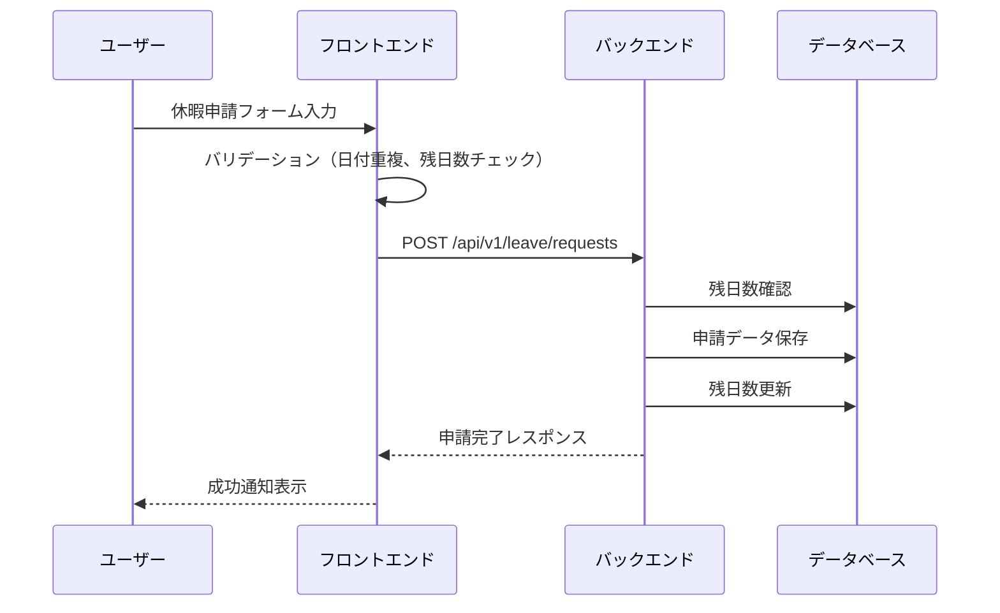
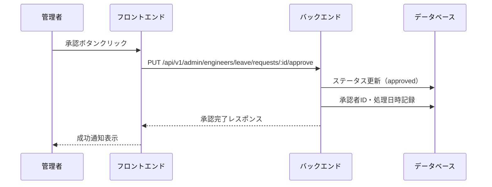

# 休暇申請機能 基本設計書

## 1. 機能概要

### 1.1 目的
SES企業のエンジニア社員が休暇申請を行い、管理者が申請内容を管理・承認できるシステムを提供する。

### 1.2 対象ユーザー
- **エンジニア**: 休暇申請の作成、申請履歴の確認
- **管理者**: 休暇申請の承認・却下、統計情報の確認

### 1.3 主要機能
1. 休暇申請作成（日単位・時間単位）
2. 休暇残日数管理
3. 申請履歴確認
4. 休暇申請承認・却下（管理者）
5. 休暇統計情報表示（管理者）

## 2. 画面構成

### 2.1 エンジニア向け画面

#### 2.1.1 休暇申請画面 (`/leave`)
- **タブ構成**
  - 休暇申請タブ: 新規申請フォーム
  - 申請履歴タブ: 過去の申請一覧

- **休暇申請フォーム**
  - 休暇種別選択（ドロップダウン）
  - 時間単位取得チェックボックス
  - 日付選択（カレンダーUI、複数選択可）
  - 時間選択（時間単位の場合のみ表示）
  - 理由入力（慶弔・特別休暇の場合必須）
  - 利用日数自動計算・表示

- **保有休暇日数表示**
  - カード形式で各休暇種別の残日数を表示
  - 有効期限の表示（期限がある場合）

### 2.2 管理者向け画面

#### 2.2.1 休暇申請管理画面 (`/admin/leave`)
- 休暇申請一覧（フィルタリング・ソート機能付き）
- 一括承認機能
- 個別承認・却下機能
- 休暇統計情報表示

## 3. データベース設計

### 3.1 主要テーブル

#### 3.1.1 leave_types（休暇種別マスタ）
| カラム名 | 型 | 説明 | 制約 |
|---------|-----|------|------|
| id | VARUUID | 主キー（UUID） | PK |
| code | VARCHAR(20) | 休暇種別コード | UNIQUE, NOT NULL |
| name | VARCHAR(50) | 休暇種別名 | NOT NULL |
| description | TEXT | 説明 | |
| default_days | DECIMAL(5,1) | デフォルト付与日数 | NOT NULL |
| is_hourly_available | BOOLEAN | 時間単位取得可否 | DEFAULT TRUE |
| reason_required | BOOLEAN | 理由必須フラグ | DEFAULT FALSE |
| gender_specific | VARCHAR(20) | 性別制限 | NULL可 |
| display_order | INT | 表示順 | NOT NULL |
| is_active | BOOLEAN | 有効フラグ | DEFAULT TRUE |

#### 3.1.2 leave_requests（休暇申請）
| カラム名 | 型 | 説明 | 制約 |
|---------|-----|------|------|
| id | VARUUID | 主キー（UUID） | PK |
| user_id | VARUUID | 申請者ID | FK(users), NOT NULL |
| leave_type_id | VARUUID | 休暇種別ID | FK(leave_types), NOT NULL |
| request_date | DATE | 申請日 | NOT NULL |
| is_hourly_based | BOOLEAN | 時間単位フラグ | NOT NULL |
| reason | TEXT | 理由 | |
| total_days | DECIMAL(5,1) | 合計日数 | NOT NULL |
| status | ENUM | ステータス | DEFAULT 'pending' |
| approver_id | VARUUID | 承認者ID | FK(users) |
| processed_at | TIMESTAMP | 処理日時 | |
| rejection_reason | TEXT | 却下理由 | |

**ステータス値**
- `pending`: 申請中
- `approved`: 承認済み
- `rejected`: 却下
- `cancelled`: 取消

#### 3.1.3 leave_request_details（休暇申請詳細）
| カラム名 | 型 | 説明 | 制約 |
|---------|-----|------|------|
| id | VARUUID | 主キー（UUID） | PK |
| leave_request_id | VARUUID | 休暇申請ID | FK(leave_requests), NOT NULL |
| leave_date | DATE | 休暇日 | NOT NULL |
| start_time | VARCHAR(10) | 開始時刻 | |
| end_time | VARCHAR(10) | 終了時刻 | |
| day_value | DECIMAL(3,1) | 日数換算値 | NOT NULL |

#### 3.1.4 user_leave_balances（ユーザー休暇残高）
| カラム名 | 型 | 説明 | 制約 |
|---------|-----|------|------|
| id | VARUUID | 主キー（UUID） | PK |
| user_id | VARUUID | ユーザーID | FK(users), NOT NULL |
| leave_type_id | VARUUID | 休暇種別ID | FK(leave_types), NOT NULL |
| fiscal_year | INT | 年度 | NOT NULL |
| total_days | DECIMAL(5,1) | 付与日数 | DEFAULT 0.0 |
| used_days | DECIMAL(5,1) | 使用日数 | DEFAULT 0.0 |
| remaining_days | DECIMAL(5,1) | 残日数 | DEFAULT 0.0 |
| expire_date | DATE | 有効期限 | |

## 4. API設計

### 4.1 エンジニア向けAPI

#### 4.1.1 休暇種別一覧取得
- **エンドポイント**: `GET /api/v1/leave/types`
- **レスポンス**:
```json
[
  {
    "id": "UUID",
    "code": "paid",
    "name": "有給休暇",
    "description": "年次有給休暇",
    "defaultDays": 10.0,
    "isHourlyAvailable": true,
    "reasonRequired": false,
    "genderSpecific": null,
    "displayOrder": 1,
    "isActive": true
  }
]
```

#### 4.1.2 休暇残日数取得
- **エンドポイント**: `GET /api/v1/leave/balances`
- **レスポンス**:
```json
[
  {
    "id": "UUID",
    "leaveTypeId": "UUID",
    "leaveTypeName": "有給休暇",
    "fiscalYear": 2024,
    "totalDays": 20.0,
    "usedDays": 5.0,
    "remainingDays": 15.0,
    "expireDate": "2025-03-31"
  }
]
```

#### 4.1.3 休暇申請作成
- **エンドポイント**: `POST /api/v1/leave/requests`
- **リクエスト**:
```json
{
  "leaveTypeId": "UUID",
  "isHourlyBased": false,
  "reason": "私用のため",
  "totalDays": 2.0,
  "requestDetails": [
    {
      "leaveDate": "2024-12-25",
      "startTime": null,
      "endTime": null,
      "dayValue": 1.0
    }
  ]
}
```

#### 4.1.4 休暇申請履歴取得
- **エンドポイント**: `GET /api/v1/leave/requests`
- **レスポンス**:
```json
[
  {
    "id": "UUID",
    "userId": "UUID",
    "leaveTypeId": "UUID",
    "leaveTypeName": "有給休暇",
    "requestDate": "2024-12-20",
    "isHourlyBased": false,
    "reason": "私用のため",
    "totalDays": 2.0,
    "status": "approved",
    "approverId": "UUID",
    "processedAt": "2024-12-21T10:00:00Z",
    "details": [
      {
        "id": "UUID",
        "leaveDate": "2024-12-25",
        "startTime": null,
        "endTime": null,
        "dayValue": 1.0
      }
    ]
  }
]
```

### 4.2 管理者向けAPI

#### 4.2.1 休暇申請一覧取得（管理者用）
- **エンドポイント**: `GET /api/v1/admin/engineers/leave/requests`
- **クエリパラメータ**:
  - `status`: フィルタリング（pending/approved/rejected）
  - `page`: ページ番号
  - `limit`: 1ページあたりの件数

#### 4.2.2 休暇申請承認
- **エンドポイント**: `PUT /api/v1/admin/engineers/leave/requests/:id/approve`

#### 4.2.3 休暇申請却下
- **エンドポイント**: `PUT /api/v1/admin/engineers/leave/requests/:id/reject`
- **リクエスト**:
```json
{
  "rejectionReason": "業務都合により承認できません"
}
```

#### 4.2.4 休暇申請一括承認
- **エンドポイント**: `POST /api/v1/admin/engineers/leave/requests/bulk-approve`
- **リクエスト**:
```json
{
  "requestIds": ["UUID1", "UUID2", "UUID3"]
}
```

## 5. 処理フロー

### 5.1 休暇申請フロー


### 5.2 承認フロー


## 6. バリデーション仕様

### 6.1 フロントエンドバリデーション
1. **日付選択**
   - 過去日の選択不可
   - 既に申請済みの日付は選択不可
   - 同一日付の重複選択不可

2. **時間単位取得**
   - 開始・終了時刻の必須入力
   - 最低1時間以上の取得
   - 1日の労働時間（8時間）を超えない

3. **理由入力**
   - 慶弔休暇・特別休暇の場合は必須
   - 最大文字数: 500文字

4. **残日数チェック**
   - 申請日数が残日数を超えていないか

### 6.2 バックエンドバリデーション
1. **二重申請チェック**
   - 同一日付で承認済み・申請中の申請がないか確認

2. **残日数チェック**
   - トランザクション内で正確な残日数を確認

3. **権限チェック**
   - 本人以外の申請作成を防止
   - 管理者以外の承認操作を防止

## 7. エラーハンドリング

### 7.1 エラーコード
| コード | 説明 | HTTPステータス |
|--------|------|----------------|
| LEAVE_001 | 残日数不足 | 400 |
| LEAVE_002 | 重複申請 | 400 |
| LEAVE_003 | 無効な日付 | 400 |
| LEAVE_004 | 申請が見つからない | 404 |
| LEAVE_005 | 承認権限なし | 403 |

### 7.2 エラーメッセージ例
- 「選択された日付は既に休暇申請されています」
- 「休暇残日数が不足しています（残り: X.X日）」
- 「理由の入力は必須です」

## 8. セキュリティ考慮事項

### 8.1 認証・認可
- Cognito認証による本人確認
- ロールベースのアクセス制御（エンジニア/管理者）

### 8.2 データ保護
- 他ユーザーの申請情報へのアクセス制限
- 個人情報（理由等）の適切な管理

### 8.3 監査ログ
- 申請・承認・却下の全操作をログ記録
- 承認者情報と処理日時の記録

## 9. パフォーマンス考慮事項

### 9.1 キャッシュ戦略
- 休暇種別マスタのキャッシュ（変更頻度低）
- 休暇残日数の適切な更新タイミング

### 9.2 クエリ最適化
- インデックスの適切な設定
  - user_id, leave_type_id, status
- N+1問題の回避（JOINの活用）

### 9.3 非同期処理
- 大量の一括承認時の非同期処理検討

## 10. 拡張性考慮事項

### 10.1 将来的な機能拡張
- 代理申請機能
- 半日休暇対応
- 承認ワークフロー（多段階承認）
- 休暇取得推奨アラート
- カレンダー連携（Google Calendar等）

### 10.2 国際化対応
- 多言語対応の準備
- タイムゾーン対応
- 各国の休暇制度への対応

## 11. テスト計画

### 11.1 単体テスト
- バリデーションロジック
- 日数計算ロジック
- API エンドポイント

### 11.2 結合テスト
- 申請から承認までのフロー
- 残日数の整合性
- 同時申請時の排他制御

### 11.3 E2Eテスト
- 休暇申請の一連の操作
- エラーケースの確認
- 権限別の動作確認