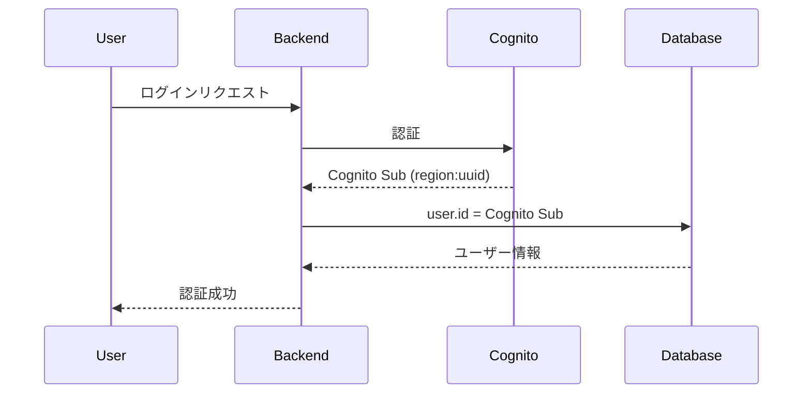
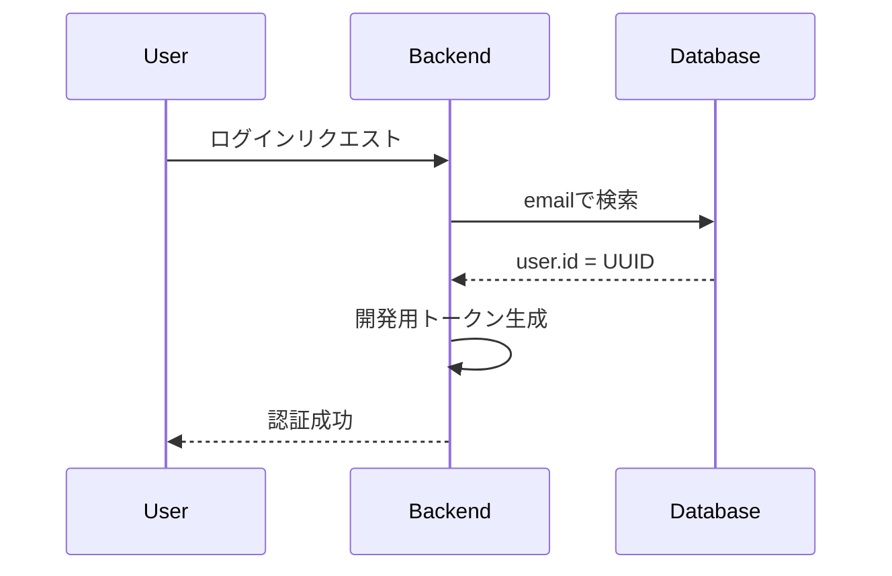

# ID管理アーキテクチャ

## 概要

Monsteraシステムにおけるユーザーの一意識別子（ID）管理方針について説明します。

## ID形式

### 1. Cognito Sub形式
**形式**: `region:uuid`  
**例**: `ap-northeast-1:123e4567-e89b-12d3-a456-426614174000`  
**使用場面**: 
- Cognito認証が有効な環境（本番環境、ステージング環境）
- AWS Cognitoから発行される一意の識別子

### 2. UUID形式
**形式**: `xxxxxxxx-xxxx-xxxx-xxxx-xxxxxxxxxxxx`  
**例**: `37f4ba88-80e1-7053-57f9-84c245af87df`  
**使用場面**:
- 開発モード（COGNITO_ENABLED=false）
- ローカル開発環境
- テスト環境

## データベース設計

### usersテーブル
```sql
CREATE TABLE users (
    id VARCHAR(255) PRIMARY KEY,  -- Cognito SubまたはUUIDを格納
    email VARCHAR(255) UNIQUE NOT NULL,
    -- cognito_subカラムは存在しない（idに統一）
    ...
);
```

**重要**: `cognito_sub`という別カラムは存在しません。すべてのユーザーIDは`id`カラムに格納されます。

## 認証モード別のID管理

### 本番環境（COGNITO_ENABLED=true）



### 開発環境（COGNITO_ENABLED=false）



## コード実装

### モデル定義
```go
// backend/internal/model/user.go
type User struct {
    // User.ID には以下の形式のIDが格納される:
    // - Cognito認証時: Cognito Sub形式 (region:uuid)
    // - 開発モード時: UUID形式
    ID    string `gorm:"type:varchar(255);primary_key" json:"id"`
    Email string `gorm:"size:255;not null;unique" json:"email"`
    // cognito_subフィールドは存在しない
}
```

### リポジトリ実装
```go
// backend/internal/repository/user_repository.go

// GetByCognitoSub Cognito SubでユーザーをD取得
// 注意: データベースのidカラムを検索する（cognito_subカラムは存在しない）
func (r *UserRepositoryImpl) GetByCognitoSub(ctx context.Context, cognitoSub string) (*model.User, error) {
    var user model.User
    err := r.DB.WithContext(ctx).First(&user, "id = ?", cognitoSub).Error
    if err != nil {
        return nil, err
    }
    return &user, nil
}
```

## 移行ガイド

### 既存システムからの移行

1. **cognito_subカラムがある場合**
   - データをidカラムに移行
   - cognito_subカラムを削除

2. **UUIDからCognito Subへの移行**
   - 新規ユーザー: Cognito Subを使用
   - 既存ユーザー: 段階的に移行またはUUID維持

## ベストプラクティス

### DO ✅
- `user.id`を一意識別子として使用
- ID形式を環境変数で判定（COGNITO_ENABLED）
- ログにID形式を明記

### DON'T ❌
- `cognito_sub`カラムを作成しない
- ID形式を混在させない（同一環境内）
- ID形式をハードコードしない

## トラブルシューティング

### よくある問題

#### 1. "column cognito_sub does not exist"エラー
**原因**: 古いコードが`cognito_sub`カラムを参照している  
**解決**: クエリを`id = ?`に修正

#### 2. ID形式の不一致
**原因**: 環境設定と実際のデータが不一致  
**解決**: COGNITO_ENABLEDの設定を確認

#### 3. ユーザーが見つからない
**原因**: ID形式が異なる（UUID vs Cognito Sub）  
**解決**: 環境に応じた正しいID形式を使用

## 関連ドキュメント

- [認証アーキテクチャ](../05_architecture/authentication-setup.md)
- [Cognito設定ガイド](../04_development/cognito-setup.md)
- [マイグレーション手順](../migration/cognito-sub-removal.md)

## 変更履歴

| 日付 | 版 | 変更内容 |
|------|-----|----------|
| 2025-08-14 | 1.0 | 初版作成 |
| 2025-08-14 | 1.1 | cognito_subカラム削除を反映 |

---

**最終更新**: 2025-08-14  
**管理者**: Monstera開発チーム