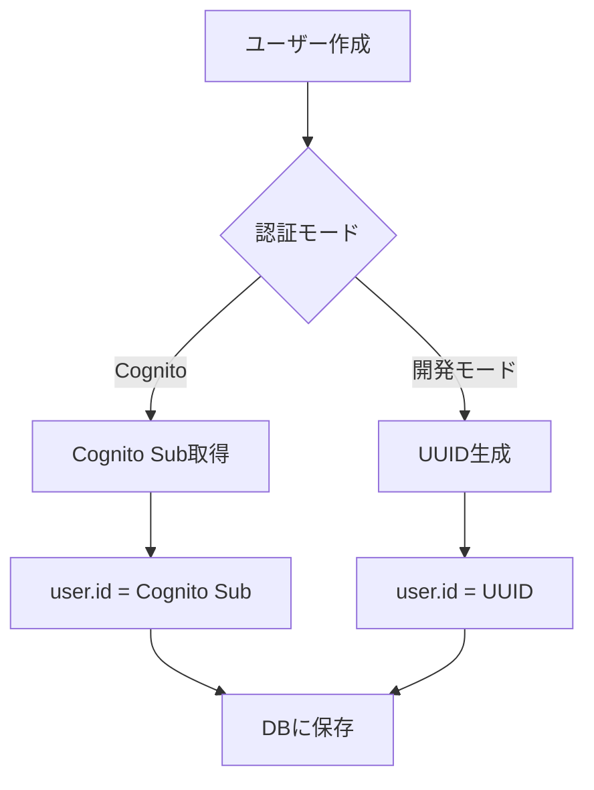
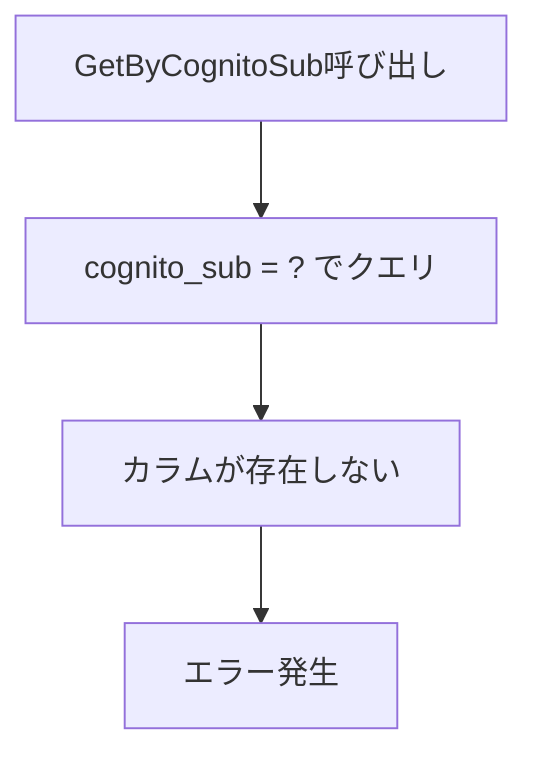
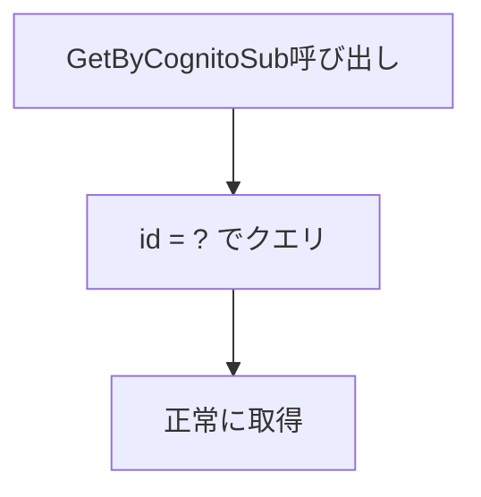

# REFACTOR-ANALYZE: cognito_subカラムの使用状況と要否分析

## 分析日時
2025-08-14 17:00:00

## 分析対象
- `cognito_sub`カラムの使用状況
- `user.id`と`cognito_sub`の関係性
- 現在の認証アーキテクチャにおける`cognito_sub`の要否

## 現状分析

### 1. データベーススキーマ
**結論: `cognito_sub`カラムは存在しない**

- `users`テーブルの現在のスキーマ（`000001_create_users_table.up.sql`）:
  - `id VARCHAR(255) PRIMARY KEY` - ユーザーID
  - `cognito_sub`カラムは定義されていない
  - コメント: `password`削除済み、Cognito認証に完全移行

### 2. モデル定義
**結論: `User.ID`がCognito Subを格納する設計**

```go
// backend/internal/model/user.go
type User struct {
    // Cognito Sub を主キーとして使用
    ID    string `gorm:"type:varchar(255);primary_key" json:"id"` // Cognito Sub
    Email string `gorm:"size:255;not null;unique" json:"email"`
    // Password フィールドは削除（Cognito認証のみ）
    ...
}
```

### 3. 実際のデータ
**結論: 現在はUUID形式のIDを使用（Cognito Sub形式ではない）**

```sql
-- 実際のユーザーデータ例
id                                    | email
--------------------------------------+-----------------------------
a0eebc99-9c0b-4ef8-bb6d-6bb9bd380a11 | daichiro.uesaka@duesk.co.jp
37f4ba88-80e1-7053-57f9-84c245af87df | engineer_test@duesk.co.jp
```

- 現在のIDはUUID形式
- Cognito Sub形式（`region:uuid`）ではない

## 問題点の特定

### 1. GetByCognitoSubメソッドのバグ
**ファイル**: `backend/internal/repository/user_repository.go`

```go
func (r *UserRepositoryImpl) GetByCognitoSub(ctx context.Context, cognitoSub string) (*model.User, error) {
    // 問題: 存在しないカラム"cognito_sub"を参照
    err := r.DB.WithContext(ctx).First(&user, "cognito_sub = ?", cognitoSub).Error
    // 正しくは: "id = ?" であるべき
}
```

### 2. テストコードの問題
**ファイル**: 
- `backend/test/unit/expense_repository_test.go`
- `backend/test/unit/expense_repository_extended_test.go`

```go
// テストテーブル作成時にcognito_subカラムを含めている
CREATE TABLE users (
    ...
    cognito_sub TEXT,  // 実際のテーブルには存在しない
    ...
)
```

### 3. ミドルウェアでのコンテキスト設定
**ファイル**: `backend/internal/middleware/cognito_auth.go`

```go
// Cognitoトークンから取得したsubをコンテキストに設定
c.Set("cognito_sub", claims["sub"])
// ユーザーIDとは別に管理している
c.Set("user_id", user.ID)
```

## 設計上の矛盾

1. **意図された設計**: `user.id`がCognito Subを格納
2. **現在の実装**: `user.id`はUUID、`cognito_sub`カラムは存在しない
3. **コードの期待**: `GetByCognitoSub`が`cognito_sub`カラムを参照（エラーになる）

## 推奨される修正方針

### オプション1: 現在の設計を維持（推奨）
**cognito_subカラムは不要、user.idをCognito Subとして使用**

#### 必要な修正:
1. `GetByCognitoSub`メソッドを修正
   ```go
   // 修正前: "cognito_sub = ?"
   // 修正後: "id = ?"
   err := r.DB.WithContext(ctx).First(&user, "id = ?", cognitoSub).Error
   ```

2. テストコードから`cognito_sub`カラムを削除

3. 認証フローの整理
   - Cognito認証時: `user.id`にCognito Sub（`region:uuid`形式）を格納
   - 開発モード時: `user.id`にUUIDを使用（現在の実装）

### オプション2: cognito_subカラムを追加
**user.idとcognito_subを分離管理**

#### 必要な修正:
1. マイグレーションで`cognito_sub`カラムを追加
2. モデルに`CognitoSub`フィールドを追加
3. 既存コードはそのまま動作

## リスク評価

### 高リスク
- `GetByCognitoSub`メソッドが本番環境で使用された場合、エラーが発生
- Cognito認証フローが正常に動作しない可能性

### 中リスク
- テストが実際のスキーマと異なるため、バグを見逃す可能性
- 開発モードとCognito認証モードでID形式が異なる

### 低リスク
- コンテキストの`cognito_sub`は参照されていない模様

## 結論

**`cognito_sub`カラムは不要**

理由:
1. 現在の設計思想は`user.id`にCognito Subを格納
2. 別カラムを追加する必要性がない
3. シンプルな構造を維持できる

## 改善提案

### 即座に修正すべき項目
1. ✅ `GetByCognitoSub`メソッドのクエリを修正（`"id = ?"`に変更）
2. ✅ テストコードのスキーマを実際のDBと一致させる
3. ✅ ドキュメントでID管理方針を明確化

### 中期的な改善
1. 開発モードでもCognito Sub形式のIDを使用（統一性向上）
2. ID生成ロジックの一元化
3. 認証フローのリファクタリング

## 影響範囲

### 修正が必要なファイル
1. `backend/internal/repository/user_repository.go` - GetByCognitoSubメソッド
2. `backend/test/unit/expense_repository_test.go` - テストスキーマ
3. `backend/test/unit/expense_repository_extended_test.go` - テストスキーマ
4. `backend/internal/middleware/cognito_auth_test.go` - テストケース

### 動作確認が必要な機能
1. Cognito認証によるログイン
2. ユーザー検索機能
3. 開発モードでの認証
4. ユーザー同期処理（syncUserWithDB）

## 次のステップ

1. **REFACTOR-PLAN**: 修正計画の策定
2. **REFACTOR-IMPLEMENT**: 実装
3. **TEST**: 動作確認

---

## 技術的詳細

### 現在のID管理フロー



### 問題のあるクエリパス



### 修正後のクエリパス



## 参考情報

- Cognito Sub形式: `region:uuid` (例: `ap-northeast-1:123e4567-e89b-12d3-a456-426614174000`)
- UUID形式: `123e4567-e89b-12d3-a456-426614174000`
- 現在の実装では両方の形式が混在している可能性

---

**分析完了**: 2025-08-14 17:00:00