# APIクライアントアーキテクチャ - リファクタリング実装計画書

## 計画日時
2025-01-16 22:40:00

## 1. 概要

### 目的と期待効果
**目的**: APIクライアント実装の統一と環境変数管理の改善により、保守性と拡張性を向上させる

**期待効果**:
- **即時効果**: 職務経歴APIの404エラー解消
- **短期効果**: APIクライアント実装の統一による混乱解消
- **中期効果**: バージョン管理の柔軟性向上
- **長期効果**: 将来的なAPI変更（v2移行、GraphQL等）への対応力向上

### スコープ
- **対象**: フロントエンドのAPIクライアント実装全体
- **影響ファイル数**: 
  - Phase 1: 2ファイル
  - Phase 2: 3ファイル
  - Phase 3: 14ファイル
  - Phase 4: 全APIファイル（約25ファイル）

## 2. 現状と改善後の比較

### Before（現状の問題）
```
【問題点】
1. APIクライアント実装の不統一
   - 3箇所で異なるAPI_BASE_URL定義
   - 職務経歴APIのみ独自実装
   
2. 環境変数の設定ミス
   - NEXT_PUBLIC_API_URL=http://localhost:8080（/api/v1欠落）
   
3. パス管理の不一致
   - 14ファイルで/api/v1をハードコード（冗長）
   - 1ファイルで相対パス使用（動作せず）
```

### After（改善後）
```
【改善点】
1. APIクライアント実装の統一
   - 単一のAPIクライアントファクトリ
   - 全APIで同じ実装パターン
   
2. 環境変数の分離管理
   - NEXT_PUBLIC_API_HOST（ホスト）
   - NEXT_PUBLIC_API_VERSION（バージョン）
   
3. パス管理の一元化
   - 全て相対パス使用（DRY原則）
   - baseURLで自動的に/api/v1付与
```

### メトリクス改善予測
| メトリクス | 現状 | 改善後 | 改善率 |
|---|---|---|---|
| APIクライアント実装数 | 3種類 | 1種類 | -67% |
| ハードコード/api/v1 | 14ファイル | 0ファイル | -100% |
| 環境変数数 | 1個（複合） | 2個（分離） | +100% |
| バージョン変更工数 | 14ファイル修正 | 1行修正 | -93% |
| 新規API追加工数 | 設定確認必要 | テンプレート使用 | -50% |

## 3. 段階的実装計画

### Phase 1: 緊急対応（15分）🚨
**目標**: 職務経歴APIを即座に動作させる

#### タスク
1. 環境変数の修正
   ```bash
   # frontend/.env.local
   NEXT_PUBLIC_API_URL=http://localhost:8080/api/v1
   ```

2. 職務経歴APIのimport修正
   ```typescript
   // frontend/src/lib/api/workHistory.ts
   - import { apiClient } from './config'
   + import apiClient from '@/lib/axios'
   ```

3. フロントエンドサーバー再起動

#### 成果物
- ✅ 職務経歴APIが正常動作
- ✅ 既存APIへの影響なし

#### テスト項目
- [ ] 職務経歴の作成
- [ ] 職務経歴の更新
- [ ] 職務経歴の削除
- [ ] 週報機能（影響なし確認）

---

### Phase 2: 環境変数の分離（1時間）⚙️
**目標**: 環境変数を分離し、管理性を向上

#### タスク
1. 環境変数の追加
   ```bash
   # frontend/.env.local
   NEXT_PUBLIC_API_HOST=http://localhost:8080
   NEXT_PUBLIC_API_VERSION=v1
   # NEXT_PUBLIC_API_URL は段階的に廃止
   ```

2. APIクライアント設定の更新
   ```typescript
   // frontend/src/lib/api/index.ts
   const API_HOST = process.env.NEXT_PUBLIC_API_HOST || 'http://localhost:8080';
   const API_VERSION = process.env.NEXT_PUBLIC_API_VERSION || 'v1';
   export const API_BASE_URL = `${API_HOST}/api/${API_VERSION}`;
   ```

3. 後方互換性の維持
   ```typescript
   // 既存のNEXT_PUBLIC_API_URLもフォールバックとして使用
   const API_BASE_URL = process.env.NEXT_PUBLIC_API_URL || 
                        `${API_HOST}/api/${API_VERSION}`;
   ```

#### 成果物
- ✅ 環境変数の分離管理
- ✅ 後方互換性維持

#### テスト項目
- [ ] 新環境変数での動作確認
- [ ] 旧環境変数での動作確認（後方互換）
- [ ] 全APIエンドポイントの疎通確認

---

### Phase 3: ハードコードの削除（2時間）🧹
**目標**: 冗長な/api/v1ハードコードを削除

#### タスク
1. 対象ファイルのリスト作成（14ファイル）
2. 段階的な修正
   ```typescript
   // Before
   await apiClient.get('/api/v1/weekly-reports')
   
   // After
   await apiClient.get('/weekly-reports')
   ```

3. APIパス定数の更新
   ```typescript
   // frontend/src/constants/api.ts
   export const WEEKLY_REPORT_API = {
   - BASE: `/api/${API_VERSION}/weekly-reports`,
   + BASE: `/weekly-reports`,
   }
   ```

#### 成果物
- ✅ DRY原則に従った実装
- ✅ パス管理の簡潔化

#### 対象ファイル（優先度順）
1. 管理画面API（5ファイル）
2. 週報API（3ファイル）
3. 休暇申請API（2ファイル）
4. その他API（4ファイル）

#### テスト項目
- [ ] 各APIの動作確認（修正ファイルごと）
- [ ] E2Eテストの実行
- [ ] コンソールエラーの確認

---

### Phase 4: アーキテクチャ改善（3時間）🏗️
**目標**: APIクライアントファクトリパターンの導入

#### タスク
1. APIクライアントファクトリの実装
   ```typescript
   // frontend/src/lib/api/client.ts
   interface ApiConfig {
     version?: string;
     timeout?: number;
     customPath?: string;
   }
   
   export const createApiClient = (config: ApiConfig = {}) => {
     const host = process.env.NEXT_PUBLIC_API_HOST || 'http://localhost:8080';
     const version = config.version || process.env.NEXT_PUBLIC_API_VERSION || 'v1';
     const basePath = config.customPath || '/api';
     const baseURL = `${host}${basePath}/${version}`;
     
     return axios.create({
       baseURL,
       timeout: config.timeout || 30000,
       withCredentials: true,
     });
   };
   ```

2. 既存APIの移行
   ```typescript
   // 各APIファイルでの使用例
   import { createApiClient } from '@/lib/api/client';
   const apiClient = createApiClient();
   ```

3. 不要ファイルの削除
   - `/lib/api/config.ts` の独自実装部分
   - 重複するAPI_BASE_URL定義

4. バージョン別クライアントのサポート
   ```typescript
   // 複数バージョンの並行運用例
   const v1Client = createApiClient({ version: 'v1' });
   const v2Client = createApiClient({ version: 'v2' });
   ```

#### 成果物
- ✅ 統一されたAPIクライアント生成
- ✅ マルチバージョン対応
- ✅ 環境別設定の柔軟性

#### テスト項目
- [ ] 新APIクライアントでの全機能テスト
- [ ] バージョン切り替えテスト
- [ ] パフォーマンステスト
- [ ] 負荷テスト

## 4. リスク管理

### 技術的リスクと緩和策

| Phase | リスク | 可能性 | 影響度 | 緩和策 |
|---|---|---|---|---|
| 1 | 環境変数の反映漏れ | 低 | 高 | サーバー再起動手順の明確化 |
| 2 | 後方互換性の破壊 | 低 | 高 | フォールバック実装 |
| 3 | パス修正ミス | 中 | 中 | 段階的修正と個別テスト |
| 4 | 全API影響 | 中 | 高 | Feature Flagによる段階的切り替え |

### スケジュールリスク
- **総工数**: 6時間15分
- **バッファ**: +2時間（約30%）
- **並行作業可能**: Phase 3の一部（ファイル別）

### ロールバック計画
各Phaseは独立しており、問題発生時は以下の手順でロールバック：

1. **Phase 1**: 環境変数を元に戻す
2. **Phase 2**: 旧環境変数を使用
3. **Phase 3**: git revertで個別ファイル復元
4. **Phase 4**: Feature Flagでオフ

## 5. テスト戦略

### 各Phase共通テスト
```bash
# 基本動作確認
npm run test:api

# E2Eテスト
npm run test:e2e

# 手動確認項目
- [ ] ログイン/ログアウト
- [ ] 主要機能の動作確認
- [ ] ネットワークタブでAPIコール確認
```

### パフォーマンステスト
```bash
# Phase 4完了後
npm run test:performance

# 確認項目
- APIレスポンスタイム: < 500ms
- バンドルサイズ増加: < 5KB
```

## 6. 移行戦略

### 段階的移行アプローチ
```
Week 1: Phase 1-2（緊急対応と環境変数分離）
Week 2: Phase 3（ハードコード削除）
Week 3: Phase 4（アーキテクチャ改善）
Week 4: 監視と最適化
```

### Feature Flagの活用（Phase 4）
```typescript
const useNewApiClient = process.env.NEXT_PUBLIC_USE_NEW_API_CLIENT === 'true';

const apiClient = useNewApiClient 
  ? createApiClient() 
  : getAuthClient();
```

## 7. 影響を受けるドキュメント

### 更新が必要なドキュメント
1. **README.md** - 環境変数の説明
2. **.env.example** - 新環境変数の追加
3. **docs/setup.md** - セットアップ手順
4. **docs/api.md** - API実装ガイドライン

### 新規作成ドキュメント
1. **docs/api-client-architecture.md** - 新アーキテクチャの説明
2. **docs/migration-guide.md** - 移行ガイド

## 8. 成功基準

### Phase 1
- ✅ 職務経歴APIが正常動作
- ✅ 既存機能への影響なし

### Phase 2
- ✅ 環境変数の分離完了
- ✅ 後方互換性維持

### Phase 3
- ✅ ハードコード削除率: 100%
- ✅ テストカバレッジ維持

### Phase 4
- ✅ 全APIの統一実装
- ✅ パフォーマンス劣化なし
- ✅ 新規API追加が容易

## 9. 実装順序とタイムライン

```mermaid
gantt
    title APIクライアント リファクタリング計画
    dateFormat  HH:mm
    section Phase 1
    環境変数修正           :p1a, 00:00, 5m
    API import修正         :p1b, after p1a, 5m
    動作確認              :p1c, after p1b, 5m
    section Phase 2
    環境変数分離          :p2a, after p1c, 30m
    後方互換性実装        :p2b, after p2a, 20m
    テスト               :p2c, after p2b, 10m
    section Phase 3
    ファイルリスト作成    :p3a, after p2c, 15m
    段階的修正           :p3b, after p3a, 90m
    テスト               :p3c, after p3b, 15m
    section Phase 4
    ファクトリ実装       :p4a, after p3c, 60m
    API移行              :p4b, after p4a, 90m
    クリーンアップ       :p4c, after p4b, 30m
```



## 10. 結論

このリファクタリング計画により、以下が実現されます：

1. **即座の問題解決**（Phase 1: 15分）
2. **保守性の向上**（Phase 2-3: 3時間）
3. **将来への拡張性**（Phase 4: 3時間）

各Phaseは独立してテスト可能で、リスクを最小限に抑えながら段階的に改善を進められます。特にPhase 1は即座に実施可能で、ビジネスへの影響を最小限に抑えられます。

## 次のアクション
1. Phase 1の即座実施（承認不要）
2. Phase 2-4の承認取得
3. 実装開始

---

## 11. 実行用ToDoリスト

### 🚨 Phase 1: 緊急対応（15分）

#### 事前準備
- [ ] 現在の環境変数をバックアップ
  ```bash
  cp frontend/.env.local frontend/.env.local.backup
  ```
- [ ] 現在のブランチを確認し、作業ブランチを作成
  ```bash
  git checkout -b fix/api-client-phase1
  ```

#### 実装作業
- [ ] **Step 1**: 環境変数の修正（2分）
  - [ ] `frontend/.env.local`を開く
  - [ ] `NEXT_PUBLIC_API_URL`を確認
  - [ ] 値を`http://localhost:8080/api/v1`に変更
  - [ ] ファイルを保存

- [ ] **Step 2**: 職務経歴APIのimport修正（3分）
  - [ ] `frontend/src/lib/api/workHistory.ts`を開く
  - [ ] 1行目の`import { apiClient } from './config'`を探す
  - [ ] `import apiClient from '@/lib/axios'`に変更
  - [ ] ファイルを保存

- [ ] **Step 3**: フロントエンドサーバー再起動（2分）
  - [ ] ターミナルで`Ctrl+C`でサーバー停止
  - [ ] `npm run dev`でサーバー再起動
  - [ ] ブラウザでリロード

#### 動作確認
- [ ] **基本動作テスト**（5分）
  - [ ] ログイン動作確認
  - [ ] スキルシート画面を開く
  - [ ] 職務経歴の新規作成ボタンをクリック
  - [ ] ダミーデータを入力して保存
  - [ ] 保存成功メッセージを確認
  - [ ] 作成した職務経歴が一覧に表示されることを確認

- [ ] **ネットワーク確認**（3分）
  - [ ] Chrome DevToolsのNetworkタブを開く
  - [ ] POSTリクエストのURLが`http://localhost:8080/api/v1/work-history`であることを確認
  - [ ] ステータスコードが201または200であることを確認

#### コミット
- [ ] 変更をコミット
  ```bash
  git add -A
  git commit -m "fix: Phase 1 - 環境変数修正と職務経歴API修正"
  ```

---

### ⚙️ Phase 2: 環境変数の分離（1時間）

#### 事前準備
- [ ] Phase 1が正常動作していることを確認
- [ ] 新しいブランチを作成
  ```bash
  git checkout -b refactor/api-client-phase2
  ```

#### 実装作業
- [ ] **Step 1**: 環境変数の追加（5分）
  - [ ] `frontend/.env.local`を開く
  - [ ] 以下を追加:
    ```
    NEXT_PUBLIC_API_HOST=http://localhost:8080
    NEXT_PUBLIC_API_VERSION=v1
    ```
  - [ ] 既存の`NEXT_PUBLIC_API_URL`はそのまま残す（後方互換性）

- [ ] **Step 2**: `.env.example`の更新（5分）
  - [ ] `frontend/.env.example`を開く（なければ作成）
  - [ ] 新しい環境変数の例を追加
  - [ ] コメントで説明を追加

- [ ] **Step 3**: APIクライアント設定の更新（15分）
  - [ ] `frontend/src/lib/api/index.ts`を開く
  - [ ] 8行目付近の`API_BASE_URL`定義を探す
  - [ ] 以下のコードに更新:
    ```typescript
    const API_HOST = process.env.NEXT_PUBLIC_API_HOST || 'http://localhost:8080';
    const API_VERSION = process.env.NEXT_PUBLIC_API_VERSION || 'v1';
    const LEGACY_URL = process.env.NEXT_PUBLIC_API_URL;
    
    export const API_BASE_URL = LEGACY_URL || `${API_HOST}/api/${API_VERSION}`;
    ```
  - [ ] ファイルを保存

- [ ] **Step 4**: 同様の変更を他のファイルにも適用（10分）
  - [ ] `frontend/src/lib/api/config.ts`
  - [ ] `frontend/src/constants/api.ts`

#### テスト作業
- [ ] **後方互換性テスト**（10分）
  - [ ] 新環境変数を一時的にコメントアウト
  - [ ] 旧環境変数のみで動作確認
  - [ ] 新環境変数を有効化
  - [ ] 旧環境変数をコメントアウト
  - [ ] 新環境変数のみで動作確認

- [ ] **全API動作確認**（15分）
  - [ ] 週報機能
  - [ ] 休暇申請機能
  - [ ] スキルシート機能
  - [ ] 職務経歴機能

#### ドキュメント更新
- [ ] README.mdに新環境変数の説明を追加（5分）
- [ ] セットアップガイドの更新（5分）

#### コミット
- [ ] 変更をコミット
  ```bash
  git add -A
  git commit -m "refactor: Phase 2 - 環境変数の分離と後方互換性維持"
  ```

---

### 🧹 Phase 3: ハードコードの削除（2時間）

#### 事前準備
- [ ] Phase 2が正常動作していることを確認
- [ ] 対象ファイルのリスト作成
  ```bash
  grep -r "/api/v1" frontend/src --include="*.ts" --include="*.tsx" > hardcoded_files.txt
  ```
- [ ] 新しいブランチを作成
  ```bash
  git checkout -b refactor/api-client-phase3
  ```

#### 実装作業（ファイルグループごとに実施）

##### グループ1: 管理画面API（30分）
- [ ] `frontend/src/lib/api/admin/index.ts`
  - [ ] `/api/v1/admin`を`/admin`に変更
  - [ ] テスト実行
- [ ] `frontend/src/lib/api/admin/weeklyReport.ts`
  - [ ] パスから`/api/v1`を削除
  - [ ] テスト実行
- [ ] 他の管理画面APIファイル（3ファイル）
  - [ ] 同様の修正
  - [ ] 各ファイルごとにテスト

##### グループ2: 週報API（20分）
- [ ] 週報関連の3ファイルを特定
- [ ] 各ファイルで`/api/v1`を削除
- [ ] 週報機能の動作確認

##### グループ3: 休暇申請API（15分）
- [ ] 休暇申請関連の2ファイルを特定
- [ ] 各ファイルで`/api/v1`を削除
- [ ] 休暇申請機能の動作確認

##### グループ4: その他API（25分）
- [ ] 残りの4ファイルを修正
- [ ] 各機能の動作確認

#### APIパス定数の更新（20分）
- [ ] `frontend/src/constants/api.ts`を開く
- [ ] 全ての定数から`/api/${API_VERSION}`を削除
- [ ] 例:
  ```typescript
  // Before
  BASE: `/api/${API_VERSION}/weekly-reports`
  // After
  BASE: `/weekly-reports`
  ```

#### 統合テスト（10分）
- [ ] 全機能の動作確認
- [ ] ネットワークタブでAPIパスの確認
- [ ] コンソールエラーの確認

#### コミット
- [ ] 変更をコミット（グループごと）
  ```bash
  git add -A
  git commit -m "refactor: Phase 3 - ハードコードされた/api/v1を削除"
  ```

---

### 🏗️ Phase 4: アーキテクチャ改善（3時間）

#### 事前準備
- [ ] Phase 3が正常動作していることを確認
- [ ] 新しいブランチを作成
  ```bash
  git checkout -b refactor/api-client-phase4
  ```
- [ ] Feature Flagの準備
  - [ ] `.env.local`に`NEXT_PUBLIC_USE_NEW_API_CLIENT=false`を追加

#### 実装作業

##### Step 1: APIクライアントファクトリの実装（30分）
- [ ] `frontend/src/lib/api/client.ts`を新規作成
- [ ] ファクトリ関数の実装
- [ ] TypeScript型定義の追加
- [ ] ユニットテストの作成

##### Step 2: 既存APIの段階的移行（90分）
- [ ] **移行順序の決定**
  1. [ ] 職務経歴API（最初にテスト）
  2. [ ] スキルシートAPI
  3. [ ] プロファイルAPI
  4. [ ] 週報API
  5. [ ] 休暇申請API
  6. [ ] その他のAPI

- [ ] **各APIの移行作業**（15分×6）
  - [ ] Feature Flagによる切り替え実装
  - [ ] 新旧両方のクライアントをサポート
  - [ ] テスト実行
  - [ ] パフォーマンス確認

##### Step 3: 不要ファイルのクリーンアップ（30分）
- [ ] `frontend/src/lib/api/config.ts`の独自実装部分を削除
- [ ] 重複するAPI_BASE_URL定義を削除
- [ ] 未使用importの削除
- [ ] ESLintの実行

##### Step 4: マルチバージョン対応の実装（30分）
- [ ] v2クライアントのテスト実装
- [ ] バージョン切り替えのテスト
- [ ] ドキュメント作成

#### テスト作業
- [ ] **ユニットテスト**（15分）
  - [ ] ファクトリ関数のテスト
  - [ ] 各種設定のテスト
  - [ ] エラーハンドリングのテスト

- [ ] **統合テスト**（15分）
  - [ ] 全APIエンドポイントの疎通確認
  - [ ] Feature Flag切り替えテスト
  - [ ] パフォーマンステスト

- [ ] **E2Eテスト**（15分）
  - [ ] 主要ユーザーフローのテスト
  - [ ] エラーケースのテスト

#### ドキュメント作成（15分）
- [ ] `docs/api-client-architecture.md`の作成
- [ ] 移行ガイドの作成
- [ ] APIクライアント使用例の追加

#### Feature Flag有効化
- [ ] `.env.local`で`NEXT_PUBLIC_USE_NEW_API_CLIENT=true`に変更
- [ ] 本番環境への段階的ロールアウト計画

#### コミット
- [ ] 変更をコミット
  ```bash
  git add -A
  git commit -m "refactor: Phase 4 - APIクライアントファクトリパターンの導入"
  ```

---

## 12. チェックリスト（マネージャー用）

### Phase完了条件
| Phase | 完了条件 | 承認者 | 完了日 |
|---|---|---|---|
| Phase 1 | 職務経歴APIが正常動作 | 不要 | _____ |
| Phase 2 | 環境変数分離＆後方互換性確認 | TL | _____ |
| Phase 3 | ハードコード0件 | TL | _____ |
| Phase 4 | 全API統一実装 | PM | _____ |

### リリース前チェック
- [ ] 全Phaseのテスト完了
- [ ] パフォーマンス劣化なし
- [ ] ドキュメント更新完了
- [ ] ロールバック手順確認
- [ ] 本番環境変数の準備

### 監視項目（リリース後1週間）
- [ ] APIエラー率
- [ ] レスポンスタイム
- [ ] ユーザーからの問い合わせ
- [ ] アプリケーションログ