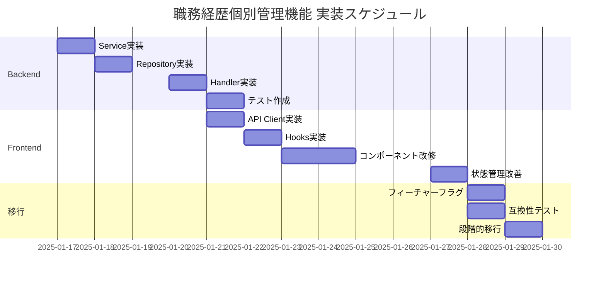

# リファクタリング計画: 職務経歴の個別管理機能への移行

## 計画作成日時
2025年1月16日 17:00

## 計画概要
職務経歴の管理を現在の一括保存方式から個別保存方式へ移行する短期的実装計画

## 目標
- **短期目標**: 職務経歴の個別CRUD機能を実装し、一括保存から個別保存への移行を完了
- **スコープ**: バックエンドAPI実装とフロントエンドの段階的移行のみ（長期的機能は除外）

## フェーズ1: バックエンドAPI実装（3-4日）

### 1.1 WorkHistoryService実装（1日）

#### ファイル作成
- `backend/internal/service/work_history_service.go`

#### 実装内容
```go
type WorkHistoryService interface {
    GetByID(ctx context.Context, id string) (*model.WorkHistory, error)
    GetByUserID(ctx context.Context, userID string, page, limit int) ([]*model.WorkHistory, int64, error)
    Create(ctx context.Context, wh *dto.WorkHistoryCreateRequest) (*model.WorkHistory, error)
    Update(ctx context.Context, id string, wh *dto.WorkHistoryUpdateRequest) error
    Delete(ctx context.Context, id string) error
    ValidateWorkHistory(wh *dto.WorkHistoryRequest) error
}
```

#### 主要機能
- Industry値のバリデーション（1-7の範囲チェック）
- 日付フォーマットの検証
- 技術項目のカテゴリ分類
- トランザクション管理
- エラーハンドリング

### 1.2 WorkHistoryRepository実装（1日）

#### ファイル作成
- `backend/internal/repository/work_history_repository.go`
- `backend/internal/repository/work_history_repository_impl.go`

#### 実装内容
```go
type WorkHistoryRepository interface {
    FindByID(id string) (*model.WorkHistory, error)
    FindByUserID(userID string, offset, limit int) ([]*model.WorkHistory, error)
    CountByUserID(userID string) (int64, error)
    Create(wh *model.WorkHistory) error
    Update(wh *model.WorkHistory) error
    Delete(id string) error
    BeginTx() *gorm.DB
}
```

#### データベース操作
- GORMを使用したCRUD操作
- ソフトデリート対応
- 関連テーブル（work_history_technologies）の同時更新
- インデックスの活用

### 1.3 WorkHistoryHandler実装（1日）

#### ファイル更新
- `backend/internal/handler/work_history_handler.go`（TODO部分の実装）

#### 実装メソッド
- `GetWorkHistories`: ページネーション付き一覧取得
- `GetWorkHistory`: 個別取得
- `CreateWorkHistory`: 新規作成
- `UpdateWorkHistory`: 更新
- `DeleteWorkHistory`: 削除

#### リクエスト/レスポンス
```go
// DTOファイル作成
backend/internal/dto/work_history_dto.go

type WorkHistoryCreateRequest struct {
    UserID           string   `json:"user_id" binding:"required"`
    ProfileID        string   `json:"profile_id" binding:"required"`
    CompanyName      string   `json:"company_name" binding:"required,max=255"`
    ProjectName      string   `json:"project_name" binding:"required,max=255"`
    StartDate        string   `json:"start_date" binding:"required"`
    EndDate          string   `json:"end_date"`
    Role             string   `json:"role" binding:"required,max=100"`
    Industry         int32    `json:"industry" binding:"min=1,max=7"`
    Description      string   `json:"description" binding:"required,max=2000"`
    Technologies     []string `json:"technologies"`
}
```

### 1.4 テスト実装（0.5日）

#### テストファイル作成
- `backend/internal/service/work_history_service_test.go`
- `backend/internal/handler/work_history_handler_test.go`

#### テストケース
- ✅ 正常系CRUD操作
- ✅ バリデーションエラー
- ✅ 権限チェック
- ✅ 同時実行制御
- ✅ トランザクションロールバック

## フェーズ2: フロントエンド実装（4-5日）

### 2.1 API Client層実装（1日）

#### ファイル作成
- `frontend/src/lib/api/workHistory.ts`

#### 実装内容
```typescript
// 個別CRUD API関数
export const workHistoryApi = {
  get: async (id: string): Promise<WorkHistory> => {},
  list: async (userId: string, page?: number): Promise<WorkHistoryList> => {},
  create: async (data: WorkHistoryCreateData): Promise<WorkHistory> => {},
  update: async (id: string, data: WorkHistoryUpdateData): Promise<void> => {},
  delete: async (id: string): Promise<void> => {}
};
```

### 2.2 Custom Hooks実装（1日）

#### ファイル作成
- `frontend/src/hooks/useWorkHistory.ts`
- `frontend/src/hooks/useWorkHistoryMutation.ts`

#### 実装内容
```typescript
// データ取得用Hook
export const useWorkHistory = (id: string) => {
  return useSWR(`/api/v1/work-history/${id}`, fetcher);
};

// 更新用Hook
export const useWorkHistoryMutation = () => {
  const { mutate } = useSWRConfig();
  
  const create = async (data: WorkHistoryCreateData) => {
    const result = await workHistoryApi.create(data);
    mutate(`/api/v1/work-history`);
    return result;
  };
  
  return { create, update, delete };
};
```

### 2.3 コンポーネント改修（2日）

#### 対象ファイル
- `frontend/src/components/features/skillSheet/WorkHistoryEditDialog.tsx`
- `frontend/src/components/features/skillSheet/WorkHistoryContentCards.tsx`

#### 改修内容
1. **WorkHistoryEditDialog**
   - 保存ボタンの追加（個別保存）
   - 保存状態のインジケーター
   - エラーハンドリングUI
   - 楽観的更新の実装

2. **WorkHistoryContentCards**
   - 個別削除機能の実装
   - リアルタイム更新反映
   - ローディング状態管理
   - エラーリトライ機能

### 2.4 状態管理の改善（1日）

#### 実装内容
- React Hook Formとの統合維持
- SWRによるキャッシュ管理
- 楽観的更新の実装
- エラー時のロールバック

## フェーズ3: 移行戦略（2日）

### 3.1 フィーチャーフラグ実装（0.5日）

#### 実装内容
```typescript
// frontend/src/config/features.ts
export const features = {
  individualWorkHistorySave: process.env.NEXT_PUBLIC_INDIVIDUAL_WORK_HISTORY_SAVE === 'true'
};
```

### 3.2 互換性維持（0.5日）

#### 実装内容
- 既存の一括保存APIとの並行稼働
- 保存方式の切り替え機能
- データ整合性チェック

### 3.3 段階的移行（1日）

#### 移行ステップ
1. **Phase A**: 新規作成のみ個別保存
2. **Phase B**: 編集も個別保存に移行
3. **Phase C**: 削除も個別処理に移行
4. **Phase D**: 一括保存を非推奨化

## 実装スケジュール



## テスト戦略

### ユニットテスト
- Service層: 100%カバレッジ目標
- Repository層: モック使用
- Handler層: 統合テスト重視

### 統合テスト
- API全エンドポイントの動作確認
- エラーケースの網羅
- パフォーマンステスト（応答時間 < 200ms）

### E2Eテスト
- 基本的なCRUDフロー
- エラー発生時のリカバリー
- 一括保存との切り替え

## リスク管理

### 技術的リスクと対策

| リスク | 影響度 | 発生確率 | 対策 |
|-------|-------|---------|------|
| 既存機能との競合 | 中 | 低 | フィーチャーフラグで分離 |
| データ不整合 | 高 | 低 | トランザクション管理徹底 |
| パフォーマンス劣化 | 中 | 中 | キャッシュ層の活用 |
| 移行時のデータ損失 | 高 | 低 | バックアップとロールバック計画 |

### 対策詳細
1. **競合回避**: 新旧APIを完全分離
2. **データ保護**: 各操作前の整合性チェック
3. **性能確保**: Redis キャッシュの活用
4. **安全な移行**: 段階的切り替えと監視

## 成功基準

### 機能要件
- ✅ 個別の職務経歴CRUD操作が可能
- ✅ 既存の一括保存と互換性維持
- ✅ データ整合性の保証

### 非機能要件
- ✅ API応答時間 < 200ms
- ✅ エラー率 < 0.1%
- ✅ テストカバレッジ > 80%

### ビジネス要件
- ✅ ユーザー影響最小化
- ✅ ダウンタイムゼロ
- ✅ 段階的移行可能

## 実装優先順位

1. **必須（P0）**
   - バックエンドAPI実装
   - 基本的なCRUD機能
   - エラーハンドリング

2. **重要（P1）**
   - フロントエンド個別保存UI
   - 楽観的更新
   - フィーチャーフラグ

3. **推奨（P2）**
   - 自動保存機能
   - キャッシュ最適化
   - 詳細なログ記録

## 完了条件

- [ ] バックエンドAPI全エンドポイント実装完了
- [ ] フロントエンド個別保存機能実装完了
- [ ] ユニットテスト作成完了（カバレッジ80%以上）
- [ ] 統合テスト実施完了
- [ ] フィーチャーフラグによる切り替え確認
- [ ] ドキュメント更新完了

## ステータス
**status**: PLAN_CREATED  
**next**: REFACTOR-IMPLEMENT  
**details**: "短期的実装計画作成完了。一括保存から個別保存への移行に焦点。推定工数: 9-11日。"