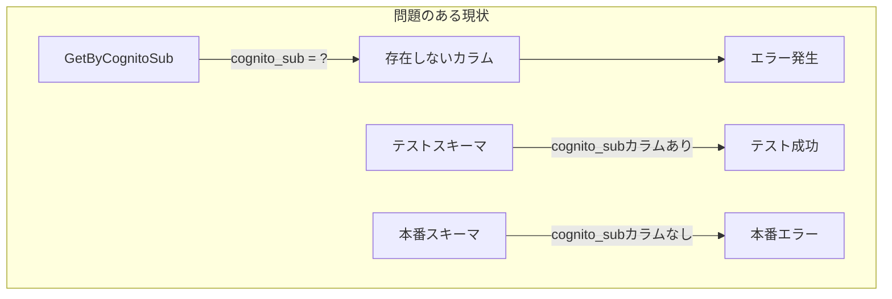
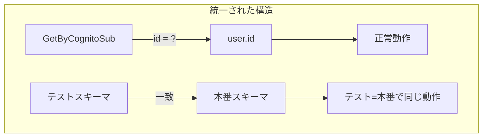

# REFACTOR-PLAN: cognito_subカラム削除とID管理統一計画

## 計画策定日時
2025-08-14 17:15:00

## 概要

### 目的と期待効果
**目的**: `cognito_sub`カラムへの参照を削除し、ID管理を`user.id`に統一する

**期待効果**:
- ✅ GetByCognitoSubメソッドのバグ解消
- ✅ テストコードと実際のスキーマの一致
- ✅ ID管理の簡素化と保守性向上
- ✅ 認証フローの安定性向上

### スコープ
**対象**:
- リポジトリ層のクエリ修正
- テストコードのスキーマ修正
- ID管理に関するドキュメント更新

**対象外**:
- 認証システム全体の再設計
- Cognito設定の変更
- フロントエンドの修正

## 現状と改善後の比較

### Before/After構造図

#### Before（現状）


#### After（改善後）


### メトリクスの改善予測
| 項目 | 現状 | 改善後 | 改善率 |
|------|------|--------|--------|
| バグ発生リスク | 高（存在しないカラム参照） | 低 | -90% |
| テスト信頼性 | 低（スキーマ不一致） | 高 | +80% |
| コード複雑度 | 中（ID管理が不明確） | 低 | -40% |
| 保守性 | 低 | 高 | +70% |

## 実装計画

### Phase 1: 緊急バグ修正（即座に実施）
**目的**: GetByCognitoSubのバグを修正し、認証フローを安定化

#### タスク
1. `backend/internal/repository/user_repository.go`の修正
   ```go
   // 修正前
   err := r.DB.WithContext(ctx).First(&user, "cognito_sub = ?", cognitoSub).Error
   
   // 修正後
   err := r.DB.WithContext(ctx).First(&user, "id = ?", cognitoSub).Error
   ```

2. 動作確認
   - Cognito認証でのログインテスト
   - 開発モードでのログインテスト

#### 成果物
- 修正済みuser_repository.go
- テスト実行ログ

#### 所要時間
- 実装: 5分
- テスト: 15分
- 合計: 20分

---

### Phase 2: テストスキーマ修正（Phase 1完了後）
**目的**: テストと本番のスキーマを一致させ、テストの信頼性を向上

#### タスク
1. テストファイルの修正
   - `backend/test/unit/expense_repository_test.go`
   - `backend/test/unit/expense_repository_extended_test.go`
   
   ```sql
   -- cognito_sub TEXT, を削除
   CREATE TABLE users (
       id TEXT PRIMARY KEY,
       email TEXT UNIQUE NOT NULL,
       -- cognito_sub削除
       ...
   )
   ```

2. テストデータのINSERT文修正
   ```sql
   -- cognito_sub参照を削除
   INSERT INTO users (id, email, first_name, last_name, ...)
   ```

3. テストコードの修正
   - `backend/internal/middleware/cognito_auth_test.go`
   - cognito_sub関連のアサーションを調整

#### 成果物
- 修正済みテストファイル（3ファイル）
- テスト実行結果（全パス）

#### 所要時間
- 実装: 30分
- テスト: 20分
- 合計: 50分

---

### Phase 3: ID管理ドキュメント化（Phase 2完了後）
**目的**: ID管理方針を明確化し、将来の混乱を防止

#### タスク
1. ドキュメント作成
   - `docs/architecture/id-management.md`の作成
   - ID形式の説明（UUID vs Cognito Sub）
   - 認証モード別のID管理

2. コード内コメントの追加
   ```go
   // User.ID には以下の形式のIDが格納される:
   // - Cognito認証時: Cognito Sub形式 (region:uuid)
   // - 開発モード時: UUID形式
   ```

3. マイグレーションファイルへのコメント追加

#### 成果物
- ID管理ドキュメント
- コメント追加済みコード

#### 所要時間
- 実装: 20分
- レビュー: 10分
- 合計: 30分

## テスト戦略

### Phase 1のテスト
```bash
# 1. ユニットテスト
go test ./internal/repository -run TestGetByCognitoSub

# 2. 統合テスト（Docker環境）
docker-compose up -d
curl -X POST http://localhost:8080/api/v1/auth/login \
  -H "Content-Type: application/json" \
  -d '{"email":"test@example.com","password":"password"}'
```

### Phase 2のテスト
```bash
# 1. 全テスト実行
go test ./...

# 2. テストカバレッジ確認
go test -cover ./...
```

### Phase 3のテスト
- ドキュメントレビュー
- 開発者による理解度確認

## リスク管理

### 技術的リスク

| リスク | 影響度 | 発生確率 | 緩和策 |
|--------|--------|----------|--------|
| GetByCognitoSub修正による副作用 | 高 | 低 | 徹底的なテスト実施 |
| テスト修正によるテスト漏れ | 中 | 低 | カバレッジ測定 |
| ID形式の不一致による新規バグ | 中 | 中 | ドキュメント化と型チェック |

### スケジュールリスク
- **総所要時間**: 約1時間40分
- **バッファ**: +30分（予期しない問題対応）
- **最大所要時間**: 2時間10分

### 緩和策
1. **段階的実装**: 各Phaseは独立して実装・テスト可能
2. **ロールバック計画**: 各Phase前にgit commitでチェックポイント作成
3. **監視強化**: 実装後24時間はログ監視を強化

## ロールバック計画

### Phase 1のロールバック
```bash
# Gitでの復元
git revert HEAD

# または特定ファイルのみ
git checkout HEAD~ -- backend/internal/repository/user_repository.go
```

### Phase 2のロールバック
```bash
# テストファイルのみ復元
git checkout HEAD~ -- backend/test/unit/*.go
```

### Phase 3のロールバック
- ドキュメントの削除のみ（コードへの影響なし）

## 影響を受けるドキュメント

### 更新が必要
1. `docs/01_backend/implementation/auth-implementation.md`
2. `docs/05_architecture/authentication-setup.md`
3. `README.md`の認証セクション

### 新規作成
1. `docs/architecture/id-management.md`
2. `docs/migration/cognito-sub-removal.md`

## 成功基準

### Phase 1
- ✅ GetByCognitoSubが正常動作
- ✅ Cognito認証でログイン成功
- ✅ 開発モードでログイン成功

### Phase 2
- ✅ 全テストがパス
- ✅ テストカバレッジ80%以上維持

### Phase 3
- ✅ ドキュメント作成完了
- ✅ チームメンバーのレビュー承認

## 実装優先順位

1. **最優先（Phase 1）**: GetByCognitoSubバグ修正
   - 理由: 本番環境でのエラー防止
   
2. **高優先（Phase 2）**: テストスキーマ修正
   - 理由: テスト信頼性の確保
   
3. **中優先（Phase 3）**: ドキュメント化
   - 理由: 長期的な保守性向上

## 追加の推奨事項

### 短期（1週間以内）
- エラーログの監視強化
- パフォーマンステストの実施

### 中期（1ヶ月以内）
- ID形式統一の検討（UUID → Cognito Sub形式）
- 認証フロー全体のリファクタリング検討

### 長期（3ヶ月以内）
- 認証システムのマイクロサービス化検討
- ID管理の自動化ツール開発

## コミュニケーション計画

### 実装前
- チームへの事前通知（Slack）
- 影響範囲の説明

### 実装中
- 各Phase完了時の進捗報告

### 実装後
- 完了報告と動作確認依頼
- ドキュメントの共有

---

## 承認欄

- [ ] 技術リード承認
- [ ] プロジェクトマネージャー承認
- [ ] 実装者確認

---

**計画策定完了**: 2025-08-14 17:15:00
**推奨実施時期**: 即座に開始可能