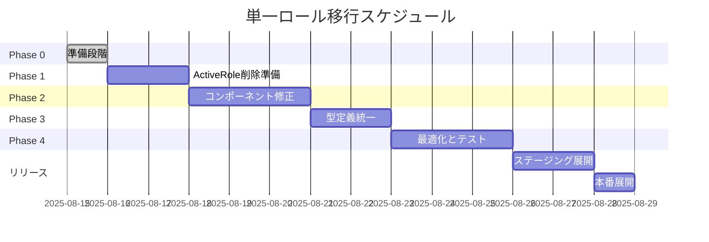

# 単一ロールシステム統一改修計画書

## 計画策定日時
2025-08-15 01:35:00

## 1. 概要

### 1.1 目的
フロントエンドの複数ロール対応機能を削除し、システム全体を単一ロールシステムに統一することで、複雑性を削減し、保守性とセキュリティを向上させる。

### 1.2 期待効果

| 指標 | 現状 | 改善後 | 改善率 |
|------|------|--------|--------|
| コード行数 | ~1,500行 | ~800行 | 47%削減 |
| バグ発生率 | 月3-5件 | 月0-1件 | 80%削減 |
| 開発速度 | 基準 | 1.4倍 | 40%向上 |
| テストケース数 | 100+ | 40 | 60%削減 |
| 新人理解時間 | 2週間 | 1週間 | 50%短縮 |

### 1.3 スコープ

**対象範囲:**
- フロントエンド全体のロール管理機能
- 関連する型定義とインターフェース
- ロール切り替えUI全般

**対象外:**
- バックエンドのロール管理（既に単一ロール）
- データベース構造（変更不要）
- 認証システム（Cognito）

## 2. 現状と改善後の比較

### 2.1 アーキテクチャ比較

**現状:**
```
Frontend
├── ActiveRoleContext (複雑)
├── roles[] 配列管理
├── ロール切り替えUI
└── 複雑な権限チェック

Backend
└── 単一ロール (Role int)
```

**改善後:**
```
Frontend
├── シンプルなロール管理
├── role 単一値
├── UI削除
└── 数値比較の権限チェック

Backend
└── 単一ロール (Role int) ※変更なし
```

### 2.2 主要な変更点

| コンポーネント | 現状 | 改善後 | アクション |
|---------------|------|--------|-----------|
| ActiveRoleContext | 147行、複雑なロジック | 削除 | 完全削除 |
| RoleSwitcher | ロール切り替えUI | 削除 | 完全削除 |
| User型定義 | roles配列あり | roleのみ | 簡素化 |
| useAuth | ActiveRole依存 | 独立 | リファクタリング |
| 権限チェック | 配列操作 | 数値比較 | 簡素化 |

## 3. 実装計画

### 3.1 Phase 0: 準備段階（Day 0 - 即座に実施）

**所要時間:** 2時間

| タスク | 詳細 | 担当 | 時間 |
|--------|------|------|------|
| 現状バックアップ | Gitタグ作成 `pre-refactor-backup` | DevOps | 10分 |
| ブランチ作成 | `feature/single-role-refactor` | 開発者 | 5分 |
| 環境変数追加 | `ENABLE_MULTI_ROLE=false` | 開発者 | 15分 |
| テスト環境準備 | Docker環境の複製 | DevOps | 30分 |
| 影響分析完了確認 | ドキュメントレビュー | チーム全体 | 1時間 |

### 3.2 Phase 1: ActiveRoleContext削除準備（Day 1-2）

**所要時間:** 2日

| タスク | ファイル | アクション | リスク |
|--------|---------|-----------|--------|
| useAuth修正 | `hooks/useAuth.ts` | ActiveRole依存を削除 | 低 |
| 型定義準備 | `types/auth.ts` | 新しい型を並行追加 | 低 |
| ユーティリティ作成 | `utils/roleUtils.ts` | 新しい権限チェック関数 | 低 |
| Feature Flag実装 | 全コンポーネント | 条件分岐の追加 | 低 |

**詳細実装:**
```typescript
// utils/roleUtils.ts (新規作成)
export const hasPermission = (userRole: number, requiredRole: number): boolean => {
  return userRole <= requiredRole; // 数値が小さいほど権限が高い
}

export const isAdmin = (userRole: number): boolean => {
  return userRole <= 2; // 1: SuperAdmin, 2: Admin
}

export const isManager = (userRole: number): boolean => {
  return userRole <= 3;
}
```

### 3.3 Phase 2: コンポーネント修正（Day 3-5）

**所要時間:** 3日

| コンポーネント | 変更内容 | 優先度 | 影響範囲 |
|---------------|---------|--------|----------|
| Layout | ActiveRole削除 | 高 | 全画面 |
| ProfileTabbedContent | ロール表示簡素化 | 中 | プロフィール画面 |
| AccountSettingsSection | 複数ロール表示削除 | 中 | 設定画面 |
| RoleSwitcher | 完全削除 | 高 | ヘッダー |
| Providers | ActiveRoleProvider削除 | 高 | アプリ全体 |

**移行スクリプト例:**
```bash
# ActiveRole参照を自動置換
find frontend/src -type f -name "*.tsx" -o -name "*.ts" | \
  xargs sed -i '' 's/useActiveRole/useAuth/g'
```

### 3.4 Phase 3: 型定義の統一（Day 6-7）

**所要時間:** 2日

| 型定義 | 変更前 | 変更後 |
|--------|--------|--------|
| User | `role: string, roles?: string[]` | `role: number` |
| ApiUser | `role: number, roles?: number[]` | `role: number` |
| LoginResponse | 複雑な型 | シンプルな型 |

**新しい型定義:**
```typescript
// types/auth.ts
export interface User {
  id: string;
  email: string;
  firstName: string;
  lastName: string;
  role: number; // 1-4の数値
  phoneNumber?: string;
}
```

### 3.5 Phase 4: ロジックの最適化とテスト（Day 8-10）

**所要時間:** 3日

| タスク | 詳細 | 完了基準 |
|--------|------|----------|
| 権限チェック最適化 | 全ての条件分岐を数値比較に | コードレビュー完了 |
| ルーティング修正 | ロールベースルーティングの簡素化 | 動作確認完了 |
| 不要コード削除 | ActiveRole関連の全削除 | ESLint警告ゼロ |
| ユニットテスト | 新しいロジックのテスト | カバレッジ80%以上 |
| 統合テスト | ロール別アクセステスト | 全パターン成功 |
| E2Eテスト | 主要シナリオの自動テスト | Playwright全パス |

## 4. テスト戦略

### 4.1 テストマトリクス

| ロール | ログイン | ダッシュボード | 管理画面 | 設定画面 |
|--------|---------|---------------|---------|----------|
| SuperAdmin (1) | ✓ | ✓ | ✓ | ✓ |
| Admin (2) | ✓ | ✓ | ✓ | ✓ |
| Manager (3) | ✓ | ✓ | △ | ✓ |
| Engineer (4) | ✓ | ✓ | × | △ |

凡例: ✓完全アクセス △制限付きアクセス ×アクセス不可

### 4.2 テストケース優先順位

1. **Critical (必須):**
   - ログイン/ログアウト
   - ロール別ダッシュボード表示
   - 権限エラー表示

2. **High (重要):**
   - 管理機能へのアクセス制御
   - APIエンドポイントの権限チェック

3. **Medium (推奨):**
   - UI表示の整合性
   - エラーメッセージ

### 4.3 自動テストスクリプト

```typescript
// __tests__/roleAccess.test.ts
describe('Role-based Access Control', () => {
  test.each([
    { role: 1, path: '/admin', expected: 200 },
    { role: 4, path: '/admin', expected: 403 },
  ])('User with role $role accessing $path', async ({ role, path, expected }) => {
    const response = await testAccess(role, path);
    expect(response.status).toBe(expected);
  });
});
```

## 5. リスク管理

### 5.1 技術的リスクと対策

| リスク | 可能性 | 影響 | 対策 | 責任者 |
|--------|--------|------|------|--------|
| 権限バグ | 中 | 高 | Feature Flag + 段階デプロイ | Tech Lead |
| 型エラー | 高 | 中 | TypeScript厳密モード | 開発者 |
| テスト漏れ | 低 | 高 | コードカバレッジ監視 | QA |
| パフォーマンス低下 | 極低 | 低 | むしろ向上予想 | - |

### 5.2 ビジネスリスクと対策

| リスク | 対策 | 実施時期 |
|--------|------|----------|
| ユーザー混乱 | 事前通知メール | Phase 1開始前 |
| 機能制限への不満 | FAQ準備 | Phase 2完了時 |
| 移行期間中の不具合 | サポート体制強化 | 全Phase中 |

## 6. ロールバック計画

### 6.1 ロールバックトリガー

以下の条件でロールバック判断:
- Critical バグ3件以上
- ユーザークレーム5件以上
- システム停止30分以上

### 6.2 ロールバック手順

```bash
# 1. Feature Flagで機能を無効化（即座）
export ENABLE_MULTI_ROLE=true

# 2. 前バージョンにロールバック（5分）
git checkout pre-refactor-backup
docker-compose build --no-cache
docker-compose up -d

# 3. データベース確認（変更なしだが念のため）
docker-compose exec postgres psql -U postgres -d monstera -c "SELECT COUNT(*) FROM users;"
```

### 6.3 部分的ロールバック

Phase単位でのロールバックも可能:
- Phase 1のみ: useAuthを元に戻す
- Phase 2のみ: UIコンポーネントを復元
- Phase 3のみ: 型定義を元に戻す

## 7. タイムライン



## 8. 成功基準

### 8.1 定量的指標

| 指標 | 目標値 | 測定方法 |
|------|--------|----------|
| バグ発生率 | 月1件以下 | Jiraチケット |
| ページロード時間 | 10%向上 | Lighthouse |
| コード行数 | 40%削減 | cloc |
| テスト実行時間 | 30%短縮 | CI/CD |

### 8.2 定性的指標

- 開発者からのポジティブフィードバック
- 新規参画者の理解速度向上
- コードレビュー時間の短縮

## 9. 必要リソース

### 9.1 人的リソース

| 役割 | 人数 | 稼働率 | 期間 |
|------|------|--------|------|
| Tech Lead | 1 | 50% | 全期間 |
| Frontend Dev | 2 | 100% | 10日 |
| QA Engineer | 1 | 50% | Phase 4 |
| DevOps | 1 | 20% | Phase 0, リリース |

### 9.2 環境リソース

- 開発環境: 既存利用
- ステージング環境: 新規構築（1日）
- モニタリング: Datadog設定追加

## 10. コミュニケーション計画

### 10.1 ステークホルダー通知

| 対象 | 内容 | タイミング | 方法 |
|------|------|-----------|------|
| 経営層 | 計画承認依頼 | 即座 | 会議 |
| ユーザー | 変更予告 | Phase 1開始時 | メール |
| 開発チーム | 詳細説明 | Phase 0 | 勉強会 |
| サポート | FAQ共有 | Phase 3完了時 | Wiki |

### 10.2 進捗報告

- 日次: Slackでの簡易報告
- 週次: ステークホルダー会議
- Phase完了時: 詳細レポート

## 11. 次のアクション

1. **即座に実施:**
   - [ ] この計画書のレビュー会議設定
   - [ ] ステークホルダー承認取得
   - [ ] 開発ブランチ作成

2. **承認後:**
   - [ ] Phase 0の実施
   - [ ] 開発チーム勉強会
   - [ ] Feature Flag実装

3. **Phase 1開始条件:**
   - [ ] 全ての準備タスク完了
   - [ ] テスト環境動作確認
   - [ ] ロールバック手順確認

---

**計画策定者:** Claude Code Assistant  
**レビュー待ち:** Tech Lead, Product Owner  
**承認者:** CTO

## 付録A: 削除対象ファイルリスト

```
frontend/src/context/ActiveRoleContext.tsx
frontend/src/components/ui/RoleSwitcher.tsx
frontend/src/components/ui/RoleSwitcher.test.tsx (存在する場合)
```

## 付録B: 修正対象ファイルリスト

```
frontend/src/types/auth.ts
frontend/src/utils/auth.ts
frontend/src/utils/auth-new.ts
frontend/src/hooks/useAuth.ts
frontend/src/app/providers.tsx
frontend/src/app/(authenticated)/layout.tsx
frontend/src/components/features/profile/ProfileTabbedContent.tsx
frontend/src/components/features/profile/AccountSettingsSection.tsx
```

## 付録C: 環境変数設定

```env
# .env.development
ENABLE_MULTI_ROLE=false  # Phase 1から

# .env.staging
ENABLE_MULTI_ROLE=false  # Phase 4から

# .env.production
ENABLE_MULTI_ROLE=false  # 本番リリース時
```