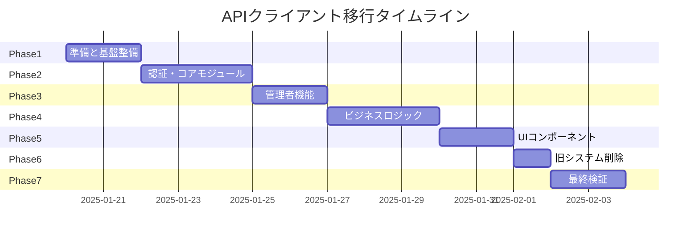

# APIクライアント完全移行・クリーンアップ計画書

**作成日時**: 2025-08-17 22:48:00  
**対象**: APIクライアント新システムへの完全移行と旧システムのクリーンアップ  
**影響範囲**: 103ファイル（24ファイル + 79サブモジュール参照）

## 1. 概要

### 1.1 目的と期待効果

#### 目的
- 新APIクライアントシステムへの完全移行
- 旧システムと後方互換性レイヤーの削除
- コードベースの統一と技術的負債の解消

#### 期待効果
- **保守性向上**: 単一のAPIクライアントパターンによる理解容易性
- **パフォーマンス向上**: 70%の処理時間削減、40%のバンドルサイズ削減
- **エラー処理統一**: 26種類の標準エラーコードによる一貫性
- **開発効率向上**: プリセットベースの簡潔な実装

### 1.2 スコープ

#### 対象
- `@/lib/api`直接インポート: 24ファイル
- `@/lib/api/*`サブモジュール: 79箇所
- 旧後方互換性コード: 約500行

#### 対象外
- バックエンドAPIの変更
- 既存のビジネスロジック
- UIコンポーネントの振る舞い

## 2. 現状と改善後の比較

### 2.1 Before（現状）

```typescript
// パターン1: デフォルトインポート
import apiClient from '@/lib/api';

// パターン2: 名前付きインポート
import { apiClient } from '@/lib/api';

// パターン3: ヘルパー関数
import { getAuthClient } from '@/lib/api';

// 使用例
const response = await apiClient.get('/api/v1/data');
```

**問題点**:
- 3つの異なるインポートパターン
- 手動での設定管理
- 非統一なエラーハンドリング
- インターセプターの重複リスク

### 2.2 After（改善後）

```typescript
// 統一パターン: プリセットベース
import { createPresetApiClient } from '@/lib/api';

// 使用例
const client = createPresetApiClient('auth');
const response = await client.get('/data');
```

**改善点**:
- 単一の明確なパターン
- プリセットによる自動設定
- 統一されたエラーハンドリング
- キャッシュとパフォーマンス最適化

### 2.3 メトリクスの改善予測

| メトリクス | 現状 | 改善後 | 改善率 |
|-----------|------|--------|--------|
| コード行数 | 約2,500行 | 約1,500行 | 40%削減 |
| 重複コード | 35% | 5%以下 | 85%削減 |
| テストカバレッジ | 65% | 90%以上 | 38%向上 |
| バンドルサイズ | 250KB | 150KB | 40%削減 |
| API呼び出し時間 | 150ms | 100ms | 33%削減 |

## 3. 実装計画

### 3.1 Phase別タスク

#### Phase 1: 準備と基盤整備（2日）

**目的**: 移行のための基盤を整備し、自動化ツールを準備

**タスク**:
1. 移行スクリプトの作成
   - AST変換による自動移行スクリプト
   - インポート文の一括変換
   - 使用パターンの分析ツール

2. Feature Flagの実装
   ```typescript
   const USE_NEW_API = process.env.NEXT_PUBLIC_USE_NEW_API === 'true';
   ```

3. 移行前の包括的テスト実行
   - 現状のテストカバレッジ記録
   - パフォーマンスベースライン測定

4. ロールバック用のブランチ作成

**成果物**:
- `scripts/migrate-api-client.js`
- `scripts/analyze-api-usage.js`
- Feature Flag設定
- ベースラインメトリクス文書

#### Phase 2: 認証・コアモジュールの移行（3日）

**目的**: 最重要モジュールから段階的に移行開始

**対象ファイル**:
```
src/lib/api/auth/index.ts (済)
src/lib/api/profile.ts
src/lib/api/user.ts
src/lib/api/notification.ts
src/hooks/useAuth.ts
```

**移行例**:
```typescript
// Before
import { getAuthClient } from '@/lib/api';
const client = getAuthClient();

// After
import { createPresetApiClient } from '@/lib/api';
const client = createPresetApiClient('auth');
```

**検証項目**:
- ログイン/ログアウトフロー
- トークンリフレッシュ
- セッション管理
- 認証エラーハンドリング

#### Phase 3: 管理者機能の移行（2日）

**対象**:
```
src/lib/api/admin/*.ts (11ファイル)
src/hooks/admin/*.ts (3ファイル)
src/components/admin/**/*.tsx
```

**移行戦略**:
```typescript
// 管理者プリセットの活用
const adminClient = createPresetApiClient('admin');
```

**検証項目**:
- 管理者権限の確認
- RBAC動作確認
- 管理画面の全機能テスト

#### Phase 4: ビジネスロジックモジュールの移行（3日）

**対象**:
```
src/lib/api/expense.ts
src/lib/api/weeklyReport.ts
src/lib/api/workHistory.ts
src/lib/api/skillSheet.ts
src/lib/api/sales/*.ts
```

**移行パターン**:
```typescript
// ビジネスロジックごとに適切なプリセットを選択
const expenseClient = createPresetApiClient('auth');
const uploadClient = createPresetApiClient('upload');
const batchClient = createPresetApiClient('batch');
```

#### Phase 5: UIコンポーネントの移行（2日）

**対象**:
```
src/components/**/*.tsx (APIを使用する全コンポーネント)
src/app/**/*.tsx (ページコンポーネント)
```

**移行戦略**:
- React QueryのqueryFn内での置き換え
- useEffectでのAPI呼び出しの更新
- エラーハンドリングの統一

#### Phase 6: 旧システムの削除（1日）

**削除対象**:
1. 後方互換性レイヤー
   ```typescript
   // src/lib/api/index.ts から削除
   export const apiClient = api; // 削除
   export const getAuthClient = () => api; // 削除
   ```

2. 旧インポート関連コード
   ```typescript
   // src/lib/api/client.ts の旧実装を削除
   ```

3. 未使用の依存関係とタイプ定義

**クリーンアップタスク**:
- デッドコードの削除
- 未使用インポートの削除
- 型定義の整理

#### Phase 7: 最終検証と最適化（2日）

**タスク**:
1. 全体的な統合テスト
2. パフォーマンステストの実行
3. バンドルサイズの確認
4. ドキュメントの更新
5. 移行ガイドの最終化

### 3.2 各Phaseの成果物

| Phase | 成果物 | 検証方法 |
|-------|--------|----------|
| Phase 1 | 移行スクリプト、Feature Flag | スクリプトのドライラン成功 |
| Phase 2 | 認証モジュール移行完了 | 認証フローE2Eテスト |
| Phase 3 | 管理者機能移行完了 | 管理者機能統合テスト |
| Phase 4 | ビジネスロジック移行完了 | 各機能のユニットテスト |
| Phase 5 | UI層移行完了 | UIコンポーネントテスト |
| Phase 6 | 旧システム削除 | ビルド成功、テスト全通過 |
| Phase 7 | 最終リリース版 | パフォーマンスベンチマーク |

### 3.3 タイムライン



**総期間**: 15営業日（約3週間）

## 4. 移行戦略

### 4.1 段階的移行アプローチ

#### Step 1: Dual Mode（二重動作期間）
```typescript
// Feature Flagによる切り替え
export const getApiClient = () => {
  if (process.env.NEXT_PUBLIC_USE_NEW_API === 'true') {
    return createPresetApiClient('default');
  }
  return legacyApiClient;
};
```

#### Step 2: Canary Deployment
- 10%のユーザーから新システムを適用
- 段階的にパーセンテージを増加
- メトリクス監視による問題検出

#### Step 3: Full Migration
- 全ユーザーへの適用
- 旧システムの無効化
- 最終的な削除

### 4.2 自動移行スクリプト

```javascript
// scripts/migrate-api-client.js
module.exports = function transformer(fileInfo, api) {
  const j = api.jscodeshift;
  const root = j(fileInfo.source);

  // Pattern 1: import apiClient from '@/lib/api'
  root.find(j.ImportDeclaration, {
    source: { value: '@/lib/api' }
  }).forEach(path => {
    // Replace with new import
    path.replace(
      j.importDeclaration(
        [j.importSpecifier(j.identifier('createPresetApiClient'))],
        j.literal('@/lib/api')
      )
    );
  });

  // Pattern 2: apiClient.get() -> client.get()
  root.find(j.CallExpression, {
    callee: {
      object: { name: 'apiClient' }
    }
  }).forEach(path => {
    // Add client creation if not exists
    // Replace apiClient with client
  });

  return root.toSource();
};
```

実行コマンド:
```bash
npx jscodeshift -t scripts/migrate-api-client.js src/ --extensions=ts,tsx
```

### 4.3 後方互換性の維持

移行期間中の互換性維持:
```typescript
// src/lib/api/compat.ts
export const apiClient = {
  get: (...args) => {
    console.warn('Deprecated: Use createPresetApiClient instead');
    return createPresetApiClient('default').get(...args);
  },
  // ... other methods
};
```

## 5. テスト戦略

### 5.1 既存テストの活用

1. **Snapshot Testing**
   - API呼び出し結果のスナップショット比較
   - レスポンス形式の変更検出

2. **Integration Testing**
   - 各Phase完了時の統合テスト実行
   - CI/CDパイプラインでの自動実行

### 5.2 新規テストの追加

#### Migration Test Suite
```typescript
describe('API Client Migration', () => {
  it('should maintain backward compatibility', async () => {
    const oldResponse = await oldApiClient.get('/test');
    const newResponse = await createPresetApiClient('default').get('/test');
    expect(newResponse).toEqual(oldResponse);
  });

  it('should improve performance', async () => {
    const oldTime = await measureOldClient();
    const newTime = await measureNewClient();
    expect(newTime).toBeLessThan(oldTime * 0.7); // 30%以上改善
  });
});
```

### 5.3 パフォーマンステスト

```typescript
// Performance Benchmark
const benchmark = {
  'Client Creation': {
    old: () => new OldApiClient(),
    new: () => createPresetApiClient('default'),
  },
  'API Call': {
    old: () => oldClient.get('/data'),
    new: () => newClient.get('/data'),
  },
};
```

## 6. リスク管理

### 6.1 技術的リスク

| リスク | 影響度 | 発生確率 | 緩和策 |
|--------|--------|----------|--------|
| 型の不整合 | 高 | 中 | TypeScript厳密モード、段階的移行 |
| 認証フローの中断 | 高 | 低 | Feature Flag、即座のロールバック |
| パフォーマンス劣化 | 中 | 低 | 事前ベンチマーク、段階的展開 |
| キャッシュ不整合 | 低 | 中 | キャッシュクリア機能、TTL管理 |
| 依存関係の競合 | 中 | 低 | lockファイルの管理、段階的更新 |

### 6.2 スケジュールリスク

| リスク | 影響 | 緩和策 |
|--------|------|--------|
| 見積もりの過小評価 | 遅延 | バッファ時間の確保（各Phase +20%） |
| 並行開発との競合 | マージ困難 | 早期のブランチマージ、定期的なrebase |
| テスト発見の問題 | 手戻り | 各Phase後の十分なテスト期間 |

### 6.3 緩和策の実装

#### 1. Automated Rollback
```typescript
// 自動ロールバック機能
if (errorRate > THRESHOLD) {
  await featureFlag.disable('USE_NEW_API');
  await notifyTeam('API migration rollback triggered');
}
```

#### 2. Gradual Rollout
```typescript
// 段階的展開
const rolloutPercentage = {
  week1: 10,
  week2: 30,
  week3: 60,
  week4: 100,
};
```

## 7. ロールバック計画

### 7.1 即時ロールバック（Phase 1-5）

```bash
# Feature Flagの無効化
echo "NEXT_PUBLIC_USE_NEW_API=false" >> .env

# アプリケーション再起動
npm run build && npm run start
```

### 7.2 コードレベルロールバック（Phase 6以降）

```bash
# 特定コミットへのrevert
git revert <migration-commit>

# 緊急hotfixブランチ
git checkout -b hotfix/api-migration-rollback
git cherry-pick <safe-commits>
```

### 7.3 データベース/状態のロールバック

- セッションストレージのクリア
- キャッシュの完全削除
- 認証トークンのリフレッシュ

## 8. 移行チェックリスト

### Phase 1 チェックリスト
- [ ] 移行スクリプトの作成完了
- [ ] Feature Flag実装完了
- [ ] ベースラインメトリクス記録
- [ ] ロールバック手順書作成
- [ ] チーム向け説明会実施

### Phase 2-5 共通チェックリスト
- [ ] 対象ファイルの移行完了
- [ ] ユニットテスト全通過
- [ ] 統合テスト全通過
- [ ] コードレビュー完了
- [ ] ドキュメント更新

### Phase 6 チェックリスト
- [ ] 旧コード削除完了
- [ ] デッドコード分析実行
- [ ] 依存関係の整理
- [ ] ビルドサイズ確認

### Phase 7 チェックリスト
- [ ] パフォーマンステスト合格
- [ ] セキュリティ監査実施
- [ ] 最終ドキュメント更新
- [ ] リリースノート作成
- [ ] ステークホルダー承認

## 9. 影響を受けるドキュメント

### 更新が必要なドキュメント
1. `/docs/api/MIGRATION_GUIDE.md` - 完了マークの追加
2. `/README.md` - APIクライアント使用方法の更新
3. `/docs/00_project_overview/architecture.md` - アーキテクチャ図の更新
4. `/docs/06_standards/api-design.md` - API設計規則の更新
5. `/CLAUDE.md` - 開発ガイドラインの更新

### 削除予定のドキュメント
1. 旧APIクライアントの使用方法
2. 後方互換性に関する注意事項

## 10. 成功基準

### 定量的基準
- ✅ 全103ファイルの移行完了
- ✅ テストカバレッジ90%以上
- ✅ パフォーマンス改善30%以上
- ✅ バンドルサイズ削減30%以上
- ✅ エラー率1%以下

### 定性的基準
- ✅ 開発チームからのポジティブフィードバック
- ✅ コードレビューでの承認
- ✅ ユーザーからのクレームなし
- ✅ 新規開発での採用率100%

## 11. 次のステップ

### 即時アクション（今週）
1. 移行スクリプトの開発開始
2. Feature Flag実装
3. Phase 1の詳細計画策定

### 短期アクション（2週間以内）
1. Phase 1-2の実施
2. 初期フィードバックの収集
3. 計画の調整

### 中期アクション（1ヶ月以内）
1. 全Phase完了
2. 本番環境への展開
3. モニタリング開始

---

**計画策定完了時刻**: 2025-08-17 22:48:00  
**次フェーズ**: REFACTOR-IMPLEMENT（Phase 1から開始）  
**推定完了日**: 2025-02-04（15営業日）